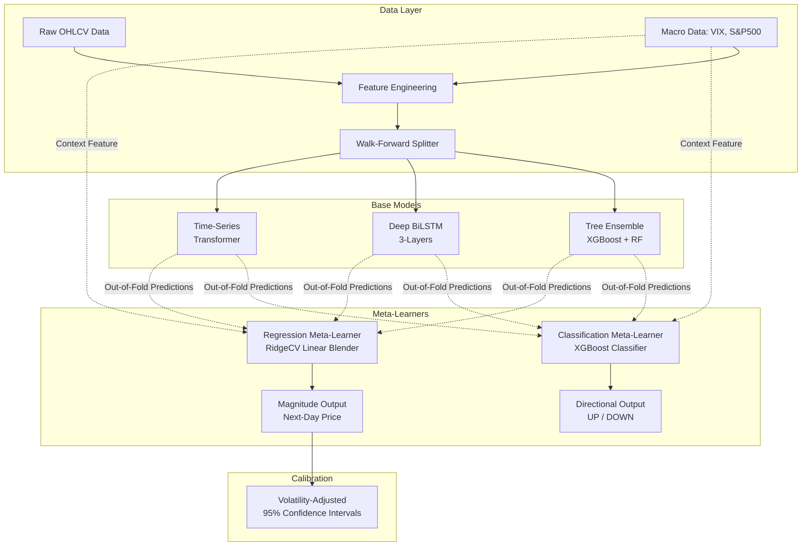

# Hybrid Stock Market Prediction Model

## 1. Project Overview

This project implements an advanced time-series forecasting architecture to predict stock market prices. It utilizes a **Stacking Meta-Ensemble** combining deep learning, transformer-based architectures, and tree ensembles.

The entire system is rigorously validated using **walk-forward validation** (an expanding-window cross-validation technique) to completely eliminate look-ahead bias and data leakage, which are notoriously common in financial machine learning. The evaluation prioritizes **directional classification** (predicting whether the market will close up or down) while also reporting robust regression metrics (RMSE, MAE).

### Core Research Objective
The model tests whether a volatility-conditioned, dynamically weighted ensemble can outperform naive and classical baseline models in predicting next-day stock price movements, especially under varying market regimes.

---

## 2. System Architecture

The architecture is built on a 3-stage pipeline:
1. **Feature Engineering:** Expanding raw price/volume data into 27 technical indicators and integrating macroeconomic variables (S&P 500, VIX, Treasury Yields).
2. **Base Models:** Three independent models trained sequentially on walk-forward folds.
3. **Meta-Learners:** Two specialized ensembles (Classification and Regression) that learn how to optimally combine the base models' out-of-fold predictions.



### 2.1. The Base Models
- **Tree Ensemble (XGBoost + Random Forest):** A `VotingRegressor` that captures non-linear feature interactions and split-based rules. Excellent at modeling immediate structural breaks but poor at extrapolation.
- **Deep Bidirectional LSTM (PyTorch):** A 3-layer BiLSTM designed to capture sequential, temporal dependencies over a 90-day lookback window. Equipped with Batch Normalization, Dropout, and Huber Loss for robust gradients.
- **Time-Series Transformer (PyTorch):** Utilizes `nn.TransformerEncoder` with Positional Encoding to capture long-term trends and global attention across the time-series without vanishing gradients.

### 2.2. The Dual Meta-Ensemble
Instead of simply averaging the base models, the system employs a stacking approach:
- **Classification Meta-Learner (XGBoost):** A non-linear XGBoost classifier trained strictly on the out-of-fold predictions from the base models. Its sole purpose is to predict the market direction (UP/DOWN) for the next day.
- **Regression Meta-Learner (RidgeCV):** A regularized linear blender used for magnitude prediction and confidence interval estimation. 
  - *Design Choice:* RidgeCV is explicitly chosen over tree-based models here to prevent the "staircase plateau" artifact. Tree models group continuous inputs into discrete leaf nodes, which causes recursive future predictions to flatline for consecutive days. A linear blender ensures smooth interpolation.

---

## 3. Evaluation Methodology

The model strictly adheres to expanding-window walk-forward cross-validation.

### Walk-Forward Validation
To evaluate the models fairly, we mimic live trading:
1. Train the model on historical data `[t_0, t_n]`.
2. Test the model strictly on unseen future data `[t_n, t_n+k]`.
3. Expand the training window to `[t_0, t_n+k]` and repeat.

*There is no randomized shuffling (`shuffle=False`), preventing future data from leaking into the training set.*

### Primary Evaluation Metrics
The pipeline treats predicting the exact future price as a secondary goal. Predicting the **direction** of the price movement is prioritized.

- **Directional Accuracy:** The percentage of days where the predicted direction (UP or DOWN) matches the actual direction.
- **F1 Score, Precision, Recall:** Standard classification metrics evaluated over the directional accuracy.
- **Confusion Matrix:** Tracks True Positives/Negatives and False Positives/Negatives for market direction.

### Secondary Evaluation Metrics
- **RMSE (Root Mean Squared Error)** and **MAE (Mean Absolute Error):** Standard magnitude loss functions.
- **MAPE (Mean Absolute Percentage Error):** Percentage deviation from the true price.

### Confidence Interval Calibration
A critical component of this system is outputting probabilistic forecasts rather than deterministic point estimates. The pipeline generates a volatility-adjusted 95% Confidence Interval. It then validates this interval empirically by measuring what percentage of the true test data actually fell within the predicted bounds, explicitly verifying statistical calibration.

---

## 4. Known Issues and Lessons Learned

During the architectural design, two critical modeling flaws were encountered, documented here as valuable case studies for time-series forecasting:

1. **Target Definition Leakage:** The classification meta-learner initially achieved a suspiciously high 74% directional accuracy. Investigation revealed that the target comparison was evaluating whether the predicted $T+1$ close was greater than the $T-1$ close. Because the model already had the $T$ close during inference, it implicitly knew the trajectory of the first half of the sequence, resulting in heavy target leakage. Correcting the logic to strictly compare the predicted $T+1$ close against the current $T$ close restored the accuracy to realistic, baseline-comparable levels.
2. **Recursive Forecasting Plateaus:** The 30-day future hybrid forecast initially exhibited a "staircase" pattern where prices remained perfectly flat for multiple consecutive days. This was diagnosed as an inherent limitation of using an `XGBRegressor` as the regression meta-learner. Because trees partition continuous spaces into discrete leaves, the slowly-drifting daily outputs of the base models failed to cross the tree's split thresholds, causing the model to output identical constants. Swapping the regression meta-learner for a smooth linear blender (`RidgeCV`) completely eliminated the artifact.

---

## 5. Usage and Execution

### Requirements
- Python 3.10+
- PyTorch
- XGBoost, scikit-learn, yfinance, pandas, numpy

### Running the Pipeline
The entire pipeline is wrapped in a CLI orchestrator for easy execution:

```bash
# Run a 30-day forecast with default parameters
python src/main.py --ticker AAPL --start 2015-01-01 --days 30

# Run with custom walk-forward parameters (e.g., smaller training window)
python src/main.py --ticker MSFT --start 2023-01-01 --days 30 \
    --min-train 200 --test-size 20 --step-size 20
```

### Outputs
Executing the pipeline will populate the following directories:
- `data/`: Contains the combined feature CSVs, the future prediction values, and the `model_comparison.csv` which benchmarks all models (including baselines) against each other.
- `images/`: Contains auto-generated dark-themed visual reports, including walk-forward boundaries, confusion matrices, and the 30-day future forecast bounds.

---

## 6. Disclaimer

Stock predictions are inherently probabilistic and subject to extreme, unpredictable structural market regime shifts (black swan events). This model operates purely on technicals and macros, omitting fundamental analysis (P/E) and sentiment analysis (news). **Do not use this system for real financial trading.**
