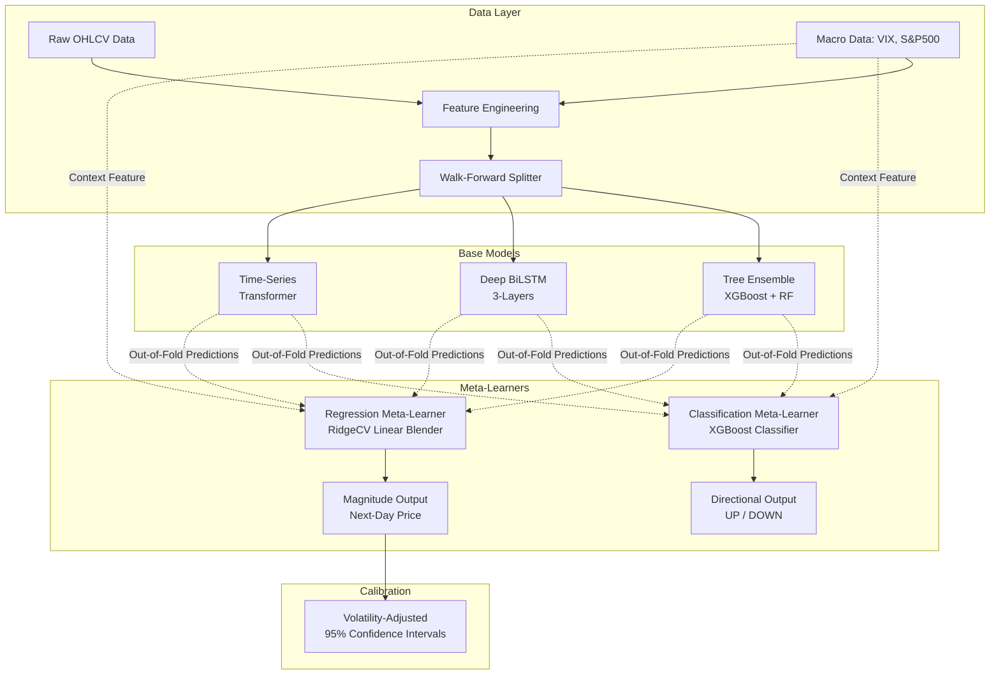

# Hybrid Stock Market Prediction Model

## 1. Project Overview

This project forecasts the **next-day log return** of a stock using a **stacking meta-ensemble** over a tree ensemble, a bidirectional LSTM and a time-series transformer.

The target is a return, not a price. Price-level targets let a model learn the identity function: yesterday's close predicts today's close to within a fraction of a percent, which produces a MAPE under 1% and an R-squared above 0.97 while containing no forecasting skill whatsoever. Every primary metric here is computed in return space, and price appears only as a clearly-labelled secondary diagnostic.

The system is validated by **walk-forward validation** (expanding window). Feature engineering is verified leak-free by a test that recomputes every feature on truncated history and asserts the values at row `t` do not change when later rows are removed.

> **On the numbers.** Honest daily equity return forecasting produces directional accuracy in the low fifties and an out-of-sample R-squared near zero, often negative. Most models here are statistically indistinguishable from a zero-return baseline. That is the correct result for this problem, and it is reported rather than hidden.

### Core Research Objective
The model tests whether a volatility-conditioned, dynamically weighted ensemble can outperform naive and classical baseline models in predicting next-day stock price movements, especially under varying market regimes.

---

## 2. System Architecture

The architecture is built on a 3-stage pipeline:
1. **Feature Engineering:** Raw price/volume data becomes 31 **scale-free** features plus macroeconomic context (S&P 500, VIX, Treasury yields). Price levels are replaced by ratios, returns and bounded oscillators: `Close/SMA_20 - 1` instead of `SMA_20`, `ATR_14/Close` instead of `ATR_14`, and so on. Trees cannot extrapolate past their training target range and a scaler fitted on a trending training window puts most test values outside it, so a level is a silent failure either way. The feature set is an explicit `FEATURE_COLUMNS` list, never inferred by excluding columns.
2. **Base Models:** Three independent models trained sequentially on walk-forward folds.
3. **Meta-Learners:** Two specialized ensembles (Classification and Regression) that learn how to optimally combine the base models' out-of-fold predictions.



### 2.1. The Base Models
- **Tree Ensemble (XGBoost + Random Forest):** A `VotingRegressor` that captures non-linear feature interactions and split-based rules. Excellent at modeling immediate structural breaks but poor at extrapolation.
- **Deep Bidirectional LSTM (PyTorch):** A 3-layer BiLSTM designed to capture sequential, temporal dependencies over a 90-day lookback window. Equipped with Batch Normalization, Dropout, and Huber Loss for robust gradients.
- **Time-Series Transformer (PyTorch):** Utilizes `nn.TransformerEncoder` with Positional Encoding to capture long-term trends and global attention across the time-series without vanishing gradients.

### 2.2. The Dual Meta-Ensemble
Instead of simply averaging the base models, the system employs a stacking approach:
- **Classification Meta-Learner (XGBoost):** A non-linear XGBoost classifier trained strictly on the out-of-fold predictions from the base models. Its sole purpose is to predict the market direction (UP/DOWN) for the next day.
- **Regression Meta-Learner (RidgeCV):** A regularized linear blender used for magnitude prediction and confidence interval estimation. 
  - *Design Choice:* RidgeCV is explicitly chosen over tree-based models here to prevent the "staircase plateau" artifact. Tree models group continuous inputs into discrete leaf nodes, which causes recursive future predictions to flatline for consecutive days. A linear blender ensures smooth interpolation.

---

## 3. Evaluation Methodology

The model strictly adheres to expanding-window walk-forward cross-validation.

### Walk-Forward Validation
To evaluate the models fairly, we mimic live trading:
1. Train the model on historical data `[t_0, t_n]`.
2. Test the model strictly on unseen future data `[t_n, t_n+k]`.
3. Expand the training window to `[t_0, t_n+k]` and repeat.

*There is no randomized shuffling (`shuffle=False`), preventing future data from leaking into the training set.*

### Primary Evaluation Metrics (return space)
- **Directional Accuracy:** `sign(y_pred)` against `sign(y_true)`. Days whose realised move is under 0.1% are excluded as near-flat, and the excluded fraction is reported alongside, because an accuracy figure means nothing without knowing how much of the sample produced it.
- **Pesaran-Timmermann statistic and p-value:** tests whether the hit rate beats what the two marginal up/down rates would give by chance. A 90% hit rate on a series that is 90% up is not skill, and this is the statistic that says so.
- **F1 macro, precision, recall, confusion matrix.**
- **R-squared OOS (Campbell-Thompson):** `1 - SSE_model / SSE_benchmark`, where the benchmark is an expanding-window historical mean computed strictly from data before each prediction and seeded with the training returns. Legitimately negative.
- **RMSE and MAE of returns, in basis points.**
- **Diebold-Mariano test** with Newey-West standard errors against the zero-return baseline. "Model A had lower RMSE than model B" without a DM test is not a finding.

All of the above are computed **per fold** and reported as mean +/- standard deviation across folds, not pooled into a single array.

### Secondary Evaluation Metrics (price space)
Price RMSE and MAPE are reported, marked `[2nd]` in the comparison table. **The zero-return baseline achieves essentially the same values on both, so they do not measure forecasting skill.** There is deliberately no price R-squared anywhere in this project.

### Meta-Ensemble: out-of-fold stacking
The meta-learner is fitted fold-respectingly: **meta-predictions for fold `k` come from a model fitted only on base-model predictions from folds `1 .. k-1`**. The first two folds therefore produce no meta-predictions at all. This is correct and is stated in the output rather than papered over. The previous version fitted on the first 80% of the pooled test rows and then reported metrics over 100% of them, making the hybrid numbers 80% in-sample and not comparable to any other row in the table.

### VIX Gating (the actual research question)
The volatility-conditional weighting is treated as a first-class experiment rather than an assumption:
- The meta-learner is fitted **with** and **without** the VIX level, and the two are compared on directional accuracy and R-squared OOS, with a Diebold-Mariano test on the difference.
- Test days are split into **VIX terciles** and per-tercile base-model weights are reported. Tercile boundaries come from the training folds only.
- If the weights genuinely shift with volatility regime, that is a result. If they do not, that is also a result, and an honest one.

The VIX used is the level at the **feature date** — the close of day `t`, when the forecast for `t+1` is made — never the level on the day being forecast.

### Confidence Interval Calibration
Intervals are built from **empirical residual quantiles on out-of-fold meta-predictions only**. Residual quantiles taken from rows the model was fitted on are optimistic by construction.

- Quantiles for fold `k` come from meta-residuals on folds before `k`, the same principle as the stacking itself. The earliest meta fold has no prior residuals and is excluded from the coverage table.
- Interval width scales with the horizon as **sqrt(h)**, since under a random walk the variance of a cumulative return grows linearly in `h`. Applying one-step-ahead quantiles flat across 30 days, as the previous version did, understates the 30-day interval by a factor of about 5.5.
- Empirical coverage is reported against the nominal 95% level as a **calibration table**, per fold and overall. Under-coverage is reported as a finding, not hidden.

---

## 4. Expected Results

After the return-space refactor the numbers collapse. Expect:

| Metric | Expected range |
|---|---|
| R-squared OOS | roughly -0.01 to +0.01 |
| Directional accuracy | 50% to 54% |
| Diebold-Mariano vs zero-return | mostly not significant |

**This is correct.** The previous MAPE of 0.89% and R-squared of 0.975 were the
naive baseline wearing a transformer costume: a model told to predict tomorrow's
*price*, given today's price as a feature, learns the identity function and
scores brilliantly on every price-space metric while forecasting nothing.

Every credible paper on daily equity return prediction reports numbers in the
range above. A project that demonstrates a correct evaluation protocol and
reports modest honest results is worth considerably more than one claiming 99%
accuracy.

Guardrails that keep it honest:

- `tests/test_leakage.py` recomputes every feature on truncated history and
  asserts row `t` is unchanged when later rows are removed. Any centred window,
  any backward fill, any global fit fails it.
- No feature may correlate above 0.5 with the next-day return. The observed
  maximum on the AAPL fixture is 0.205 (`SP500_Return_1d`, short-horizon
  reversal).
- `src/contracts.py` validates every model's output frame: exact schema, no
  NaNs, unique and sorted `target_date`. It fails loudly.
- A cross-model test asserts the tree, LSTM and transformer forecast exactly
  the same set of days, which is what removes the original off-by-one between
  them.

---

## 5. Beyond One Stock

### Experiment runner (`src/experiments.py`)
One stock is an anecdote. The runner sweeps tickers, regimes and seeds, and
persists **raw per-fold, per-ticker predictions** to `results/predictions/`.
Every aggregate is then computed by reading those files back, never from
whatever happens to still be in memory, so the tables can be rebuilt many times
while writing up without retraining anything.

```bash
# Full sweep: 30 tickers, 5 seeds
python src/experiments.py --regimes full

# One regime, fewer seeds
python src/experiments.py --tickers AAPL MSFT JPM --regimes crash_2020 --seeds 0 1 2

# Rebuild the aggregate tables from runs already on disk
python src/experiments.py --aggregate-only
```

Regimes: `pre_2020`, `crash_2020`, `drawdown_2021_2022`, `post_2023`, `full`.

**Seed variance is reported**, in `results/seed_variance.csv`. Single-seed
neural results are not credible: the spread across seeds is frequently larger
than the gap between two models, and a comparison that ignores it is not a
finding.

> **Survivorship bias.** The default ticker list is 30 names that still trade
> today. Companies delisted, acquired or bankrupted over the sample are absent,
> which biases every aggregate upward. The runner prints this warning on every
> sweep. Fixing it properly requires point-in-time index constituents including
> delisted names.

### Economic evaluation (`src/backtest.py`)
Directional accuracy does not pay for lunch. A model can be right 53% of the
time and still lose money, because the days it gets wrong are bigger than the
days it gets right, or because it trades so often that costs eat the edge.

The strategy is deliberately the simplest thing that follows from the forecast
— take the predicted sign, long/flat or long/short — so what is measured is the
forecast and not a trading overlay. Reported per model:

- Sharpe ratio, **gross and net of costs**
- Maximum drawdown and annualised turnover
- **Break-even transaction cost**: the round-trip cost in basis points at which
  the strategy stops being profitable. "Profitable at 5bps" and "profitable at
  500bps" are very different claims.
- **Buy-and-hold, on the same days, for comparison**

Default cost is 7.5bps round-trip (`--cost-bps`), realistic for liquid US
equities. If the strategy loses to buy-and-hold after costs, the pipeline says
so plainly. That is a publishable finding and reviewers respect it.

---

## 6. Known Issues and Lessons Learned
Flaws found and fixed during this project, kept as case studies. Each one produced plausible numbers rather than a crash, which is what made them dangerous.

1. **Target Definition Leakage:** The classification meta-learner initially achieved a suspiciously high 74% directional accuracy. Investigation revealed that the target comparison was evaluating whether the predicted $T+1$ close was greater than the $T-1$ close. Because the model already had the $T$ close during inference, it implicitly knew the trajectory of the first half of the sequence, resulting in heavy target leakage. Correcting the logic to strictly compare the predicted $T+1$ close against the current $T$ close restored the accuracy to realistic, baseline-comparable levels.
2. **Recursive Forecasting Plateaus:** The 30-day future hybrid forecast initially exhibited a "staircase" pattern where prices remained perfectly flat for multiple consecutive days. This was diagnosed as an inherent limitation of using an `XGBRegressor` as the regression meta-learner. Because trees partition continuous spaces into discrete leaves, the slowly-drifting daily outputs of the base models failed to cross the tree's split thresholds, causing the model to output identical constants. Swapping the regression meta-learner for a smooth linear blender (`RidgeCV`) completely eliminated the artifact.
3. **The price-target identity function.** The original model was asked to predict tomorrow's *close* while being given today's close as a feature. It learned the identity function, scoring MAPE 0.89% and R-squared 0.975 while forecasting nothing: the naive "tomorrow equals today" baseline scores the same. Every price-level feature was also non-stationary, which trees cannot extrapolate past and MinMax scaling maps outside [0, 1] on any trending test fold. Fixed by moving the target to log returns and every feature to a scale-free transform.
4. **Two incompatible definitions of directional accuracy.** One took `np.diff` of the concatenated *prediction series*, measuring whether prediction t+1 exceeded prediction t and inventing a spurious observation at every fold boundary. In return space the definition is just `sign(y_pred)` vs `sign(y_true)`, and the boundary problem disappears.
5. **An 80/20 split inside the test set is not out-of-fold.** The meta-learner was fitted on the first 80% of pooled test rows and then reported metrics over 100% of them, making the hybrid numbers 80% in-sample and not comparable to any other row in the table. Fixed with fold-respecting stacking: fold k's meta-model sees only folds 0..k-1.
6. **A cold R-squared-OOS benchmark flatters everything.** The expanding-mean benchmark was started from nothing on the pooled test series, so its first values were one- and two-observation means. On a test period opening with the March 2020 crash those are forecasts of double-digit moves, the benchmark's error inflates, and *every* model's R-squared-OOS rises with it — the zero-return baseline scored +0.087 instead of the correct -0.005. Fixed by seeding each fold's benchmark with that fold's training returns.

---

## 7. Usage and Execution

### Requirements
- Python 3.10+
- PyTorch
- XGBoost, scikit-learn, yfinance, pandas, numpy

### Running the Pipeline
The entire pipeline is wrapped in a CLI orchestrator for easy execution:

```bash
# Evaluate the pipeline on AAPL
python src/main.py --ticker AAPL --start 2015-01-01

# Custom walk-forward parameters (e.g. a smaller training window)
python src/main.py --ticker MSFT --start 2023-01-01 \
    --min-train 200 --test-size 20 --step-size 20

# Add the illustrative 30-day recursive forecast (see the warning below)
python src/main.py --ticker AAPL --start 2015-01-01 --demo-forecast 30
```

> ### `--demo-forecast` is illustrative only
>
> Recursive multi-step forecasts are **excluded from every scientific claim in
> this project** and appear in no metrics table. Each step feeds a synthetic bar
> back into the feature pipeline, so the ATR, Bollinger and intraday-range
> features are computed from a price that has no real high, low or volume, and
> the errors compound over the horizon. The flag exists because the chart is
> useful for illustration, not because the forecast is trustworthy.
>
> For genuine multi-horizon results, train separate direct models for
> h = 1, 5, 21 rather than recursing. The flag is off by default.

### Outputs
Executing the pipeline will populate the following directories:
- `data/model_comparison.csv` - every model and baseline, primary metrics in return space, price metrics marked `[2nd]`.
- `data/diebold_mariano.csv` - DM tests of every model against the zero-return baseline.
- `data/aligned_predictions.csv` - one row per forecast day, every model's predicted return side by side, merged on `target_date`.
- `data/combined_predictions.csv` - written only with `--demo-forecast`; every row carries the caveat above.
- `images/` - walk-forward fold boundaries and tree feature importances.

---

## 8. Disclaimer

Stock predictions are inherently probabilistic and subject to extreme, unpredictable structural market regime shifts (black swan events). This model operates purely on technicals and macros, omitting fundamental analysis (P/E) and sentiment analysis (news). **Do not use this system for real financial trading.**
