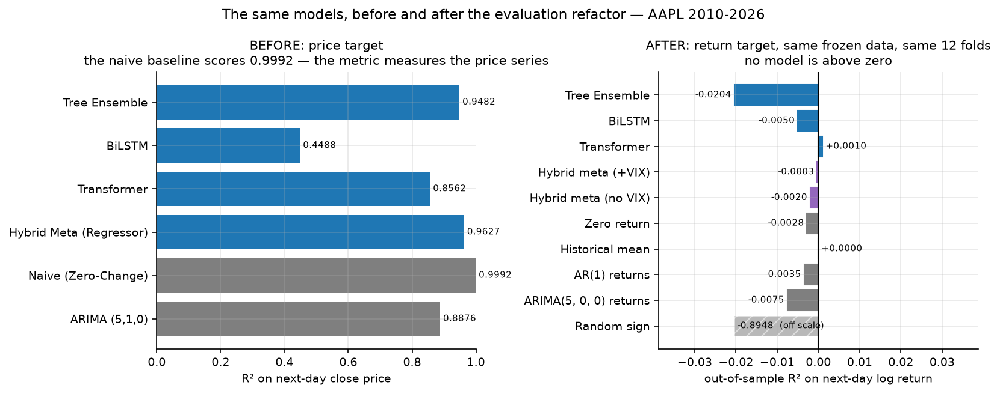
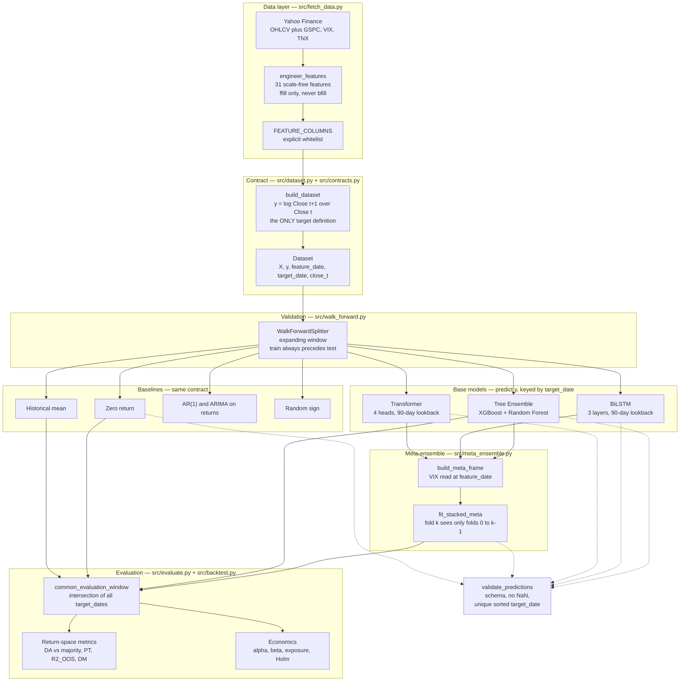
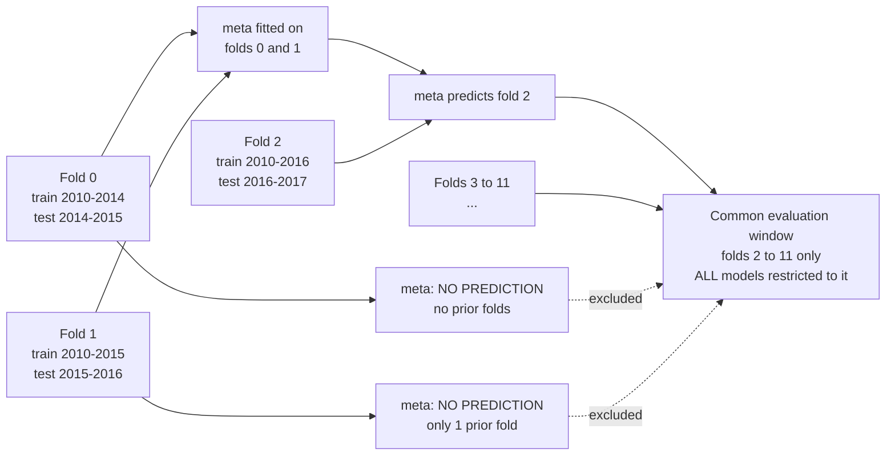

# Hybrid Stock Market Prediction Model

A walk-forward evaluation framework for next-day equity return forecasting,
comparing a tree ensemble, a bidirectional LSTM, a time-series transformer and
a stacked meta-ensemble against five baselines.

**The headline result is a null.** Across 30 US large caps and 2010–2026, none
of the models forecasts next-day returns better than trivial baselines. No
model achieves positive out-of-sample R², none beats its majority class, and
none has statistically significant alpha after correcting for multiple testing.

That is the finding, not a failure of the implementation. The value of this
repository is the evaluation protocol that makes such a result legible — and
the documented case study of what the same models reported before that protocol
existed.

---

## 1. The headline number

An earlier version of this project reported R² = 0.9627 and MAPE = 9.89% and
described itself as achieving state-of-the-art precision. Those numbers were
real arithmetic on a broken target.

| | Before (price target) | After (return target) |
|---|---|---|
| Target | next-day **close price** | next-day **log return** |
| Best model, primary metric | R² = **0.9627** | R²_OOS = **+0.0011** (fold median; mean −0.0022 ± 0.0109, pooled −0.0003) |
| Naive / zero-return baseline | R² = **0.9992**, MAPE **1.23%** | R²_OOS = **−0.0023** (fold median; pooled −0.0028) |
| Does the best model beat the baseline? | **No** — and the metric hid it | **Not distinguishably** — a thousandth above a benchmark at zero, with a fold sd of 0.011 and DM p = 0.47 |

Both runs use *identical frozen data* (`docs/frozen_aapl_raw.csv`) and an
identical 12-fold configuration.

The old model was asked to predict tomorrow's price while being given today's
price as a feature. It learned the identity function. On a trending price
series, R² measures the price series — so the naive "tomorrow equals today"
baseline scored **higher than every model** (R² 0.9992, MAPE 1.23%) while the
best model managed 0.9627 and 9.89%. Every model was worse than doing nothing,
and the metric could not show it.

Full tables: [`docs/baseline_before_refactor.csv`](docs/baseline_before_refactor.csv),
[`docs/baseline_after_refactor.csv`](docs/baseline_after_refactor.csv).

---

## 2. What this project does **not** claim

This is a null result on a narrow question. It is not any of the following.

**It does not claim markets are efficient.** Efficiency is a theory about all
information and all horizons. This tests 31 technical and macro features on one
horizon.

**It does not claim equity returns are unpredictable.** A large literature
finds predictability at monthly and annual horizons, in the cross-section
rather than the time series, and conditional on variables absent here
(valuation ratios, order flow, earnings revisions, sentiment, options-implied
measures). Nothing here speaks to any of that.

**It does not claim deep learning cannot work in finance.** Two architectures,
one hyperparameter configuration each, one seed for the headline and five for
the variance study. A negative result at this scale is evidence about *these
runs*, not about a model class.

**It does not claim these models are correctly specified.** The neural models
were given a 90-day lookback and default-ish hyperparameters. Optuna search was
available but disabled for the reported runs. A better-tuned model might do
better; this repository does not test that.

The claim is narrow and specific: **with these features, this horizon, this
universe and this protocol, the models do not beat trivial baselines, and the
protocol is strict enough that had they done so, the result would be
credible.**

---

## 3. Results

### 3.1 Table 1 — AAPL headline

AAPL, 2010-03-16 → 2026-09-03, 12 expanding walk-forward folds, common
evaluation window of 2520 forecast days (2016-05-27 → 2026-06-05). R²_OOS is
reported three ways from the same per-fold series: the **fold median** is the
headline, the fold mean ± sd shows the spread, and the pooled value (a
variance-weighted ratio that the worst fold dominates; see section 8.3) is
secondary. `results/fold_aggregates_headline.csv`,
`python analysis/fold_aggregates.py`.

| Model | DA (%) | Majority (%) | DA − majority (pp) | PT p | R²_OOS, fold median | R²_OOS, fold mean ± sd | R²_OOS, pooled | RMSE (bps) |
|---|---|---|---|---|---|---|---|---|
| Tree Ensemble | 52.82 | 54.01 | −1.19 | 0.0586 | **−0.0081** | −0.0152 ± 0.0326 | −0.02037 | 183.4 |
| BiLSTM ᵃ | 52.47 | 54.01 | −1.54 | 0.7159 | **−0.0009** | −0.0043 ± 0.0113 | −0.00499 | 182.0 |
| Transformer ᵃ | 52.60 | 54.01 | −1.41 | 0.7065 | **−0.0003** | +0.0011 ± 0.0074 | +0.00102 | 181.5 |
| Ridge (returns) | 53.28 | 54.01 | −0.73 | 0.2698 | **0.0000** | +0.0004 ± 0.0033 | +0.00124 | 181.5 |
| Logistic (direction) | 53.88 | 54.01 | −0.13 | 0.5217 | **−0.0004** | −0.0008 ± 0.0027 | −0.00027 | 181.6 |
| Hybrid meta (+VIX) ᵇ | 52.65 | 54.01 | −1.37 | 0.7480 | **+0.0011** | −0.0022 ± 0.0109 | −0.00029 | 181.6 |
| Hybrid meta (no VIX) ᵇ | 52.30 | 54.01 | −1.71 | 0.5926 | **+0.0010** | −0.0016 ± 0.0120 | −0.00197 | 181.8 |
| Zero return | 45.99 | 54.01 | −8.02 | — | **−0.0023** | −0.0037 ± 0.0063 | −0.00276 | 181.8 |
| Historical mean | 54.01 | 54.01 | 0.00 | — | **0.0000** | 0.0000 ± 0.0000 | 0.00000 | 181.6 |
| AR(1) returns | 53.71 | 54.01 | −0.30 | 0.2355 | **−0.0027** | −0.0028 ± 0.0063 | −0.00347 | 181.9 |
| ARIMA(5,0,0) returns | 52.05 | 54.01 | −1.96 | 0.8962 | **−0.0082** | −0.0066 ± 0.0101 | −0.00753 | 182.3 |
| Random sign | 50.26 | 54.01 | −3.75 | 0.2745 | **−0.8630** | −1.1199 ± 0.5787 | −0.89480 | 249.9 |

> **ᵃ Single seed (42) drawn from a distribution measured over 5 seeds.**
>
> | | DA (%) | R²_OOS | PT p |
> |---|---|---|---|
> | BiLSTM range | 51.46 – 53.91 | −0.0102 – −0.0032 | 0.014 – 0.893 |
> | Transformer range | 52.27 – 52.95 | −0.0106 – **+0.0010** | 0.201 – 0.696 |
>
> Under the pooled aggregation the Transformer's +0.00102 was the only positive
> R²_OOS; under the fold median it is −0.0003 and the two meta rows are
> +0.0011 and +0.0010. Which row sits a thousandth above zero depends on the
> aggregation, and every one of them is inside a seed range or a fold sd that
> **crosses zero**. None is a positive result.
>
> **ᵇ Single seed, range not measured.** The meta-learner's inputs are the
> base-model predictions, so it inherits their seed variance and adds the
> meta-fit on top. Its true spread is at least as wide as the base models' and
> was not quantified.

**Not one model beats the majority class.** Always predicting "up" scores
54.01%; the best model reaches 54.04% on the fixture and 52.82% here.
Directional accuracy against 50% is meaningless on a series that rises 54% of
the time.

**No Diebold-Mariano test against the zero-return baseline is significant** on
2520 shared days — the smallest p-value is 0.177 (Transformer). `Random sign`
is significant at p<0.0001 *in favour of the baseline*, which is the sanity
check behaving.

### 3.2 The 30-ticker sweep

30 US large caps across sectors, same 12-fold configuration, seed 42.
595,224 predictions persisted to `results/predictions/`.

Tree Ensemble across all 30:

| | mean | median | sd | min | max |
|---|---|---|---|---|---|
| DA − majority (pp) | −2.17 | −2.41 | 1.33 | −4.16 | **+0.15** |
| R²_OOS, pooled | −0.116 | −0.096 | 0.074 | −0.343 | **−0.032** |
| **R²_OOS, fold median** | **−0.047** | −0.042 | 0.021 | −0.107 | **−0.014** |
| PT p-value | 0.440 | 0.408 | 0.312 | 0.021 | 0.932 |
| t(alpha) | −0.84 | −0.64 | 1.12 | −2.64 | +0.99 |

| | count |
|---|---|
| Tickers with R²_OOS > 0 | **0 / 30** — pooled, fold mean and fold median alike (`results/fold_aggregates_sweep.csv`) |
| Tickers with t(alpha) > 1.96 | **0 / 30** |
| Tickers beating majority class | 3 / 30 (by ≤ 0.15pp) |

**Does any ticker break the null?**

| test | raw p<0.05 | expected by chance | Holm-corrected | P(≥ k ‖ null) |
|---|---|---|---|---|
| Pesaran-Timmermann | 2 / 30 (AVGO, META) | 1.5 | **0 / 30** | 0.446 |
| alpha | 8 / 30 | 1.5 | **0 / 30** | <0.001 |

The two linear comparators (`src/linear_models.py`; `results/comparators/`)
on the same thirty tickers: R²_OOS within 0.017 of zero by fold median on
every ticker, positive on 12 (ridge) and 18 (logistic) of 30, which is what a
forecast of the historical mean scores; DA − majority mean −0.48 and −0.28 pp;
PT p < 0.05 on 5 and 4 of 30 against 1.5 expected (binomial p = 0.016 and
0.061); Holm within model 0 and 1; Holm across all 90 direction tests of the
three models, 0; alpha hits 1+1 and 0+2 of 30 (negative + positive), none
surviving Holm. Paper §6.2 discusses the excess of uncorrected directional hits.

Two PT hits against 1.5 expected is chance. The eight alpha hits look alarming
until you check the sign: **all eight are t < −1.96**, none positive. The tree
underperforms a rising market because it holds ~50% exposure at beta 0.44–0.65;
that is a shortfall, not skill.

### 3.3 Seed variance versus architecture difference

Five seeds each of the BiLSTM and Transformer on AAPL, same 12-fold
configuration.

The statistic is `mean|arch gap| / mean(seed sd)`. Its null distribution — both
architectures identical, five seeds each — was obtained by **simulation, not a
closed form** (400,000 trials of two iid normal samples at n=5):

```
null median        1.22
null 90% interval  [0.67, 1.77]
```

| metric | observed ratio | p (one-tailed) | inside 90% interval |
|---|---|---|---|
| R²_OOS | 1.66 | 0.083 | **yes** |
| Directional accuracy | 1.69 | 0.072 | **yes** |
| sd of predicted returns | 0.62 | 0.036 | no (lower tail) |

**The architecture difference is not distinguishable from seed noise.** Both
1.66 and 1.69 fall inside the interval you would get if the two architectures
were identical.

The 0.62 on prediction dispersion falls *below* the interval, which would
suggest reseeding moves that quantity more than switching architecture does.
**This is not claimed**: it is a single comparison at n=5, one of three
reported, and it is not corrected for that.

Two apparent positive findings dissolve across seeds:

- **Transformer R²_OOS changes sign** across seeds (−0.0106 to +0.0010).
- **BiLSTM seed 4 reports PT p = 0.0137**, the only configuration in this
  project beating its majority class with a significant PT statistic. Its
  other four seeds give 0.33, 0.52, 0.71, 0.89. The seed study ran **10 tests**
  (2 architectures × 5 seeds); the expected number of hits at p<0.05 is 0.5 and
  P(at least one) is **0.401**. This is the expected chance hit.

### 3.4 Economics

Long/flat on the predicted sign, 7.5bps round-trip, buy-and-hold on the same
2520 days.

| Model | Alpha ann. | t(alpha) | p Holm | Beta | Exposure | Sharpe net |
|---|---|---|---|---|---|---|
| Tree Ensemble | +0.0740 | 1.71 | **0.873** | 0.663 | 0.608 | 1.166 |
| Hybrid meta (+VIX) | −0.0419 | −1.88 | 0.667 | 0.937 | 0.888 | 0.861 |
| Transformer | +0.0156 | 0.39 | 1.000 | 0.742 | 0.845 | 0.963 |
| Ridge (returns) | +0.0390 | 1.23 | 1.000 | 0.860 | 0.846 | 1.115 |
| Logistic (direction) | −0.0162 | −1.05 | 1.000 | 0.971 | 0.985 | 0.973 |
| BiLSTM | −0.0257 | −0.93 | 1.000 | 0.899 | 0.848 | 0.896 |
| Historical mean | −0.0000 | −1.00 | 1.000 | **1.000** | **1.000** | 1.045 |
| Buy and hold | 0.0000 | — | — | 1.000 | 1.000 | 1.045 |

**Zero strategies significant, corrected or uncorrected.** Simulating the null
gives E[max‖t‖] = 1.92 across the eleven tests if independent and 1.44 at ρ=0.8
(P(max‖t‖ ≥ 1.71) = 0.63 and 0.29), so the tree's t = 1.71 is what no-alpha
looks like when you look eleven times. The count is read from the economics
table (`results/aapl_economics_holm.csv`), never typed in.

Raw Sharpe cannot distinguish skill from market exposure: `Historical mean` has
beta 1.000 and exposure 1.000 — it *is* buy-and-hold, holding a long position
99.9% of the time. The tree's net Sharpe of 1.166 against buy-and-hold's 1.045
is the other face of the same point: it compares a position with beta 0.663
and 61% exposure against one with beta 1 and 100%, so the gap is not a
like-for-like measure of skill. The market-adjusted alpha is, and the table
above (t = 1.71, Holm p = 0.698, inside the null's expected maximum) and the
stress table below (t = 1.43 at 10 bps; negative under a one-day lag at any
cost) show what that alpha is worth.

**The tree's alpha survives neither stress:**

| lag | cost (bps) | alpha ann. | t | p |
|---|---|---|---|---|
| 0 | 0.0 | +0.1101 | +2.55 | 0.011 |
| 0 | 7.5 | +0.0740 | +1.71 | 0.087 |
| 0 | **10.0** | +0.0619 | +1.43 | **0.152** |
| **1** | 0.0 | **−0.0179** | −0.41 | 0.682 |
| **1** | 7.5 | **−0.0539** | −1.24 | 0.217 |

Only the zero-cost, zero-lag corner is significant. A one-day execution lag
**flips the sign negative at every cost level**, including zero cost.

### 3.5 Distribution shift is the mechanism for the magnitude error

Each fold trains on one return distribution and is scored on the next. A KS
test on all 357 fold-ticker pairs:

```
KS rejects at 5%: 119/357 = 33.3%   (expected under no shift: 5.0%)
```

Regressing per-fold performance on the fold's KS statistic:

| outcome | slope | t | p | R² |
|---|---|---|---|---|
| R²_OOS ~ KS | −1.576 | **−6.84** | <0.0001 | **0.116** |
| DA (%) ~ KS | −11.65 | −2.09 | 0.038 | 0.012 |

| | folds | mean R²_OOS | mean DA |
|---|---|---|---|
| KS not significant | 238 | −0.0505 | 50.82 |
| KS significant | 119 | **−0.1419** | 49.69 |

Welch t = −4.10, p = 0.0001 on R²_OOS.

Shifted folds are ~2.8× worse. But KS explains **11.6%** of R²_OOS variance and
only **1.2%** of DA variance: distribution shift explains *how much* the models
lose, not *why they have no directional signal*.

---

## 4. Figures

Every figure below is drawn from the numbers in the results tables — the
committed per-fold predictions under `results/`, the frozen comparison CSVs
under `docs/`, and nothing else. No figure computes a metric of its own; where
one needs a derived series (an equity curve from daily returns) it calls the
same evaluation function the tables used, on the same inputs, so a picture
cannot disagree with its table.

Two ways they are produced:

- **Every pipeline run** writes the per-run set to `images/` (gitignored,
  regenerated each time) unless `--no-plots` is passed.
- **`python analysis/make_figures.py`** rebuilds the committed set below into
  `docs/figures/` from `results/` and `docs/`, without retraining anything.
- **`python analysis/freeze_headline_predictions.py`** re-runs the §3.1
  headline configuration on the frozen CSV and writes its per-fold
  predictions to `results/headline/AAPL__frozen__seed42.parquet`, the
  committed source of every AAPL figure. About an hour on CPU; only needed
  if a model changes.

> **Provenance.** Each subsection below names its source. The AAPL figures
> in §4.2 are built from `results/headline/AAPL__frozen__seed42.parquet`: the
> §3.1 headline run itself, re-executed on `docs/frozen_aapl_raw.csv` with the
> same 12-fold configuration and seed, so their fold boundaries are Table 1's
> (fold 0's test window opens 2014-05-29). `make_figures.py` asserts two
> things before drawing: the parquet's fold-0 realised returns equal the
> frozen dataset's, and the comparison table rebuilt from the parquet equals
> `docs/baseline_after_refactor.csv`, which is Table 1, to the printed digits.
> `tests/test_headline_provenance.py` runs the same two checks. The
> cross-ticker figures in §4.3 come from the 30-ticker sweep, where every
> ticker sits on its own fetch grid and no offset arises. The sweep's AAPL
> fetch cache is a different file from the frozen CSV, and its fold grid
> opens 49 trading days earlier (2014-03-19); the two figures that use that
> run, the five-seed study and the ringed AAPL point in the cross-ticker
> strip, state the offset in their own titles rather than relying on this note.

### 4.1 The headline

| | |
|---|---|
|  | **`before_after.png`** — The same models on identical frozen data. Left: R² on the *price* target, where the naive baseline scores 0.9992 and beats every model. Right: R²_OOS on the *return* target, where nothing is above zero. `Random sign` is drawn off-scale so it cannot squash the panel. |

### 4.2 AAPL headline run, Table 1's grid: 2520 common-window days, 12 folds, seed 42

Source: `results/headline/AAPL__frozen__seed42.parquet` and `docs/frozen_aapl_raw.csv`.

| figure | what it shows |
|---|---|
| [`aapl_predicted_vs_realised.png`](docs/figures/aapl_predicted_vs_realised.png) | Predicted vs realised next-day return, one panel per model. **Every model is a horizontal band.** Correlations are −0.012 to +0.068 across the seven panels; prediction spread is 2–23% of realised spread. This is the central picture. |
| [`aapl_prediction_dispersion.png`](docs/figures/aapl_prediction_dispersion.png) | Distribution of each model's predictions beside the realised distribution. The models that pick a level rather than forecast collapse to a spike. |
| [`aapl_model_comparison.png`](docs/figures/aapl_model_comparison.png) | Directional accuracy minus the majority-class rate, and R²_OOS, per model, with zero lines. Models first, baselines last. |
| [`aapl_alpha_beta.png`](docs/figures/aapl_alpha_beta.png) | Annualised alpha with its t-statistic (red if \|t\| > 1.96 — none is) and beta against buy-and-hold. `Historical mean` has beta 1.000: it *is* the market. |
| [`aapl_equity_curves.png`](docs/figures/aapl_equity_curves.png) | Net-of-cost growth of 1 for each long/flat strategy against buy-and-hold, log scale. The historical-mean curve sits on buy-and-hold: it is always long. The tree's Sharpe (1.17) edges buy-and-hold's (1.04), but its alpha t-statistic is +1.71, inside the noise band (see `aapl_alpha_beta.png`); the meta curves sit below buy-and-hold. The flat stretches in the tree and meta curves through 2021 are time out of the market. |
| [`aapl_r2_oos_by_fold.png`](docs/figures/aapl_r2_oos_by_fold.png) | R²_OOS per walk-forward fold, per model. Shows the instability that the pooled number hides. |
| [`aapl_da_minus_majority_by_fold.png`](docs/figures/aapl_da_minus_majority_by_fold.png) | The same for directional accuracy minus majority. |
| [`aapl_calibration.png`](docs/figures/aapl_calibration.png) | Empirical coverage of the 95% interval per fold, quantiles from earlier folds only, against the nominal line. |
| [`aapl_walk_forward_folds.png`](docs/figures/aapl_walk_forward_folds.png) | Price history with each fold's test span shaded: 12 expanding folds, test always after train. |

### 4.3 Beyond one stock, from the 30-ticker sweep

Source: `results/predictions/`, `results/seeds/`, `results/fold_diagnostics.csv`
and `docs/baseline_*.csv`. Only the before/after pair is on the frozen data.

| figure | what it shows |
|---|---|
| [`cross_ticker_null.png`](docs/figures/cross_ticker_null.png) | Tree Ensemble on 30 US large caps: DA − majority, R²_OOS and t(alpha) as strip plots, AAPL ringed. **0/30 above zero on R²_OOS; 0/30 with t > +1.96; 8/30 with t < −1.96.** The ringed AAPL is the sweep's own run, on the sweep grid (fold 0 opens 2014-03-19, 49 trading days before Table 1's), as the title states. |
| [`seed_variance.png`](docs/figures/seed_variance.png) | Five seeds each of BiLSTM and Transformer, run on the sweep's fetch cache and therefore on the sweep grid; the title states the 49-day offset from Table 1. The Transformer's R²_OOS straddles zero across seeds; the DA clouds overlap. Architecture is not distinguishable from seed noise. Requires `results/raw/` to rebuild. |
| [`shift_vs_r2_oos.png`](docs/figures/shift_vs_r2_oos.png) | Per-fold R²_OOS against the fold's train-vs-test KS statistic, all 357 fold-ticker pairs, shifted folds in red with the OLS fit. Distribution shift predicts the *magnitude* error (slope −1.58, t = −6.84) — but the fit's **R² = 0.116** is printed on the figure so the ceiling is visible: shift explains about a ninth of the R²_OOS variance and almost none of the directional error. Requires `results/raw/` to rebuild. |

---

## 5. System architecture



### 5.1 Why the meta-learner skips early folds



A meta-model for fold *k* is fitted only on folds `0 … k−1`, so the first two
folds produce no meta-prediction. Every primary comparison then runs on the
**intersection** of all models' forecast days. Without this, the base models
would be scored across two extra folds the meta-learner never saw — on the
AAPL fixture those folds were the 2020 crash, at 3.22% daily realised
volatility against 1.92% elsewhere.

---

## 6. The row contract

Everything depends on one convention, enforced by `src/contracts.py`.

| Quantity | Definition |
|---|---|
| `feature_date[t]` | Trading day `t`. All features use information available at the **close** of day `t`. |
| `target_date[t]` | Trading day `t+1`. The day being forecast. |
| `close_t[t]` | `Close[t]`, the last observed price. Known at forecast time. |
| `y[t]` | `log(Close[t+1] / Close[t])`, the next-day log return. **The target.** |

Every model returns a frame with exactly `target_date, fold_id, close_t,
y_true, y_pred`, keyed by **`target_date`**. `validate_predictions()` asserts
the schema, rejects NaNs and infinities, and requires `target_date` to be
unique and sorted. It is called at the end of every train function and fails
loudly.

Keying by `target_date` is what removes the off-by-one between a sequence model
consuming a 90-day window and a tree consuming one row. A test asserts all
three base models forecast **exactly the same set of days**.

Price is a display quantity only: `close_hat[t+1] = close_t[t] * exp(y_hat[t])`.
**No primary metric is computed on reconstructed prices.**

---

## 7. Leakage controls

| Control | Mechanism |
|---|---|
| **Truncation invariance** | Every feature at row `t` must be identical whether computed on full history or history truncated at `t`. Catches centred windows, global fits, and any forward reference. |
| **Mutation-tested** | Six known leaks are injected into a copy of the feature code and each must be caught (`tests/test_leakage_mutations.py`). A test that never fails is not a test. |
| **No backward fill** | `ffill()` only. Verified behaviourally on a fixture whose macro series starts *after* the price series, since `bfill` can only alter leading NaNs. |
| **Explicit feature set** | `FEATURE_COLUMNS` is a whitelist. Every raw column is banned as a feature unless named in `LEVEL_FEATURES_ALLOWED`, so a new raw column is banned by default. |
| **Target correlation bound** | No feature may correlate above 0.5 with the next-day return. Observed maximum 0.205 (`SP500_Return_1d`, short-horizon reversal). |
| **Fold-respecting stacking** | Meta-model for fold `k` fitted only on folds `0…k−1`. |
| **Scalers fitted on training folds only** | `StandardScaler`, not MinMax: MinMax maps the training range onto [0,1] and puts every larger test move outside it. |
| **Offline tests** | `yfinance` is imported lazily inside `_get_ticker()`; a subprocess test asserts it is not in `sys.modules` after importing the data layer. |

**Test suite: 341 tests.** The most important is
`test_features_do_not_depend_on_future_rows`.

---

## 8. Limitations

These are material and are not worked around.

### 8.1 Annual refit only

Models are refitted **once per fold — once per year**. A model trading in
May 2026 was last fitted on data ending June 2025. Real deployment would refit
monthly or daily. This is the single largest gap between this evaluation and
practice, and it plausibly explains part of the poor performance: the
distribution-shift analysis shows a third of folds train on a materially
different return distribution from the one they are scored on, and a staler
model suffers more. **The direction of this bias is against the models.**

### 8.2 Survivorship bias

The 30 tickers are all names that still trade today. Companies delisted,
acquired or bankrupted over 2010–2026 are absent. This biases every
cross-sectional aggregate **upward** — the surviving universe outperformed. The
sweep prints this warning on every run. Fixing it requires point-in-time index
constituents including delisted names, which this project does not have.

### 8.3 Other constraints

| Limitation | Detail |
|---|---|
| **One market, one horizon** | US large-cap equities, next-day. No other geography, asset class or horizon. |
| **Single seed for headline results** | Only the 5-seed AAPL study quantifies neural variance. Cross-ticker results are seed 42 only. |
| **Hyperparameters not tuned** | Optuna support exists but was disabled. One configuration per architecture. |
| **No transaction-cost model beyond a flat spread** | 7.5bps round-trip, no market impact, no borrow cost for shorts. |
| **Long/flat only in reported results** | Long/short is implemented but not the reported configuration. |
| **12 folds, not 57** | The frozen comparison uses `--test-size 252` for tractability. The default 63-day config gives 57 folds and takes ~11–45h per run. |
| **Pooled R²_OOS depends on where the fold boundaries fall** | Same AAPL tree, same code, same seed: pooled R²_OOS −0.025 on the frozen grid and −0.121 on the sweep grid (49 days earlier). The data is not the cause (`results/grid_vs_data.csv`); one fold whose boundary sits on the March 2020 low is. Across ten grid offsets the pooled value ranges over 0.089, the fold median over 0.029 (`results/grid_offset_sweep.csv`). The cross-ticker pooled mean is grid-conditional (−0.122 vs −0.032 on five tickers); the 0/30 null is not (`results/grid_conditional_tickers.csv`). |
| **Recursive multi-step forecasting is a demo** | `--demo-forecast` is excluded from every metric. Each step feeds a synthetic bar back into the features and errors compound. |

---

## 9. Reproducibility

Every number in section 3.1 comes from one command on frozen data.

```bash
git clone https://github.com/harshitt13/Stock-Market-Prediction-Model.git
cd Stock-Market-Prediction-Model
git checkout refactor/returns-pipeline
pip install -r requirements.txt

# Table 1 — AAPL headline, no network access, ~100 min
python src/main.py --ticker AAPL \
    --raw-csv docs/frozen_aapl_raw.csv \
    --min-train 1008 --test-size 252 --step-size 252 --no-plots
```

| Artefact | Value |
|---|---|
| Results commit | `3fa7f8b` (seeds), `baeca9f` (sweep) |
| Frozen input | `docs/frozen_aapl_raw.csv` |
| SHA-256 | `213808b8e187e49a6a0406e5d217428b1ded57848409d42a723945b950a57ac5` |
| Shape | 4144 rows × 34 cols, AAPL 2010-03-16 → 2026-09-03 |
| Seed | 42 (headline), 0–4 (variance study) |
| Environment | `requirements-lock.txt` (`pip freeze` of the environment that produced the results) |
| Meta-learner fits | `results/AAPL__frozen__seed42_meta_fits.csv` (per-fold ridge penalty, intercept, coefficients; `python analysis/persist_meta_fits.py`) |
| Runtime | ~100 min, single machine, CPU only |

The `--raw-csv` flag exists so a run reproduces exactly the data an earlier run
saw. The before/after comparison in section 1 uses this file for **both** runs,
so it measures the code change and nothing else.

Reproducing the rest:

```bash
python src/fetch_universe.py                     # cache 30 tickers, ~3 min
python src/experiments.py --parallel --workers 6 # sweep, ~270 min
python seed_study.py                             # 5 seeds AAPL, ~240 min

python analysis/cross_ticker_sweep.py            # section 3.2
python analysis/seed_variance.py                 # section 3.3
python analysis/alpha_correction_and_window.py   # section 3.4
python analysis/distribution_shift_and_exposure.py  # section 3.5
```

`results/predictions/`, `results/seeds/` and `results/headline/` are committed,
so every analysis script runs without retraining. `results/raw/` is gitignored (86MB,
regenerable).

---

## 10. Repository layout

| Path | Purpose |
|---|---|
| `src/fetch_data.py` | Data acquisition and leak-free feature engineering. `FEATURE_COLUMNS`. |
| `src/dataset.py` | `build_dataset()` — the single definition of the target and alignment. |
| `src/contracts.py` | Prediction contract, validation, common evaluation window. |
| `src/walk_forward.py` | Expanding-window splitter. |
| `src/tree_model.py` `src/lstm_model.py` `src/transformer_model.py` | Base models. |
| `src/baselines.py` | Zero return, historical mean, AR(1), ARIMA, random sign. |
| `src/meta_ensemble.py` | Fold-respecting stacking, VIX gating, interval calibration. |
| `src/evaluate.py` | Return-space metrics, Pesaran-Timmermann, R²_OOS, Diebold-Mariano. |
| `src/backtest.py` | Economics: alpha/beta, Holm correction, cost and lag stress. |
| `src/linear_models.py` | Two well-regularised linear comparators (RidgeCV on returns, L2 logistic on direction) on the same contract. |
| `src/experiments.py` | Multi-ticker sweep, parallel execution, parquet persistence. |
| `src/main.py` | CLI orchestrator. |
| `analysis/` | One-shot analyses that read `results/` without retraining. |
| `docs/` | Frozen input and the before/after comparison tables. |
| `tests/` | 341 tests, including the mutation-tested leakage suite. |

---

## 11. Usage

```bash
# Evaluate on live data
python src/main.py --ticker MSFT --start 2015-01-01

# Custom walk-forward configuration
python src/main.py --ticker MSFT --start 2015-01-01 \
    --min-train 1008 --test-size 252 --step-size 252

# Illustrative 30-day recursive forecast (see warning below)
python src/main.py --ticker AAPL --demo-forecast 30
```

> ### `--demo-forecast` is illustrative only
>
> Recursive multi-step forecasts are **excluded from every claim in this
> project** and appear in no metrics table. Each step feeds a synthetic bar back
> into the feature pipeline, so ATR, Bollinger and intraday-range features are
> computed from a price with no real high, low or volume, and errors compound.
> For genuine multi-horizon results, train separate direct models for
> h = 1, 5, 21 rather than recursing. Off by default.

### Outputs

| File | Contents |
|---|---|
| `data/model_comparison.csv` | Primary table, return-space metrics on the common window. |
| `data/model_comparison_full_range.csv` | Secondary, per-model full range. **Not comparable across rows.** |
| `data/diebold_mariano.csv` | DM tests against the zero-return baseline. |
| `data/backtest.csv` | Alpha, beta, exposure, Sharpe, Holm-corrected p. |
| `data/aligned_predictions.csv` | One row per forecast day, every model side by side. |

---

## 12. Case studies

Flaws found and fixed. Each produced plausible numbers rather than a crash,
which is what made them dangerous.

1. **The price-target identity function.** Predicting tomorrow's close given
   today's close as a feature scored R² 0.9627 while forecasting nothing.
2. **Two incompatible definitions of directional accuracy.** One differenced
   the concatenated *prediction series*, inventing a spurious observation at
   every fold boundary.
3. **An 80/20 split inside the test set is not out-of-fold.** The meta-learner
   was fitted on the first 80% of pooled test rows and scored on 100% of them.
4. **A cold R²_OOS benchmark flatters everything.** Starting the expanding-mean
   benchmark from nothing made the zero-return baseline score +0.087 instead of
   −0.005. *This bug recurred during analysis of the 30-ticker sweep and was
   caught by the zero-return baseline scoring +0.035 on all 30 tickers.* The
   fix is now structural: the training returns are a required argument of
   the evaluator, omitting them is an error, and the flag that recorded the
   omission is gone (`src/evaluate.py`, `require_training_returns`).
5. **Window length manufactures significance.** The same VIX-gating DM test
   gives p = 0.0203 favouring −VIX on a 420-day window and p = 0.5519 favouring
   +VIX on 2520 days. Same code, same statistic, opposite signs.
6. **A cross-window comparison flattered the base models.** Scoring each model
   over its own range gave the base models 1.9–2.3pp more directional accuracy
   than the common window does.

---

## 13. Disclaimer

Stock predictions are inherently probabilistic and subject to structural regime
shifts. This model operates purely on technical and macro features, omitting
fundamental and sentiment analysis. The results reported here are **negative** —
the models do not forecast next-day returns better than trivial baselines.
**Do not use this system for real financial trading.**
