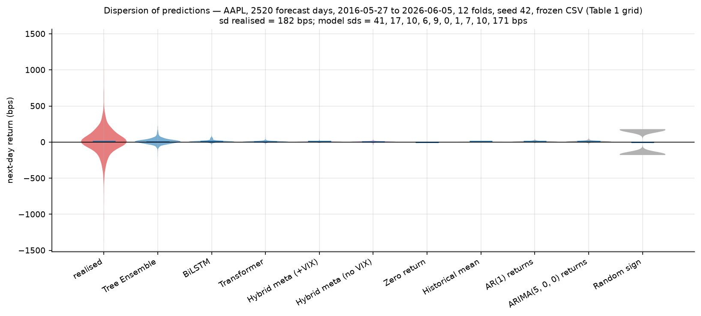

# Abstract

The same models, trained on the same frozen data with the same walk-forward
folds and hyperparameters, scored R² = 0.9627 on a next-day price target
under a conventional evaluation protocol and R²_OOS = −0.0003 on the
next-day return under a leak-free one; a naive zero-change forecast scored
0.9992 on the former. We isolated and measured five evaluation choices that
produce such numbers without a forecast behind them; none is leakage under
Kapoor and Narayanan's taxonomy. Across thirty US equities the tree ensemble
had positive R²_OOS on no ticker under any aggregation and eight
significant alphas that were all negative; nothing survived Holm-Bonferroni
correction. Two linear comparators scored within 0.018 of zero on every
ticker and showed a weak positive directional association on a few,
significant before correction under the measured null, surviving no
multiple-testing correction, converting to directional accuracy above the
majority class on four tickers by fold median and to a corrected alpha on
none. Train-test distribution shift, present in a third of folds, explained
11.6% of the variance in R²_OOS and 1.2% in directional accuracy. Across
five seeds, architecture differences were the size of seed noise. Code,
frozen data, 341 tests and every prediction are released.

# 1. Introduction

Of the ten primary studies of deep learning for equity prediction that we
survey in §2, nine forecast a price level rather than a return, none
reports a naive or persistence baseline at the level we could examine, and
none reports a significance test. The reported numbers are correspondingly
high: coefficients of determination of 0.98 on next-day closing prices,
mean absolute percentage errors of two to three percent. Our own earlier
pipeline was one of these. Predicting Apple's next-day close from a feature
set that included today's close, it reported R² = 0.9627, and described
itself as achieving state-of-the-art precision.

The gap in that protocol is not that the models were leaky in the sense
usually meant. Today's close is a legitimate input at forecast time. The gap
is that the protocol had no row that said what doing nothing scores. When we
added one, the naive "tomorrow equals today" forecast scored R² = 0.9992 and
a mean absolute percentage error of 1.23% on the same data, beating every
model on both metrics. R² on a trending price series measures the price
series, and a persistence forecast is the identity function computed
exactly. The number was real arithmetic on a target that could not
discriminate a forecaster from a copy.

We rebuilt the pipeline around a return target and a leak-free walk-forward
protocol, and then did two things the original protocol could not. First,
we ran the same models on the same frozen file, the same twelve folds and
the same hyperparameters under both protocols, so that the difference
between what each reported is attributable to the evaluation alone: the
best model's R² of 0.9627 became an out-of-sample R² of −0.0003 against the
historical mean (§4.1, §6.1). Second, we took the protocol to thirty US
large caps with the multiple-testing treatment that a thirty-ticker table
requires, added two well-regularised linear comparators so that the models
span the capacity range from ridge regression to a Transformer, reran the
neural architectures across five seeds, and tested the mechanism we
propose for the failure rather than asserting it (§5, §6).

What we found is a null result with a positive mechanism and one nuance.
The tree ensemble had positive out-of-sample R² on none of the thirty
tickers under any aggregation, two directional hits against 1.5 expected by
chance, and eight significant alphas that were all negative, the
signature of a model underexposed to a rising market rather than of skill;
nothing survived Holm-Bonferroni correction (§6.2, §6.3). The nuance came
from the linear comparators. Their out-of-sample R² sat within 0.018 of
zero on every ticker, positive on about half, which is what a forecast of
the unconditional mean scores; but they registered more directional hits
at the uncorrected 5% level than a binomial count expects, eleven of the
eighty-six defined tests across the three models against 4.3. That excess
was a positive association in every case, significant before correction
under the correlation we measured for the test statistics themselves and
not under the higher correlation a reader might assume for the returns; it
survived no multiple-testing correction across the ninety tests, it
converted to directional accuracy above the majority class on four of the
eleven tickers by fold median, and it converted to a corrected alpha on
none (§6.2). We report it as a weak, non-robust directional tilt, and we
report both nulls. A third of walk-forward folds trained on a return
distribution that differed detectably from the one they were scored on,
and that shift explained 11.6% of the variance in per-fold R²_OOS and 1.2%
of the variance in directional accuracy: the magnitude of the loss, not the
absence of signal (§6.4). Across five seeds, the difference between the two
neural architectures was the same size as the seed noise, so no ranking
between them is identifiable at one seed (§6.5). And in every model family
we observed the same convergence to the unconditional mean, from sequence
models whose test-fold predictions spanned under a tenth of their training
range to a ridge regression whose own cross-validation chose the largest
penalty on its grid (§7.3).

Along the way we isolated five evaluation choices that each produced a
plausible number without a forecast behind it, measured each in our own
pipeline, and found that none of them is leakage under the taxonomy of
Kapoor and Narayanan (2023); two, the construction of the benchmark and the
alignment of comparisons across models, are to our knowledge
uncharacterised (§4, §2.4). One of them, the cold-started benchmark,
recurred after we had found it, fixed it, flagged it and written a
regression test for it, and was caught the second time by a trivial
baseline scoring what it could not honestly score. We take that as the
paper's most transferable lesson: a check on the output survives a new call
site, and a check on the code does not (§4.2, §7.2).

We make six contributions, listed in §3 and summarised here: a controlled
before/after on identical data; five isolated and measured protocol
artifacts, none of them leakage and two uncharacterised; a thirty-ticker
null with correct multiple-testing treatment together with the weak
positive association that survives none of it; a distribution-shift
mechanism tested rather than asserted, with its ceiling stated; seed
variance that renders architecture comparisons unidentifiable; and an
open, tested artifact with 341 tests, mutation-tested leakage detection,
frozen data and a tagged results commit.

We are explicit about what we do not claim. We do not claim that markets
are efficient, that equity returns are unpredictable, or that deep learning
cannot work in finance. We tested three architectures and two linear
comparators, at one configuration each, on one horizon (the next trading
day), in one market (US large caps), for the most part at one seed; the
thirty-ticker evaluation covers the tree ensemble, the five baselines and
the two comparators, while the two neural architectures and the
meta-learner ran on five tickers. A large literature finds predictability
at longer horizons, in the cross-section and from information we did not
use, and nothing here speaks to it. Our claim is narrow: with these
features, this horizon, this universe and this protocol, the models did
not beat trivial baselines, and the protocol was strict enough that had
they done so the result would have been credible.

The rest of the paper is organised as follows. §2 reviews the three
literatures we draw on and positions this work against the closest prior
study. §3 lists the contributions. §4 treats the five protocol artifacts,
each with its mechanism, its measured magnitude and how to detect it, and
closes with a checklist. §5 gives the data, the row contract, the features,
the walk-forward design, the models, the baselines and the metrics, and
states two limitations in place. §6 reports the results. §7 discusses what
the null does and does not support and why the architectures converged.
§8 states the limitations at length. §9 is the reproducibility statement.

# 2. Related Work

Our work sits at the intersection of three literatures: deep learning
applied to equity price prediction, the forecast-evaluation methodology
developed in econometrics, and the recent body of work documenting leakage
and reproducibility failures in machine-learning-based science. We review
each in turn and then state our position relative to the closest prior work.

## 2.1 Deep learning for equity price prediction

The application of recurrent and attention-based architectures to equity
forecasting has produced a large literature over the past decade. Fischer
and Krauss (2018) established the reference point for this line of work:
they deployed long short-term memory networks to predict out-of-sample
directional movements of the constituent stocks of the S&P 500 from 1992 to
2015, and reported that the networks outperformed memory-free classifiers, a
random forest, a deep neural network and a logistic regression, and a
rules-based short-term reversal strategy. Wang et al. (2022) became the
corresponding reference point for attention-based work, applying a deep
Transformer to the prediction of major stock market indices, the CSI 300,
the S&P 500, the Hang Seng Index and the Nikkei 225, and comparing it with
convolutional and recurrent baselines by error metrics and by back-tested
trading.

We emphasise at the outset that our critique is not directed at these
papers. Fischer and Krauss forecast direction rather than price level,
evaluate on a broad cross-section rather than a single instrument, and
report comparisons against non-trivial benchmarks. Wang et al. evaluate
across four indices and report back-tested trading results alongside error
metrics; their target is the index series itself. Our critique
concerns a protocol pattern, price-level targets scored by fit statistics
without a trivial baseline or a significance test, and we document below
how common that pattern is.

The subsequent literature is large and heterogeneous. Architectural variants
have proliferated: convolutional-recurrent hybrids (Lu et al., 2020, 2021),
decomposition-based pipelines (Jin et al., 2020; Zhang et al., 2025),
sentiment-augmented models (Jin et al., 2020; Ouf et al., 2024) and
incremental-learning Transformers (Qian, 2025). Surveys of the field (Sezer
et al., 2020; Thakkar and Chaudhari, 2021; Shah et al., 2022) document
hundreds of such contributions. Reported performance is frequently very
high. A 2025 review in *Archives of Computational Methods in Engineering*
opens by observing that machine learning techniques are now used to predict
stock prices with high accuracy (Shafiei Hafshejani and Mansouri, 2025), a
framing that reflects the prevailing view rather than an outlier position.

Three properties of this literature motivate our study. Rather than assert
them, we tabulate them for the ten primary studies cited in this section,
recording for each the prediction target, whether a naive, persistence,
zero-return or majority-class baseline is reported, whether any
significance test or uncertainty quantification is reported, and the level
at which we were able to check (full text, abstract, or secondary
description). Absence from an abstract is not proof of absence from a
paper, so the baseline and significance counts are reported at the level
examined and should be read as what the papers foreground.

| Study | Target | Naive or persistence baseline | Significance test or uncertainty | Checked at |
|---|---|---|---|---|
| Fischer and Krauss (2018) | direction (S&P 500 constituents) | none; benchmarks are RF, DNN, LR and a reversal strategy | none reported | abstract |
| Wang et al. (2022) | index series | none reported | none reported | secondary |
| Lu et al. (2020) | next-day closing price, Shanghai Composite | none reported | none reported | abstract |
| Lu et al. (2021) | next-day closing price, Shanghai Composite | none reported | none reported | abstract |
| Jin et al. (2020) | closing price | none reported | none reported | abstract |
| Ouf et al. (2024) | price (Apple, Google, Tesla) | none reported | none reported | abstract |
| Zhang et al. (2025) | price (one Shanghai stock) | none reported; ARIMA and six networks | none reported | abstract |
| Qian (2025) | closing price (two Chinese indices, three stocks) | none, anywhere in the paper | none; 20-run averages without error bounds | full text |
| Chaudhary (2025) | closing price (Apple, Google, Microsoft, Amazon) | none; ARIMA only | none; confidence intervals deferred to future work | full text |
| Tejas et al. (2026) | multi-step price | not reported in abstract | not reported in abstract | abstract |

First, price levels are the dominant target: nine of the ten studies
forecast a price or index level, and one forecasts direction. As the
cleanest illustration, Chaudhary (2025) forecasts the closing prices of
Apple, Google, Microsoft and Amazon from Yahoo Finance data, using a sliding
window of sixty days of normalised prices, moving averages and sentiment
scores to predict the sixty-first day's close, and reports a mean absolute
percentage error of 2.72% for Apple against ARIMA as the sole comparison.
The previous close is in the feature window, no persistence baseline is
reported, and no significance test is reported. This is the artifact of
§4.1 in its simplest form, on substantially the same data as our own
experiments. Lu et al. (2021) report a coefficient of determination of
0.9804 for next-day closing prices of the Shanghai Composite Index; our own
pre-refactor pipeline reported 0.9627 on the same kind of target, and a
naive zero-change forecast scored 0.9992 on it (§4.1).

Second, trivial baselines are rarely reported. None of the ten studies
reports a naive, persistence, zero-return or majority-class baseline at the
level we examined, including both full texts. The comparison models are
other learners: ARIMA, other networks, or in Fischer and Krauss's case a
rules-based strategy.

Third, significance testing is uncommon. None of the ten reports a
significance test or an uncertainty quantification at the level examined;
of the two full texts, one presents averages over twenty runs without error
bounds and the other names confidence intervals as future work. This
mirrors a finding reported outside finance: in a reproducibility study of
civil war prediction, Kapoor and Narayanan (2023) found that nine of the
twelve papers for which complete code and data were available included no
significance tests or uncertainty quantification for classifier performance
comparison.

## 2.2 Forecast evaluation methodology

The statistical apparatus required to evaluate forecasts rigorously is long
established. Diebold and Mariano (1995) introduced the standard test for
comparing the predictive accuracy of two forecasts. Pesaran and Timmermann
(1992) provided a non-parametric test of directional predictive performance
that accounts for the marginal frequencies of predicted and realised signs,
a correction that matters precisely when a predictor is close to constant.
Campbell and Thompson (2008) formalised the out-of-sample R² against an
expanding historical-mean benchmark, which has since become the standard
measure of return predictability. Harvey, Liu and Zhu (2016) argued for
substantially raised significance thresholds in cross-sectional asset
pricing given the volume of hypotheses tested, and Bailey et al. (2014)
documented the effect of backtest overfitting on out-of-sample performance.

Two results in this literature bear directly on ours. Welch and Goyal
(2008) evaluated a broad set of equity premium predictors out of sample and
found that most fail to outperform the historical average, a result that
reframed the return-predictability literature around the difficulty of
beating a trivial benchmark. Our finding is the deep-learning-era analogue
of theirs: the architectures we evaluate do not outperform the historical
mean at the daily horizon, and the metric by which we establish this is the
one Campbell and Thompson proposed in direct response to Welch and Goyal.

This apparatus is standard in the forecasting and empirical asset pricing
literatures. It is not standard in the deep-learning stock prediction
literature surveyed in §2.1, and that gap is the subject of our paper.

## 2.3 Leakage and reproducibility in machine-learning-based science

Kapoor and Narayanan (2023) surveyed twenty-two papers that identify
pitfalls in the adoption of machine learning across seventeen scientific
fields and found that data leakage collectively affected at least 294
papers, in some cases producing wildly overoptimistic conclusions. They
introduced a taxonomy of eight leakage types organised under three headings:
lack of clean separation between training and test data (L1, comprising no
test set, L1.1; pre-processing on training and test set, L1.2; feature
selection on training and test set, L1.3; and duplicates, L1.4); use of
features that are not legitimate (L2); and a test set not drawn from the
distribution of scientific interest (L3, comprising temporal leakage, L3.1;
nonindependence between training and test samples, L3.2; and sampling bias
in the test distribution, L3.3). Their survey records, separately from
leakage, further categories of pitfall, among them metric choice, a mismatch
between the evaluation metric and the scientific question, which four of
the surveyed papers highlighted. They proposed model info sheets, twenty-one
questions organised by the taxonomy, as a preventive instrument.

Their case study is the closest precedent for the form of our result. In
civil war prediction, complex models were believed to substantially
outperform logistic regression. From a systematic search yielding 124
papers they examined the twelve that predicted civil war with a train-test
split and shared complete code and data, and found errors in four, exactly
the four that claimed superior performance for complex models. When the
errors were corrected, the complex models performed no better than the
logistic regression baseline in each case except one, where the gap in area
under the curve fell from 0.14 to 0.01; and this against logistic
regressions that had been specified as explanatory models rather than tuned
for prediction. They situate this alongside comparable findings for
children's life outcomes and recidivism, and recommend research that
identifies and communicates the limits to prediction in a given domain.

Within finance, Prata et al. (2024) conducted the closest study to ours.
They evaluated fifteen state-of-the-art deep learning models for stock price
trend prediction on limit order book data through an open-source framework,
and reported that all models exhibit a significant performance drop when
exposed to new data, raising questions about their real-world
applicability.

Correct practice is not absent from the recent stock-prediction literature.
Tejas et al. (2026) normalise their inputs with strictly backward-looking
rolling z-scores and protect against leakage with an expanding walk-forward
gap, and report under that protocol that a standalone LSTM and a CNN-LSTM
both fail to outperform their best feed-forward network. We read this as
consistent with the convergence behaviour we document in §7.3, though we
have not verified the authors' own account of the mechanism. Positive
results for machine learning in equity returns are well supported in the
cross-section and at longer horizons (Gu, Kelly and Xiu, 2020); our claim
is specific to the daily single-name horizon, and we state it as such.

## 2.4 Position of this work

Our contribution differs from the three literatures above in the following
respects.

Relative to §2.1, we do not propose an architecture. We evaluate established
ones under a protocol designed to eliminate the specific failure modes we
identify, and we report the difference between what the conventional
protocol reports and what the corrected protocol reports on identical data.

Relative to §2.2, we do not introduce a statistical method. We apply
existing tests to a literature in which they are seldom applied, and we
quantify how much of the reported performance in that literature they
remove.

Relative to §2.3, our position requires more care, and it is the sharpest
way to state our contribution. The leakage we found in our own data layer
and removed, a backward fill of macroeconomic series and a global rescaling,
maps cleanly onto their taxonomy as temporal leakage (L3.1) and
pre-processing across the split (L1.2), and neither is among the five
artifacts of §4, because neither produced a headline number. None of the
five artifacts is leakage under their definition:

- The first, a price-level target evaluated while the previous close is
  available as a feature, involves no illegitimate feature (the previous
  close is available at forecast time) and no contamination of the test
  set. The overoptimism arises from a target and metric specification under
  which a trivial persistence forecast attains a high coefficient of
  determination. Kapoor and Narayanan record metric choice as a category of
  pitfall separate from leakage; this artifact belongs there.
- The second, a cold-started out-of-sample benchmark, falls outside their
  framework entirely. The error resides in the construction of the reference
  quantity rather than in the model, the features or the test distribution.
  To our knowledge this failure mode has not previously been characterised.
- The third, comparison of models evaluated over non-identical test
  windows, is adjacent to sampling bias in the test distribution (L3.3) but
  distinct from it: each model's test set may be individually representative
  while the comparison between them remains invalid. We know of no prior
  characterisation of it either.
- The fourth and fifth, sensitivity of a reported estimate to the
  evaluation-window length and to the random seed, are failures of
  uncertainty quantification. Kapoor and Narayanan document the absence of
  uncertainty quantification as an empirical finding of their case study,
  but it lies outside the leakage taxonomy, and we measure two specific
  mechanisms by which its absence inflates a reported result.

We therefore position this work as an extension of Kapoor and Narayanan's
framework rather than a further illustration of it. All five failure modes
we document produce the same overoptimism as leakage while arising from
error classes outside the leakage taxonomy; two of them, the benchmark
construction and the alignment of comparisons, are to our knowledge
uncharacterised anywhere; and we suggest that a complete account of
reproducibility failure in predictive science must address the construction
of benchmarks, the alignment of comparisons and the stability of reported
estimates alongside the integrity of the train-test split.

Relative to Prata et al. (2024), we differ in data, task and contribution.
They evaluate limit order book models on an intraday trend-classification
task and measure generalisation failure across datasets. We evaluate daily
OHLCV models on an absolute return-regression task and attribute the gap
between reported and corrected performance to five separately measured
causes.

# 3. Contributions

We make six contributions, in descending order of strength.

1. **A controlled before/after on identical data.** The same models,
   trained on the same frozen file (`docs/frozen_aapl_raw.csv`), the same
   twelve walk-forward folds and the same hyperparameters, scored R² = 0.9627
   on a price-level target under the conventional protocol and R²_OOS =
   −0.0003 on the return target under the corrected one (pooled; +0.0011 by
   fold median, −0.0022 ± 0.0109 by fold mean). Only the target and the
   evaluation changed. The naive zero-change forecast scored R² = 0.9992 on
   the price target and beat every model (§4.1, §6.1).

2. **Five protocol artifacts, each isolated and measured in our own
   pipeline.** A price-level target with the previous close as a feature; a
   cold-started out-of-sample benchmark (+0.087 against −0.005 on the
   fixture, +0.0349 against −0.0006 across thirty tickers, one ticker moved
   from apparently positive to none); evaluation windows that differed
   across models (1.9 to 2.3 points of directional accuracy); a short
   evaluation window (the same test at p = 0.0203 on 420 days and p = 0.552
   on 2520, with opposite signs); and single-seed neural results (the one
   significant directional result among five seeds, and an R²_OOS that
   changed sign across them). None of the five is leakage under Kapoor and
   Narayanan's taxonomy, and two, the benchmark construction and the
   alignment of comparisons, are to our knowledge uncharacterised (§4, §2.4).
   The cold benchmark recurred after it had been fixed, flagged and
   regression-tested, and was caught by a trivial baseline rather than by
   the test; the fix is now structural (§4.2).

3. **A cross-ticker null with correct multiple-testing treatment, and the
   weak positive directional association that survives none of it.** Across
   thirty US large caps the tree ensemble had positive R²_OOS on no ticker
   under pooled, fold-mean or fold-median aggregation, two directional hits
   against 1.5 expected, and eight alpha hits that were all negative;
   nothing survived Holm-Bonferroni. Two linear comparators added at the
   bottom of the capacity range scored within 0.018 of zero by fold median
   on every ticker and registered more directional hits than chance,
   significant before correction under the correlation we measured for the
   test statistics and not under the correlation a reader would assume;
   none survived correction across the ninety tests, eight of the eleven
   beat their majority class pooled and four did by fold median, and none
   produced a corrected alpha (§6.2, §6.3).

4. **A distribution-shift mechanism, tested rather than asserted, with its
   ceiling stated.** A third of the 357 fold-ticker pairs rejected a
   train-test Kolmogorov-Smirnov test at 5%, 6.7 times the null rate;
   per-fold R²_OOS fell with the KS statistic (t = −6.84); and the fit
   explained 11.6% of the variance in R²_OOS and 1.2% of the variance in
   directional accuracy. Shift explains the magnitude of the loss, not the
   absence of directional signal (§6.4). A related finding is that pooled
   statistics inherit their extreme folds: one fold boundary on the March
   2020 low moved pooled R²_OOS by 0.09, which is why the headline magnitude
   is the fold median (§5.7, §8.3).

5. **Seed variance that renders architecture comparisons unidentifiable.**
   Over five seeds each, the ratio of the BiLSTM-Transformer gap to the seed
   standard deviation was 1.66 on R²_OOS and 1.69 on directional accuracy,
   inside the 90% interval [0.67, 1.77] expected if the two architectures
   were identical; the Transformer's R²_OOS changed sign across seeds, and
   the study's one significant directional result was the expected chance
   hit from ten tests (§6.5).

6. **An open, tested artifact.** 341 tests, all offline; a truncation-
   invariance leakage check whose power is demonstrated by six injected
   leaks that it must catch; a frozen input with a published hash; every
   prediction behind every table committed, with the results tagged
   `v1.0-results` and the environment frozen in a lock file; and Table 1
   reproducible by one command with no network access (§5.3, §9).

# 4. Protocol artifacts

A protocol artifact is an evaluation choice that produces a good-looking
number without a forecast behind it. None of the five below crashes a
pipeline. Each produced plausible output in ours, and each was found by
noticing that a trivial baseline scored in a way it could not honestly score.
This section treats them one at a time, and for each covers three things in
order: the mechanism, the magnitude measured in our own pipeline with the
artifact cited, and how a reader detects it in their own work. It closes
with a checklist.

Every number is read from a committed file in the repository at the results commit recorded in §9.1 (results tagged `v1.0-results` at `3fa7f8b`) or from the message
of a commit in its history, and the source is named beside it.

| # | Artifact | Measured effect | Where |
|---|---|---|---|
| 4.1 | Price-level target with the previous close as a feature | R² 0.9627 → R²_OOS −0.0003, same model, same data, same folds | `docs/baseline_before_refactor.csv`, `docs/baseline_after_refactor.csv` |
| 4.2 | Cold-start R²_OOS benchmark | zero-return baseline +0.087 vs −0.005 (fixture); +0.0349 vs −0.0006 (30 tickers); 1 of 30 tickers moved from apparently positive to 0 of 30 | commit `db46cb3`, `tests/test_baselines.py`; recomputed from `results/predictions/` against `results/per_ticker_model.csv` |
| 4.3 | Mismatched evaluation windows across models | base models lost 1.9 to 2.3 points of directional accuracy; their lead over the meta-learner narrowed from about 5 points to 2.3 to 3.5 | commit `710d90c`; README §5.1, §12 |
| 4.4 | Short evaluation window | the same VIX-gating test: DM +2.32, p = 0.0203 on 420 days; DM −0.595, p = 0.552 on 2520 days; opposite signs | `analysis/alpha_correction_and_window.py`; README §12 |
| 4.5 | Single-seed neural results | the project's only significant directional result appears in 1 of 5 seeds; the Transformer's R²_OOS changes sign across seeds | `results/seeds/`; README §3.3; commit `3fa7f8b` |

## 4.1 A price-level target with the previous close as a feature

**Mechanism.** Ask a model to predict tomorrow's closing price and give it
today's closing price as an input. The cheapest function that fits is the
identity: output the input. On a trending price series the variance of the
target is almost entirely the variance of the level, which the identity
reproduces, so R² on the price target measures the price series rather than
the forecast, and a mean absolute percentage error of one or two percent is
what a random walk looks like at a daily horizon. The number that exposes
this is the naive "tomorrow equals today" baseline: under this protocol it is
the identity function computed exactly, so it scores at least as well as any
model that has merely approximated the identity. A protocol that reports
R² on price levels without that baseline cannot tell a forecaster from a
copy.

**Magnitude.** The previous version of this pipeline predicted the next-day
close from a feature set that included the close, moving averages of the
close, Bollinger bands and lagged closes (the intermediates now listed in
`src/fetch_data.py`, `LEGACY_LEVEL_COLUMNS`). Its comparison table was
frozen as `docs/baseline_before_refactor.csv`, produced at commit `3933168`
on the frozen file `docs/frozen_aapl_raw.csv` with the twelve-fold
configuration of §5.4 (commit `d26ad59`). The refactored pipeline was then
run on the same file with the same folds, giving
`docs/baseline_after_refactor.csv`.

| Model | Before: R² on price | Before: MAPE (%) | After: R²_OOS on return |
|---|---|---|---|
| Hybrid meta (regressor; "+VIX" after) | **0.9627** | 9.89 | **−0.00029** |
| Tree ensemble | 0.9482 | 9.27 | −0.02037 |
| Transformer | 0.8562 | 17.59 | +0.00102 |
| BiLSTM | 0.4488 | 40.48 | −0.00499 |
| ARIMA (5,1,0) before; (5,0,0) on returns after | 0.8876 | 16.30 | −0.00753 |
| Naive zero-change before; zero return after | **0.9992** | **1.23** | −0.00276 |

The "after" column is the pooled R²_OOS. For the same meta-learner the
across-fold median is +0.0011 and the across-fold mean −0.0022 ±
0.0109 (§6.1; `results/fold_aggregates_headline.csv`); under no
aggregation is it distinguishable from zero, and the contrast with 0.9627
is the same under all three.

The naive baseline beat every model on both of the old protocol's metrics,
and the protocol could not show it because the table had no row that said
"this is what doing nothing scores". The best model's R² of 0.9627 became
R²_OOS of −0.00029 with nothing changed but the target and the evaluation:
same bytes in, same fold boundaries, same hyperparameters. The old table's
directional accuracy column (46 to 52%) was itself an artifact of a second
kind, computed by differencing the concatenated prediction series and so
inventing an observation at every fold boundary (README §12, item 2); it is
not used here.

**Detection.**

- Put a last-value baseline in every table, under the same metric as the
  models. If it sits at or near the top, the metric is measuring the series.
  In this pipeline the zero-return baseline is a first-class model with the
  same contract as every other (`src/baselines.py`,
  `zero_return_baseline`).
- Move the target to return space and score against a benchmark that is
  itself a forecast (§4.2). The price-space metrics survive only as a
  labelled secondary table (`src/evaluate.py`, `PRICE_METRICS_CAVEAT`).
- Bound the correlation between any feature and the target. Here no feature
  may correlate above 0.5 in absolute value with the next-day return, on the
  grounds that anything higher means the target has leaked in; the observed
  maximum is 0.205 (`tests/test_leakage.py`,
  `MAX_ABS_TARGET_CORRELATION`; README §7).
- Ban levels by default. Every raw column is excluded from the feature set
  unless it is named in an explicit allow-list with a reason
  (`src/fetch_data.py`, `LEVEL_FEATURES_ALLOWED`;
  `tests/test_leakage.py`, `test_feature_set_contains_no_price_levels`).

## 4.2 The cold-start R²_OOS benchmark

This artifact gets an extended treatment because of what happened after it
was fixed.

**Mechanism.** Out-of-sample R² (Campbell and Thompson, 2008) is
1 − SSE_model / SSE_benchmark, with the benchmark the expanding mean of all
returns observed before each forecast day. The benchmark is a forecast too,
and it has to be given its history. If the expanding mean is started from
nothing at the first day of a test period, its first values are means of
one and two observations. When that period opens on a volatile stretch,
those are forecasts of double-digit daily moves, the benchmark's squared
error inflates, and the ratio falls for every model identically. The
symptom is that a forecast of zero, which can only be about as good as the
historical mean, scores clearly better than it.

The specification was right. `REFACTOR_PLAN.md` §4.2 defines the benchmark
as "the expanding-window historical mean return computed only from data
before each prediction. Not the test-set mean." The implementation dropped
the training history: it built one expanding mean over the pooled test
series with no seed.

**Magnitude, first occurrence.** The bug was found while writing the
baseline tests in Phase 5. On the test fixture (1008 raw rows of AAPL,
2018 to 2021, whose test period opens on the March 2020 crash), the
zero-return baseline scored R²_OOS = **+0.087** with the cold benchmark and
**−0.005** with the benchmark seeded from each fold's training returns
(commit `db46cb3`; `tests/test_baselines.py`,
`test_an_unseeded_benchmark_inflates_r2_oos`, whose docstring records both
numbers). Every model would have been flattered by the same amount. The fix
assembled the pooled benchmark per fold, each fold seeded with its own
training returns (`src/evaluate.py`, `evaluate_predictions`,
`expanding_mean_benchmark`), and added three defences: the result carries a
boolean `unseeded_benchmark`; the report printer warns when it is true
("R2_OOS is biased upward; pass y_train_by_fold", `print_evaluation`); and a
regression test asserts that on the fixture the cold benchmark is more than
0.05 too optimistic and the seeded one is within 0.05 of zero.

**The recurrence.** The 30-ticker sweep persists every prediction to
`results/predictions/` and recomputes its aggregates from disk. The
aggregation function, `aggregate` in `src/experiments.py`, calls
`evaluate_predictions(predictions, model_name=..., validate=False)` and
passes no training returns, because a long parquet of predictions does not
carry them. The result dictionaries it received each had
`unseeded_benchmark = True`. Nothing on that path reads the flag: the
printer that carries the warning is not called during aggregation. The
sweep's entry point calls `write_aggregates` at the end of every run, which
calls `aggregate` and writes the cold numbers out. The bug therefore came
back, in a codebase built specifically to prevent it, by people who had
already found it once, with a fix, a flag, a warning and a regression test
in place.

The regression test did not catch it, and could not have. It tests
`evaluate_predictions` on the fixture with and without seeds, and that
function behaved exactly as tested. The new call site simply did not pass
the seeds, and no test asserted that every call site does. What caught it
was a sanity check on the output: the zero-return baseline scored +0.035 on
all thirty tickers, and a forecast of zero cannot beat the historical mean
by three and a half percent (`analysis/cross_ticker_sweep.py`, comment at
the training-returns rebuild; README §12, item 4).

**Magnitude, recurrence, recomputed from committed files.** The cold path
is still callable, so its output can be regenerated from the committed
predictions alone and set beside the committed seeded table:

| | Cold benchmark (`experiments.aggregate` on `results/predictions/`) | Seeded (`results/per_ticker_model.csv`) |
|---|---|---|
| Zero-return baseline, mean R²_OOS over 30 tickers | **+0.0349** | **−0.0006** |
| Tree ensemble, tickers with R²_OOS > 0 | **1 of 30** (JNJ, +0.0001) | **0 of 30** (JNJ: −0.0533; maximum −0.0318) |

The seeded numbers come from the analysis path, which rebuilds each
ticker's dataset from the raw cache to recover its training returns before
evaluating (`analysis/cross_ticker_sweep.py`). The cold path above is the
code as it stood when the recurrence was found; it can be checked out at
commit `a2995de` and run, which is how the table was produced.

**The fix was structural.** After the recurrence we stopped relying on
care. The training-returns argument of the evaluator is now required and
keyword-only, so omitting it is a `TypeError` at the call site before
anything runs; passing `None`, or a mapping that lacks any fold present in
the predictions, raises `UnseededBenchmark` before any metric is computed;
the `unseeded_benchmark` flag and its printed warning no longer exist,
because a flag that nothing reads is not a defence (`src/evaluate.py`,
`require_training_returns`). The aggregation path that recurred now takes a
required loader for the raw data and rebuilds every fold's training returns
from the run's own test windows (`src/experiments.py`, `aggregate`,
`training_returns_for_run`); the cold call is no longer expressible. The
regression test that missed the recurrence was replaced by one that asserts
the refusal in all three forms and reproduces the +0.087 by building the
cold benchmark by hand, so the size of what the refusal prevents stays on
record (`tests/test_baselines.py`, `test_an_unseeded_benchmark_is_refused`;
`tests/test_metrics.py`, `test_refuses_to_run_without_training_returns`).

**What this shows.** Care is demonstrably insufficient. A correct
specification, a fix by people who understood the failure, a flag on every
result, a printed warning and a passing regression test did not prevent a
recurrence three phases later, because the recurrence happened at a call
site none of those things covered. What worked was a baseline whose correct
score is known a priori: a forecast of zero must score about zero against
the historical mean, and when it scored +0.035 the number could not be
believed. Trivial baselines are not a courtesy to the reader; they are the
only check that operates on the output rather than on the code, and so the
only one that survives a new call site.

**Detection.**

- Run a zero forecast through the same R²_OOS code as the models. Its
  score against the historical mean must be near zero or slightly
  negative. A do-nothing forecast at +0.03 means the benchmark is wrong,
  whatever the tests say.
- Seed the benchmark from the training data of the fold, and make the seed
  argument impossible to omit at every call site: raise, rather than flag,
  when it is missing. This pipeline flagged, the flag was not enough, and
  it now raises.
- Print the benchmark's first few values for each fold. A one-observation
  mean of a crash-day return is visible to the eye.
- Recompute aggregates from persisted predictions, never from memory, so
  that a cold aggregate can be regenerated and compared, as in the table
  above (`REFACTOR_PLAN.md` §9; `src/experiments.py`, `load_runs`).

## 4.3 Mismatched evaluation windows across models

**Mechanism.** A stacked meta-learner that is fitted only on earlier folds'
out-of-fold predictions cannot forecast the earliest folds, so it covers
fewer days than its base models. Scoring each model over the days it
happens to cover compares different periods. If the days only the base
models cover are unusual, the comparison is biased, in either direction,
by however unusual they are. Nothing in the arithmetic flags it: every
model gets a number, and the table looks complete.

**Magnitude.** On the AAPL fixture with the nine-fold configuration of
§5.4, the meta-learner covered 420 of the 540 days the base models did. The
excluded folds ran from 2019-10-16 to 2020-04-07, the 2020 crash, with
3.22% daily realised volatility against 1.92% in the retained window and a
13.8% single-day move. The base models were being scored across the most
volatile stretch in the sample while the meta-learner never saw it.
Restricting every model to the common window cost the base models 1.9 to
2.3 percentage points of directional accuracy and narrowed their apparent
lead over the meta-learner from about 5 points to 2.3 to 3.5. The bias was
real and it favoured the base models (commit `710d90c`; README §5.1, §12
item 6). The same commit found a second instance in the economics: the
buy-and-hold benchmark had been computed over whichever model came first in
the dictionary, the base models' full range, so the meta-learner's rows were
compared with a buy-and-hold measured over two folds it was never allowed to
trade.

Every primary comparison now runs on the intersection of all models'
forecast days, including the meta's (`src/contracts.py`,
`common_evaluation_window`, which asserts the intersection is non-empty and
contiguous, and `restrict_all`). On the headline run that is folds 2 to 11,
2520 days (§5.4). The economics table refuses to compare strategies over
different day sets (`src/backtest.py`, `backtest_table`,
`require_identical_days`) and names the frame buy-and-hold is computed from
(`benchmark_predictions`). Models that cover more days are still reported
over their full range, in a separate table labelled secondary and never
mixed into the primary one (`data/model_comparison_full_range.csv`; README
§11).

**Detection.**

- Before any cross-model table, assert that the set of forecast days is
  identical across models. If it is not, restrict all models to the
  intersection and report what was excluded.
- Report the volatility of the excluded days beside the volatility of the
  retained ones. A gap the size of the one above is the artifact.
- Compute the market benchmark on exactly the days each strategy could
  trade. A benchmark measured over a range a strategy could not enter is a
  different benchmark.
- Keep the full-range numbers, labelled, in a table of their own. Deleting
  them hides the size of the effect; mixing them in reintroduces it.

## 4.4 Short evaluation windows

**Mechanism.** A test statistic computed on a short window of one ticker
has enough sampling variance that sign and significance both depend on the
window. At the 5% level a null effect reaches significance one time in
twenty by construction, and from inside a single window there is no way to
tell which time this is. The artifact is not the short window itself but
reporting its p-value as if it were a property of the method.

**Magnitude.** The pipeline asks whether adding the VIX level to the
meta-learner's inputs changes its forecasts, and answers with a
Diebold-Mariano test between the two variants' error series. The same test,
same code, same statistic, on two windows:

| Window | Days | DM statistic | p | Favours | Significant at 5% |
|---|---|---|---|---|---|
| Fixture, 2018 to 2021 | 420 | **+2.321** | **0.0203** | no VIX | yes |
| Full span, 2016 to 2026 | 2520 | **−0.595** | **0.5519** | with VIX | no |

(`analysis/alpha_correction_and_window.py`, the window-artifact table;
README §12, item 5.) The short window says VIX gating significantly hurts;
the long one says the two variants are indistinguishable and, if anything,
VIX helps. The signs are opposite. The project's own earlier reading of the
short-window result is on record: a commit interpreting the ridge grid
found that "adding VIX makes the meta want roughly ten times more
regularisation ... which agrees with the DM test favouring −VIX at p=0.02"
(commit `d26ad59`). That agreement was between two readings of the same 420
days, and it did not survive the full span.

**Detection.**

- Report the window length, in days, beside every p-value, and the number
  of tickers it covers.
- Re-run the test on the longest window available before reporting a sign.
  If the sign changes, report both and claim neither.
- Treat a single-ticker finding on fewer than a few years of daily data as
  a hypothesis for a longer window, not a result.
- Keep a separate short fixture for testing mechanism and refuse to report
  numbers from it. This pipeline's fixture exists for exactly that
  (`analysis/alpha_correction_and_window.py`: "the fixture is for testing
  mechanism, not for producing results").

## 4.5 Single-seed neural results

**Mechanism.** Neural training is a stochastic procedure: weight
initialisation, dropout masks and, with shuffling, batch order all depend
on the seed. A result at one seed is one draw from a distribution over
seeds, and a comparison between two architectures at one seed each is a
comparison between two draws. When the seed spread is as large as the gap
between architectures, the ranking is not identifiable from one seed, and
any single significant result among several seeds is what chance produces.

**Magnitude.** Five seeds each of the BiLSTM and the Transformer on AAPL
under the headline fold configuration (`results/seeds/`; 12 folds; run on
the sweep's fetch cache, see §5.4 for the grid offset). Two of the
project's apparent positive findings dissolve:

- **The Transformer's R²_OOS changes sign across seeds**, from −0.0106 to
  +0.0010 (README §3.3; commit `3fa7f8b`). The Transformer's +0.00102
  (`docs/baseline_after_refactor.csv`), the only positive pooled R²_OOS
  among the original ten models of Table 1 (the ridge comparator added
  later scores +0.0012, §6.1), is seed 42 landing on one side of a
  distribution that straddles zero.
- **BiLSTM seed 4 reports a Pesaran-Timmermann p of 0.0137** with
  directional accuracy 0.43 points above its majority class, the only
  neural configuration in this project to beat its majority class with a
  significant directional statistic (the linear comparators' directional
  hits are treated in §6.2). Its other four seeds give p = 0.329,
  0.521, 0.708 and 0.893; the five Transformer seeds give 0.201 to 0.696
  (recomputed from `results/seeds/` with `src/evaluate.py`; README §3.3).
  The seed study ran ten tests, two architectures by five seeds, so the
  expected number of hits at the 5% level is 0.5 and the probability of at
  least one is 1 − 0.95¹⁰ = 0.401. This is the expected chance hit.

The ratio of the architecture gap to the seed standard deviation is 1.66 on
R²_OOS and 1.69 on directional accuracy; under a null in which the two
architectures are identical, the 90% interval of that ratio at five seeds
is [0.67, 1.77], obtained by simulation, and both observed values fall
inside it (README §3.3). The seed variance and the architecture difference
are the same order of magnitude, and the paper accordingly withdraws any
ranking of one architecture over the other.

**Detection.**

- Never report a neural comparison at one seed. Report the range or the
  standard deviation across seeds beside every point estimate, as Table 1
  does for its BiLSTM and Transformer rows (README §3.1).
- Count the tests. With *k* seeds and *m* architectures there are *k·m*
  chances at a 5% hit; report the expected number and the probability of at
  least one.
- Do not rank architectures whose seed clouds overlap. State that the
  ordering is not identifiable at the number of seeds run.
- Say which results are single-seed. Here the thirty-ticker sweep is seed
  42 only, and the hybrid rows of Table 1 are marked single-seed because
  their spread was never measured (README §3.1, §8.3).

## 4.6 A detection checklist

Each item is a check on the output, not on the code, and each is one that
this pipeline either failed once or was built to enforce. The artifact it
targets is in brackets.

1. **A do-nothing forecast in every table, under the same metric.** A
   zero-return or last-value baseline that scores well means the metric is
   measuring the series or the benchmark is wrong. [4.1, 4.2]
2. **R²_OOS of the zero forecast near zero or negative.** If it is
   positive by more than sampling noise, the benchmark started cold. [4.2]
3. **Benchmark seed mandatory, not flagged.** A missing training history
   should raise at every call site. A flag that nothing reads is not a
   defence; this pipeline's flag was read by nothing on the path that
   recurred, and has been replaced by a required argument. [4.2]
4. **Aggregates recomputed from persisted predictions**, so a suspect
   number can be regenerated and compared, as in the cold-versus-seeded
   table above. [4.2]
5. **No feature correlated with the target above a stated bound**, and no
   level-valued feature without a named reason. [4.1]
6. **Identical forecast-day sets across models before any comparison**,
   asserted, with the excluded days' volatility reported. [4.3]
7. **The market benchmark computed on the days each strategy could
   trade.** [4.3]
8. **Window length and ticker count beside every p-value**, and every
   sign re-tested on the longest available window. [4.4]
9. **Seed ranges beside every neural point estimate**, the number of tests
   counted, and no ranking where the seed clouds overlap. [4.5]
10. **Every number traceable to a committed file.**

# 5. Method

Every number in this section is read from a committed file in the repository
at the results commit recorded in §9.1 (results tagged `v1.0-results` at `3fa7f8b`), and the file
is named where the number appears.

## 5.1 Data and universe

**Source.** Daily open, high, low, close and volume from Yahoo Finance through
the `yfinance` client, joined to three daily macro series from the same
source: the S&P 500 index (`^GSPC`), the CBOE VIX (`^VIX`) and the 10-year
Treasury yield (`^TNX`) (`src/fetch_data.py`, `MACRO_SYMBOLS`,
`fetch_stock_data`). The macro series are forward-filled only; a backward fill
would move a future observation into the past and is excluded by test (§5.3).

**The headline series.** The single-ticker results (Table 1) are computed on a
frozen file, `docs/frozen_aapl_raw.csv`: AAPL, 4144 trading days from
2010-03-16 to 2026-09-03, 34 columns (raw inputs plus the previous feature
set, which is discarded and recomputed on load), SHA-256
`213808b8e187e49a6a0406e5d217428b1ded57848409d42a723945b950a57ac5`
(README §9). Freezing the file is what makes the before/after comparison
in §6.1 a comparison of code alone: both protocols read the same bytes.
Feature engineering (§5.3) consumes 49 leading rows for the longest rolling
window and one trailing row whose next-day target does not exist, leaving
4094 rows of 31 features, the first dated 2010-05-25 (computed from the frozen
file with `src/dataset.py`, `build_dataset`).

**The universe.** The cross-sectional evaluation uses thirty US large-cap
equities in six sector groups, listed in `src/experiments.py`
(`DEFAULT_TICKERS`):

| Group | Tickers |
|---|---|
| Technology | AAPL, MSFT, NVDA, AVGO, CRM, ORCL |
| Communication services | GOOGL, META, NFLX, DIS |
| Consumer | AMZN, TSLA, HD, MCD, NKE, PG, KO, WMT |
| Financials | JPM, BAC, GS, BRK-B |
| Health care | JNJ, UNH, PFE, MRK |
| Industrials, energy, utilities | CAT, BA, XOM, NEE |

Each was fetched from 2010-01-01 with an open end date
(`src/fetch_universe.py`, `--start` default; `src/experiments.py`,
`REGIMES["full"]`). The fetch cache itself is not committed (`results/raw/`
is gitignored), so the per-ticker raw row counts and end
dates of the 29 non-AAPL series, and the calendar date on which the sweep's
cache was fetched, are not recoverable from a committed artifact. What is
committed is every prediction the sweep made (`results/predictions/`, 595,224
rows). From those, the first forecast day is 2014-03-19 for 28 of the 30
tickers; the two later listings start later and have fewer folds, META from
2016-08-03 with 10 folds and TSLA from 2014-09-11 with 11. Last forecast days
run from 2025-09-18 to 2026-08-12, the spread being a consequence of the
start-anchored fold grid (§5.4) rather than of differing data ends.

**Survivorship bias, stated.** All thirty names trade today. Firms that were
delisted, acquired or went bankrupt between 2010 and 2026 are absent, which
biases every cross-sectional aggregate upward: the surviving universe
outperformed the universe that existed at the time. The sweep prints this
warning on every run (`src/experiments.py`, `SURVIVORSHIP_WARNING`; README
§8.2). Correcting it needs point-in-time index constituents including
delisted names, which this study does not have.

**The 5-versus-30 split, stated.** The thirty-ticker evaluation covers the
tree ensemble and the five baselines only. The two neural architectures and
the stacked meta-learner were run on five of the thirty, spanning five of the
six sector groups: AAPL, JNJ, JPM, WMT and XOM. The committed predictions
show this directly: five tickers carry all ten models and twenty-five carry
six (`results/predictions/`). The reason for the
restriction and the basis for choosing those five are not recorded in any
committed artifact. The compute context is: a full run of all models on one
ticker takes about a hundred minutes on the machine used (README §9,
"Runtime"), and the default quarterly configuration would take 11 to 45
hours per run (README §8.3); that is context, not a cited decision. Every
claim in §6.2 about "30 tickers" is therefore a claim about the
tree ensemble; the neural null is established on five tickers, and on one of
them across five seeds (§5.4).

## 5.2 The row contract

Everything downstream depends on one convention, reproduced from
`REFACTOR_PLAN.md` §1 and enforced in code by `src/contracts.py`. For a
dataset row indexed *t*:

| Quantity | Definition |
|---|---|
| `feature_date[t]` | Trading day *t*. Every feature uses only information available at the **close** of day *t*. |
| `target_date[t]` | Trading day *t+1*, the day being forecast. |
| `close_t[t]` | `Close[t]`, the last observed price, known at forecast time. |
| `y[t]` | `log(Close[t+1] / Close[t])`, the next-day log return. **This is the target.** |

Three consequences follow.

*Predictions are keyed by `target_date`, never by `feature_date`.* A tree
consumes one row and a sequence model consumes a 90-day window ending at the
same row; keying both outputs by the day they forecast is what removed the
off-by-one between them that the previous pipeline carried. A test asserts
that all three base models forecast exactly the same set of days (README §6).

*Price is a display quantity only.* Where a price is wanted it is
reconstructed as `close_hat[t+1] = close_t[t] · exp(y_hat[t])`, and no primary
metric is computed on a reconstructed price (`REFACTOR_PLAN.md` §1; the
price-space columns in the results tables are labelled secondary).

*Every model returns the same object.* A frame with exactly the columns
`target_date, fold_id, close_t, y_true, y_pred`. `validate_predictions`
asserts the schema and dtypes, rejects NaN and infinite values, and requires
`target_date` to be unique and sorted; it is called at the end of every train
function, including every baseline, and fails loudly (`src/contracts.py`).
The final row of every series is dropped at dataset construction because its
target does not exist (`src/dataset.py`, `build_dataset`).

## 5.3 Features

Thirty-one features, all computed in `src/fetch_data.py` (`engineer_features`)
from information at or before the close of day *t*, and all scale-free: no
price level, no volume level and no cumulative sum enters the feature matrix.
The set is an explicit whitelist (`FEATURE_COLUMNS`); every raw column is
banned as a feature unless named in `LEVEL_FEATURES_ALLOWED`, which contains
exactly `VIX` and `TNX_Yield`, both bounded and mean-reverting over the
sample, the VIX level being needed by the meta-learner's gating variant
(§5.5). A new raw column is therefore banned by default. Fourteen
level-valued intermediates from the previous feature set (`SMA_20`, `EMA_12`,
`MACD`, `BB_Upper`, `OBV`, lagged closes, and so on) are computed as locals and
dropped, and a frozen file that still carries them has them stripped on load
(`LEGACY_LEVEL_COLUMNS`).

The transformations, with *C, O, H, L, V* the close, open, high, low and
volume on day *t*, *ε* = 10⁻⁸, and all windows in trading days:

| # | Feature | Definition | Window |
|---|---|---|---|
| 1 | `hl_range` | (H − L) / C | 1 |
| 2 | `oc_ret` | log(C / O) | 1 |
| 3 | `clv` | (C − L) / (H − L + ε) | 1 |
| 4 | `close_to_sma20` | C / SMA₂₀(C) − 1 | 20 |
| 5 | `close_to_sma50` | C / SMA₅₀(C) − 1 | 50 |
| 6 | `close_to_ema12` | C / EMA₁₂(C) − 1 | 12 |
| 7 | `close_to_ema26` | C / EMA₂₆(C) − 1 | 26 |
| 8 | `macd_norm` | (EMA₁₂ − EMA₂₆) / C | 26 |
| 9 | `macd_signal_norm` | EMA₉(MACD) / C | 26 + 9 |
| 10 | `macd_hist_norm` | (MACD − EMA₉(MACD)) / C | 26 + 9 |
| 11 | `RSI_14` | 100 − 100 / (1 + mean gain / mean loss), simple 14-day means; NaN → 50, ∞ → 100 | 14 |
| 12 | `bb_position` | (C − BB_lower) / (BB_upper − BB_lower + ε), bands SMA₂₀ ± 2·SD₂₀ | 20 |
| 13 | `BB_Width` | (BB_upper − BB_lower) / SMA₂₀ | 20 |
| 14 | `atr_pct` | ATR₁₄ / C, true range = max(H − L, \|H − C₋₁\|, \|L − C₋₁\|) | 14 |
| 15 | `Volatility_20` | SD₂₀ of `Log_Return` | 20 |
| 16 | `Log_Return` | log(C / C₋₁) | 1 |
| 17 | `Return_1d` | C / C₋₁ − 1 | 1 |
| 18 | `Return_5d` | C / C₋₅ − 1 | 5 |
| 19 | `Return_10d` | C / C₋₁₀ − 1 | 10 |
| 20 | `Return_21d` | C / C₋₂₁ − 1 | 21 |
| 21 | `obv_change` | ΔOBV / mean₂₀(V), OBV = Σ sign(ΔC)·V | 20 |
| 22 | `Volume_Ratio` | V / mean₂₀(V) | 20 |
| 23 | `log_volume_change` | Δ log V | 1 |
| 24 | `DayOfWeek` | weekday of day *t*, 0–4 | — |
| 25 | `SP500_Return_1d` | S&P 500 one-day simple return | 1 |
| 26 | `SP500_Return_5d` | S&P 500 five-day simple return | 5 |
| 27 | `Corr_SP500_20` | 20-day rolling correlation of C with the S&P 500 level | 20 |
| 28 | `VIX` | VIX close, as a level (allowed) | — |
| 29 | `VIX_Change` | ΔVIX | 1 |
| 30 | `TNX_Yield` | 10-year yield, as a level (allowed) | — |
| 31 | `TNX_change` | ΔTNX | 1 |

Rows 1–24 need only the ticker's own OHLCV; 25–31 need the macro joins
(`BASE_FEATURE_COLUMNS`, `MACRO_FEATURE_COLUMNS`). Warm-up rows are left as
NaN and dropped explicitly, never filled; the 50-day moving average sets the
warm-up at 49 rows. Feature 27 is a correlation of levels, not of returns; it
is reported as implemented.

**Leakage controls.** The contract is tested rather than assumed
(`tests/test_leakage.py`, `tests/test_leakage_mutations.py`; summarised in
README §7). The central test is truncation invariance: every feature at row
*t* must be identical whether computed on the full history or on the history
truncated at *t*, checked at rows 200, 400, 600 and 800 of the test fixture
and, for a fixture whose macro series begins after its price series, at rows
1, 3 and 5, where a backward fill is the only thing that can differ
(`TRUNCATION_POINTS`, `LEADING_TRUNCATION_POINTS`). The test's own power is
demonstrated by mutation: six known leaks are injected into a copy of the
feature code and each must be caught: a macro backward fill, a centred
20-day moving average, a centred rolling volume, a volatility fitted on the
whole series, a direct one-row-ahead read, and an RSI z-scored on the full
sample (`tests/test_leakage_mutations.py`, `MUTATIONS`). A further test bounds
the absolute correlation of any feature with the next-day return at 0.5, on
the grounds that anything higher means the target has leaked in
(`MAX_ABS_TARGET_CORRELATION`); the observed maximum is 0.205, for
`SP500_Return_1d` (README §7). The fixture on which these tests run is 1008
raw rows of AAPL, 2018-01-02 to 2021-12-31 (`tests/fixtures/aapl_raw.csv`),
so the suite is offline; the data client is imported lazily and a subprocess
test asserts it is absent after the data layer loads. The suite has 341 tests
(README §7).

## 5.4 Walk-forward evaluation

**The splitter.** Expanding-window walk-forward (`src/walk_forward.py`,
`WalkForwardSplitter`): fold *k* trains on rows [0, *m* + *k·s*) and tests on
the next *n* rows, with *m* the minimum training size, *n* the test size and
*s* the step. Test folds never overlap and training always precedes testing.

**The headline configuration.** *m* = 1008, *n* = 252, *s* = 252, which on the
4094-row AAPL dataset gives twelve folds, each a year of forecasts
(`README` §9, the reproduction command; `results/headline/AAPL__frozen__seed42.parquet`).
The boundaries, from the committed predictions and the frozen file:

| Fold | Training rows | Training span | Test span |
|---|---|---|---|
| 0 | 1008 | 2010-05-25 to 2014-05-27 | 2014-05-29 to 2015-05-28 |
| 1 | 1260 | to 2015-05-27 | 2015-05-29 to 2016-05-26 |
| 2 | 1512 | to 2016-05-25 | 2016-05-27 to 2017-05-26 |
| 3 | 1764 | to 2017-05-25 | 2017-05-30 to 2018-05-29 |
| 4 | 2016 | to 2018-05-25 | 2018-05-30 to 2019-05-30 |
| 5 | 2268 | to 2019-05-29 | 2019-05-31 to 2020-05-29 |
| 6 | 2520 | to 2020-05-28 | 2020-06-01 to 2021-05-28 |
| 7 | 2772 | to 2021-05-27 | 2021-06-01 to 2022-05-27 |
| 8 | 3024 | to 2022-05-26 | 2022-05-31 to 2023-05-31 |
| 9 | 3276 | to 2023-05-30 | 2023-06-01 to 2024-05-31 |
| 10 | 3528 | to 2024-05-30 | 2024-06-03 to 2025-06-04 |
| 11 | 3780 | to 2025-06-03 | 2025-06-05 to 2026-06-05 |

Each test fold has 252 days; 62 rows after the last fold are unused. The
thirty-ticker sweep uses the same *m, n, s* on each ticker's own series
(`results/fold_diagnostics.csv`: `n_train` = 1008 at fold 0 and `n_test` = 252
throughout; 357 fold-ticker rows, being 28 × 12 + 11 + 10).

**The common evaluation window.** The meta-learner for fold *k* is fitted on
the out-of-fold predictions of folds 0 to *k*−1, so it produces nothing for
the first two folds (`src/meta_ensemble.py`, `MIN_TRAIN_FOLDS` = 2). Every
primary comparison is therefore computed on the **intersection** of all
models' forecast days, including the meta's: folds 2 to 11, 2520 days,
2016-05-27 to 2026-06-05 (README §3.1; the meta rows in the headline parquet
number exactly 2520). `common_evaluation_window` asserts the intersection is
non-empty and contiguous, since a hole would mean a model is missing days the
others have (`src/contracts.py`). Scoring the base models on the two extra
folds the meta never saw is one of the protocol artifacts measured in §4; on
the fixture, those folds were the 2020 crash (README §5.1).

**Limitation: the annual refit.** A 252-day test fold with a 252-day step
means every model is refitted once per fold, once per year, and forecasts for
up to twelve months without seeing new data. A model trading in May 2026 was
last fitted on data ending in June 2025. Real deployment would refit monthly
or daily. This was a compute concession: a full run of one ticker costs
about a hundred minutes under this configuration (README §9), the default
quarterly configuration 11 to 45 hours (README §8.3), and a monthly refit
would multiply the fold count by twelve again. The direction of the
bias is against the models. The distribution-shift analysis in §6.4 shows a
third of folds train on a materially different return distribution from the
one they are scored on, and a staler model suffers more from that; the annual
refit therefore plausibly accounts for part of the poor performance, and the
limitation is stated here rather than in §8 alone (README §8.1).

**The fixture configuration.** The mechanism experiments reported in §4
(the cold-start benchmark and the short-window artifacts) were run on the
test fixture with *m* = 400, *n* = 60, *s* = 60 (`analysis/ridge_grid_and_tree.py`),
a quarterly refit that gives nine folds on the fixture's 958 dataset rows and
a 420-day common window for the meta (computed from `tests/fixtures/aapl_raw.csv`
with `src/dataset.py` and `src/walk_forward.py`; the 420-day window is the
one named in `analysis/alpha_correction_and_window.py`). The fixture is for
demonstrating mechanism, not for producing results; no headline number comes
from it.

**Seeds.** The headline run and the sweep use seed 42 throughout
(`src/main.py` default; the `seed` column of every committed prediction).
The seed study reran the two neural architectures on AAPL for seeds 0 to 4
under the same 1008/252/252 configuration (`seed_study.py`;
`results/seeds/`, BiLSTM and Transformer only, 12 folds each). The seed study
ran on the sweep's AAPL fetch cache rather than the frozen file, so its fold
grid opens 49 trading days earlier than Table 1's (2014-03-19 against
2014-05-29; computed from `results/predictions/` and the frozen file by
`analysis/make_figures.py`, `grid_offset`).

## 5.5 Models

No hyperparameter was tuned against a test fold. The values below are the
ones in the committed code; the transformer carries an optional Optuna search
over its own training data that is off by default and was not used in any
reported run (`src/main.py`, `--optimize` default false; `src/experiments.py`,
`run_single` takes the default). Every model is fitted from scratch on each
fold's training rows.

**Tree ensemble** (`src/tree_model.py`, `_build_tree_ensemble`). An
equal-weight average (`VotingRegressor`) of a gradient-boosted regressor
(`XGBRegressor`: 500 trees, depth 6, learning rate 0.05, row subsample 0.8,
column subsample 0.8, L1 penalty 0.1, L2 penalty 1.0) and a random forest
(`RandomForestRegressor`: 300 trees, depth 12, minimum 5 samples to split and
3 per leaf, √*d* features per split). Inputs are not scaled: trees split on
rank and a scaler changes nothing.

**Bidirectional LSTM** (`src/lstm_model.py`). Input windows of 90 days
(`DEFAULT_LOOKBACK`), each row the 31 features, standardised by a
`StandardScaler` fitted on the fold's training rows only; the target is
standardised the same way and predictions are mapped back
(`src/model_utils.py`, `fit_feature_scaler`, `fit_target_scaler`). A test
window may reach back into training rows for its lookback, which is reaching
backwards and is not leakage (`src/dataset.py`, `build_sequences`). Three
stacked bidirectional LSTM layers of 128, 64 and 32 units per direction, each
followed by batch normalisation and dropout 0.3; the final time step feeds a
head of 64 and 32 units with ReLU and dropout 0.2, then one output. Training:
Huber loss (δ = 1), Adam at 10⁻³, learning rate halved on a plateau of five
epochs down to 10⁻⁶, batch 64, gradient norm clipped at 1.0, up to 100
epochs with early stopping after 15 epochs without improvement on a
validation set that is the time-ordered last 10% of the training windows.

**Transformer** (`src/transformer_model.py`). The same windows, scalers and
training loop. A linear projection of the 31 features to *d* = 64, sinusoidal
positional encoding, three encoder layers with 4 heads, feed-forward width
128 and dropout 0.2; the representation at the last position feeds a head of
32 units with ReLU and dropout, then one output (`DEFAULT_PARAMS`,
`TimeSeriesTransformer`).

**Two linear comparators** (`src/linear_models.py`). To span the capacity
range from linear to Transformer with something at its bottom that has
almost no capacity to misbuild, two well-regularised linear models run on
the same folds and the same contract as every other model, in the headline
run and on all thirty sweep tickers. `Ridge (returns)` standardises the 31
features on the fold's training rows and fits `RidgeCV` over the
meta-learner's penalty grid, 10⁻³ to 10⁶, to the next-day log return; its
selected penalty and the ratio of its prediction spread to the training
return spread are recorded per fold (`results/linear_fits_headline.csv`,
`results/linear_fits_sweep.csv`; `analysis/run_linear_comparators.py`).
`Logistic (direction)` fits an L2 logistic regression to the sign of the
return with the inverse penalty chosen from 10⁻⁴ to 10⁴ by a
time-respecting inner cross-validation on the training rows
(`TimeSeriesSplit`, five splits); because the contract needs a return-scale
number, its output is (2*p* − 1) times the training fold's return standard
deviation, so the sign is the class decision and the magnitude is
confidence at the training scale. Its R²_OOS is reported for completeness
and is not a return forecast. Neither comparator feeds the meta-learner,
whose inputs remain the three base models, so that no reported
meta-learner number changed when they were added.

**Stacked meta-learner with VIX gating** (`src/meta_ensemble.py`). For fold
*k* ≥ 2, a ridge regression is fitted on the out-of-fold predictions that the
three base models made for folds 0 to *k*−1, with the realised return as the
target, and predicts fold *k* only, so every meta-prediction is genuinely
out-of-sample (`fit_stacked_meta`). Inputs are standardised and the penalty
is chosen by `RidgeCV` over the grid 10⁻³ to 10⁶ in decades (`RIDGE_ALPHAS`),
with the estimator's default leave-one-out selection. Two variants are
reported: with the VIX level as a fourth input (`Hybrid meta (+VIX)`) and
without it (`Hybrid meta (no VIX)`). "Gating" is tested, not assumed: the two
variants are compared by a Diebold-Mariano test on their error series
(`compare_vix_gating`), and base-model weights refitted within VIX terciles are
reported as a diagnostic (`vix_tercile_weights`). The penalty `RidgeCV`
selected in each fold of the headline run is committed
(`results/AAPL__frozen__seed42_meta_fits.csv`, written by
`analysis/persist_meta_fits.py`, which refits both variants from the stored
base predictions and asserts the refit reproduces the parquet's meta
predictions exactly). Over the ten fitted folds the +VIX variant chose 10³
three times, 10⁴ four times and 10⁶, the top of the grid, three times; the
no-VIX variant chose 10³ six times, 10⁴ three times and 10⁶ once. The only
tuned component in the pipeline therefore chose heavy shrinkage in every
fold and, in four fold-fits, the heaviest the grid allowed.

**Software.** The pipeline is Python with pandas, NumPy, scikit-learn,
XGBoost, PyTorch, statsmodels, SciPy and Optuna (`requirements.txt`, the
unpinned install list). The exact versions in the environment that produced
the committed results are recorded in `requirements-lock.txt`, a `pip freeze`
of that environment.

## 5.6 Baselines

Five baselines, on the same folds, the same contract and the same evaluation
window as the models (`src/baselines.py`). They are ordered from the one that
predicts nothing to the one that predicts noise.

| Baseline | Forecast for day *t*+1 | Fitted on |
|---|---|---|
| Zero return | 0 | nothing |
| Historical mean | expanding mean of every return observed before the day, seeded with the fold's training returns and extended with realised test returns as they arrive | training fold, then expanding |
| AR(1) returns | *c* + *φ·y[t−1]*, with *y[t−1]* the return from close *t*−1 to close *t*, known at the close of day *t* | OLS on the training fold |
| ARIMA(5, 0, 0) returns | one-step-ahead forecast from an AR(5) on log returns; realised test returns are appended with the coefficients frozen at their training values | maximum likelihood on the training fold (statsmodels) |
| Random sign | ±1 with equal probability, scaled by the training fold's return standard deviation, seed 42 | nothing |

The zero-return baseline is the benchmark, not a strawman: it is what the
previous protocol's "naive" price baseline was in return space, and for daily
equity returns it is hard to beat. The historical mean is exactly the
Campbell-Thompson benchmark of §5.7, so its R²_OOS is zero by construction and
it is the model that "is the market" in the economic tests. ARIMA is fitted
with *d* = 0 because returns are already differenced; the previous pipeline's
(5, 1, 0) was differencing a price series.

## 5.7 Metrics

All primary metrics are computed in return space on the common evaluation
window (`src/evaluate.py`, `src/backtest.py`). Price-space error metrics are
computed on reconstructed prices, reported in the tables as secondary and
labelled as such; on a trending series they are near-perfect for every model
and measure the price series, not the forecast (`src/evaluate.py`,
`PRICE_METRICS_CAVEAT`).

**Direction.** Directional accuracy is the fraction of days on which
sign(*ŷ*) = sign(*y*), computed after excluding near-flat days with
|*y*| ≤ 10 bps (`DIRECTION_THRESHOLD` = 0.001); the excluded fraction is
reported beside every accuracy figure because an accuracy on a different
denominator is a different number (7.0% of the AAPL common window,
`docs/baseline_after_refactor.csv`). Accuracy is compared not with 50% but
with the **majority-class rate**, max(*p*, 1 − *p*) for *p* the fraction of
up days among the kept rows, which is what "always predict the common class"
scores; the reported quantity is DA minus majority, in percentage points
(`directional_accuracy`). Significance of direction is the Pesaran-Timmermann
(1992) test, whose null is independence of predicted and realised signs
(`pesaran_timmermann`).

**Magnitude.** Out-of-sample R² follows Campbell and Thompson (2008):
R²_OOS = 1 − SSE_model / SSE_benchmark, where the benchmark for each day is
the expanding mean of all returns before it. The benchmark is **seeded with
the fold's training returns** and extended with realised test returns
(`expanding_mean_benchmark`); a benchmark that restarts from nothing at each
fold's first day is the cold-start artifact measured in §4. The training
returns are a required argument of the evaluation function: omitting them
is an error at the call site, and a mapping that lacks any fold raises
before a metric is computed (`evaluate_predictions`,
`require_training_returns`; §4.2 records why this is structural rather than
a flag). R²_OOS is legitimately negative when the
model is worse than the mean. RMSE and MAE are reported in basis points of
log return. Every metric is also computed per fold, and the standard
deviation across folds is reported beside the pooled value
(`per_fold_metrics`, `summarize_across_folds`).

A note on aggregation. Pooled R²_OOS is a ratio of sums of squared errors
over every test day, so each fold enters it in proportion to its
variance, and the statistic inherits the fragility of the
highest-variance fold: moving one fold boundary through a market crash
changes the pooled value by more than the effects under study (§6.2,
§8.3). The across-fold mean and median weight every fold equally. We
therefore report the across-fold median of R²_OOS as the headline
magnitude, with the across-fold mean and standard deviation and the
pooled value beside it, computed from the committed predictions by
`analysis/fold_aggregates.py` (`results/fold_aggregates_headline.csv`,
`results/fold_aggregates_sweep.csv`). Signs, counts and corrected
p-values, on which the paper's claims rest, are reported under both. The
same fragility appears wherever a statistic is pooled over folds: the grid
analysis of §8.3, where one fold moved pooled R²_OOS by 0.09, and the one
directional hit that survives a within-model Holm correction in §6.2, whose
pooled edge of +2.1 points sits over a fold median of −0.7. We treat the
three as one recurring finding.

**Equal predictive accuracy.** Diebold-Mariano (1995) on squared errors,
each model against the zero-return baseline on exactly the days the two
share (`dm_table`; the reference is `Zero return`, `src/main.py`). The
long-run variance uses Newey-West weights with truncation lag *h* − 1, which
for the one-step horizon used here is lag 0, so the statistic reduces to the
mean loss differential over its plain standard error (`diebold_mariano`).
The VIX-gating comparison of §5.5 uses the same test between the two
meta-learner variants.

**Economics.** Each model is traded as a long/flat rule, long the next day
when *ŷ* > 0 and flat otherwise, and compared with buy-and-hold on the same
days (`positions_from_predictions`, `backtest`). Log returns are converted to
simple returns before compounding. Transaction cost is 7.5 basis points per
round trip, charged as half that per unit of turnover, turnover being the
absolute change in position (`DEFAULT_COST_BPS`); a stress grid re-runs the
tree at 0, 7.5 and 10 bps with and without a one-day execution lag, the lag
shifting each position one day later (`stress_alpha`, `execution_lag`;
`analysis/alpha_correction_and_window.py`). Reported quantities: net and
gross annualised Sharpe ratio, zero risk-free rate, √252 scaling, sample
standard deviation (`_sharpe`); average exposure, the fraction of days long;
annualised turnover; and the break-even round-trip cost
2·10⁴·mean(gross return)/mean(turnover), shown only when annualised turnover
is at least 5 because below that it divides by nothing
(`breakeven_cost_bps`, `MIN_TURNOVER_FOR_BREAKEVEN`). Skill is separated
from exposure by regressing the strategy's daily returns on buy-and-hold's,
*r*ₛ = α + β·*r*ₘ + *e*; α is annualised by 252 and its t-statistic uses plain
OLS standard errors, not a HAC estimator, and should be read as indicative
(`market_adjusted`). Because eleven strategies are tested for alpha on the same
asset (buy-and-hold is the market and the never-trading zero-return rule has
no alpha to test; README §3.4), the p-values are corrected by the
Holm-Bonferroni step-down
procedure, which controls the family-wise error rate without assuming
independence (`holm_bonferroni`).

**Distribution shift.** For every fold of every ticker, a two-sample
Kolmogorov-Smirnov test between the training and the test return
distributions, its 5% rejection flag, and the fraction of test returns
outside the training range (`src/experiments.py`, `fold_return_diagnostics`;
`results/fold_diagnostics.csv`, 357 rows). This is a diagnostic of how much
any model could have learned that still applied, and it is used in §6.4 to
explain the magnitude of the error, not its sign.

### Artifacts cited in this section

| File | What it sources here |
|---|---|
| `docs/frozen_aapl_raw.csv` | the headline series: rows, span, columns; row counts after engineering (with `src/dataset.py`) |
| `results/headline/AAPL__frozen__seed42.parquet` | the twelve headline fold boundaries; the 2520-day meta window |
| `results/predictions/` | sweep coverage: 30 tickers, which carry ten models and which six, first and last forecast days, fold counts |
| `results/fold_diagnostics.csv` | sweep fold sizes; the 357 fold-ticker pairs |
| `results/seeds/` | the seed study's models, seeds and folds |
| `results/AAPL__frozen__seed42_meta_fits.csv` | the ridge penalty, intercept and coefficients the meta-learner fitted in each fold |
| `requirements-lock.txt` | library versions of the environment behind the committed results |
| `tests/fixtures/aapl_raw.csv` | the fixture: rows, span; nine folds and 420 days under 400/60/60 |
| `src/fetch_data.py`, `src/dataset.py`, `src/contracts.py`, `src/walk_forward.py` | data source, features, contract, splitter |
| `src/tree_model.py`, `src/lstm_model.py`, `src/transformer_model.py`, `src/meta_ensemble.py`, `src/model_utils.py`, `src/baselines.py` | every model and baseline setting |
| `src/evaluate.py`, `src/backtest.py`, `src/experiments.py` | every metric definition |
| `src/main.py`, `src/fetch_universe.py`, `seed_study.py`, `analysis/ridge_grid_and_tree.py`, `analysis/alpha_correction_and_window.py`, `analysis/make_figures.py`, `analysis/persist_meta_fits.py` | defaults, fetch window, seed study, fixture configuration, grid offset, meta-fit persistence |
| `tests/test_leakage.py`, `tests/test_leakage_mutations.py` | truncation points, correlation bound, the six injected leaks |
| `README.md` §3.1, §6, §7, §8, §9 | common window dates, contract test, observed maximum correlation, test count, limitations, SHA-256 and runtime |
| `REFACTOR_PLAN.md` §1 | the row contract, reproduced |

# 6. Results

Every number in this section was read from a committed file in the
repository at the results commit recorded in §9.1 (results tagged `v1.0-results` at
`3fa7f8b`) or recomputed from committed predictions with the committed
evaluation code, and the source is named beside it.

## 6.1 The before/after on identical data

Table 1 reports the headline configuration of §5.4: AAPL on the frozen file
`docs/frozen_aapl_raw.csv`, twelve expanding folds, and every model scored
on the common evaluation window of 2520 forecast days from 2016-05-27 to
2026-06-05 (`docs/baseline_after_refactor.csv`; README §3.1). Directional
accuracy excludes the 7.0% of days on which the realised return was within
10 basis points of zero, identically for every row. For the magnitude we
report three aggregations of the same per-fold R²_OOS series. The pooled
value is a ratio of summed squared errors and is dominated by the fold with
the largest errors (§5.7); the across-fold median is our headline; the mean
and its standard deviation show the spread across folds.

**Table 1.** AAPL, return target, common window, seed 42, including the two
linear comparators of §5.5. The headline
magnitude is the across-fold median of R²_OOS over the ten common-window
folds; the across-fold mean and standard deviation and the pooled value
are beside it (`results/fold_aggregates_headline.csv`; §5.7 on why).

| Model | DA (%) | Majority (%) | DA − majority (pp) | PT p | R²_OOS, fold median | R²_OOS, fold mean ± sd | R²_OOS, pooled | RMSE (bps) |
|---|---|---|---|---|---|---|---|---|
| Tree Ensemble | 52.82 | 54.01 | −1.19 | 0.0586 | **−0.0081** | −0.0152 ± 0.0326 | −0.02037 | 183.4 |
| BiLSTM ᵃ | 52.47 | 54.01 | −1.54 | 0.7159 | **−0.0009** | −0.0043 ± 0.0113 | −0.00499 | 182.0 |
| Transformer ᵃ | 52.60 | 54.01 | −1.41 | 0.7065 | **−0.0003** | +0.0011 ± 0.0074 | +0.00102 | 181.5 |
| Ridge (returns) | 53.28 | 54.01 | −0.73 | 0.2698 | **0.0000** | +0.0004 ± 0.0033 | +0.00124 | 181.5 |
| Logistic (direction) | 53.88 | 54.01 | −0.13 | 0.5217 | **−0.0004** | −0.0008 ± 0.0027 | −0.00027 | 181.6 |
| Hybrid meta (+VIX) ᵇ | 52.65 | 54.01 | −1.37 | 0.7480 | **+0.0011** | −0.0022 ± 0.0109 | −0.00029 | 181.6 |
| Hybrid meta (no VIX) ᵇ | 52.30 | 54.01 | −1.71 | 0.5926 | **+0.0010** | −0.0016 ± 0.0120 | −0.00197 | 181.8 |
| Zero return | 45.99 | 54.01 | −8.02 | — | **−0.0023** | −0.0037 ± 0.0063 | −0.00276 | 181.8 |
| Historical mean | 54.01 | 54.01 | 0.00 | — | **0.0000** | 0.0000 ± 0.0000 | 0.00000 | 181.6 |
| AR(1) returns | 53.71 | 54.01 | −0.30 | 0.2355 | **−0.0027** | −0.0028 ± 0.0063 | −0.00347 | 181.9 |
| ARIMA(5,0,0) returns | 52.05 | 54.01 | −1.96 | 0.8962 | **−0.0082** | −0.0066 ± 0.0101 | −0.00753 | 182.3 |
| Random sign | 50.26 | 54.01 | −3.75 | 0.2745 | **−0.8630** | −1.1199 ± 0.5787 | −0.89480 | 249.9 |

ᵃ Single seed drawn from a distribution measured over five seeds (§6.5):
across seeds the BiLSTM's directional accuracy ranged from 51.46 to 53.91%
and its R²_OOS from −0.0102 to −0.0032; the Transformer's from 52.27 to
52.95% and from −0.0106 to +0.0010 (README §3.1). ᵇ Single seed, spread not
measured; the meta-learner inherits its inputs' seed variance and adds its
own.

We draw three observations from the table. First, no model beat the
majority class. A rule that always predicted "up" scored 54.01% on this
window, and the closest model was the logistic direction classifier at
53.88%, whose forecasts were near-constant votes for "up" (§7.3);
directional accuracy measured against 50% would have reported every row as a
success. Second, no model's
R²_OOS was distinguishable from zero under any aggregation. Under the pooled
aggregation the ridge comparator's +0.00124 and the Transformer's
+0.00102 were the only positive entries, each inside a fold standard
deviation of 0.0033 and 0.0074. Under the fold
median the two meta-learner variants were the largest entries above zero, at
+0.0011 and +0.0010, against a fold standard deviation of
0.0109 and 0.0120, with the ridge at +0.00004 and the
Transformer at −0.0003. Which model sits a thousandth above zero depends on how
the folds are aggregated, and every such entry is inside a seed range or a
fold standard deviation that crosses zero. The historical mean's zero is by
construction, since it is the benchmark. Third, no Diebold-Mariano test against the zero-return baseline
was significant on the 2520 shared days. Recomputed from the committed
headline predictions (`results/headline/AAPL__frozen__seed42.parquet`,
`src/evaluate.py`, `dm_table`), the smallest p-value among the models was
0.174 (Logistic (direction), DM = −1.36) and among the baselines 0.174 (historical
mean); the random-sign baseline was rejected at DM = 23.8, p < 0.0001, in
favour of the zero forecast, which is the sanity check behaving.

The same models under the previous protocol, on the same file and the same
twelve folds, are in `docs/baseline_before_refactor.csv` (run at commit
`3933168`; commit `d26ad59`). We reproduce the comparison in §4.1 and repeat
only its headline here: the best model's R² on the price target was 0.9627
against 0.9992 for the naive zero-change baseline, and its R²_OOS on the
return target is +0.0011 by fold median, −0.0022 ± 0.0109 by fold mean and
−0.00029 pooled. The "before" columns report mean absolute
percentage error and R² computed on a different target with the previous
close available as a feature; they are not like-for-like with the "after"
columns and were never intended to be. They are what the old protocol
claimed.

## 6.2 The null across thirty tickers

We ran the tree ensemble and the five baselines on thirty US large caps
under the same fold configuration and seed (§5.1; `results/predictions/`),
and evaluated each ticker over all its folds with the benchmark seeded from
its own training returns (`results/per_ticker_model.csv`; produced by
`analysis/cross_ticker_sweep.py`). All statistics below were recomputed from
that table.

**Table 2.** Tree ensemble across 30 tickers, 12 folds each (10 for META,
11 for TSLA), seed 42.

| | mean | median | sd | min | max |
|---|---|---|---|---|---|
| DA − majority (pp) | −2.17 | −2.41 | 1.33 | −4.16 | +0.15 |
| R²_OOS, pooled | −0.116 | −0.096 | 0.074 | −0.343 | −0.032 |
| R²_OOS, fold mean | −0.081 | −0.078 | 0.031 | −0.150 | −0.035 |
| **R²_OOS, fold median** | **−0.047** | −0.042 | 0.021 | −0.107 | −0.014 |
| PT p-value | 0.440 | 0.408 | 0.311 | 0.021 | 0.932 |
| t(alpha) | −0.84 | −0.64 | 1.12 | −2.64 | +0.99 |
| beta | 0.54 | 0.53 | 0.07 | 0.44 | 0.65 |
| exposure | 0.54 | 0.52 | 0.05 | 0.45 | 0.63 |

No ticker had positive R²_OOS under any aggregation: 0 of 30 pooled (best
−0.032), 0 of 30 by fold mean (best −0.035) and 0 of 30 by fold median
(best −0.014) (`results/fold_aggregates_sweep.csv`). The fold on which each
ticker scored worst was the same fold, fold 6, on 25 of 30 tickers, with a mean
R²_OOS of −0.481 on that fold alone; on the sweep grid its test window opens on
2020-03-20, the day after the March 2020 low (§8.3). No ticker had
t(alpha) above 1.96 (0 of 30). Three tickers beat their majority class, by
at most 0.15 percentage points (META, PFE, TSLA). Two tickers reached a
Pesaran-Timmermann p below 0.05 (AVGO and META) against 1.5 expected by
chance under the null; the probability of at least two such hits in thirty
independent tests at the 5% level is 0.446. Eight tickers reached an alpha
p below 0.05 against 1.5 expected, which has probability 8.5 × 10⁻⁵ under
the null; we return to those eight in §6.3. After Holm-Bonferroni correction
across the thirty tickers, neither test retained a single hit (0 of 30 for
both; `src/backtest.py`, `holm_bonferroni`).

AAPL, the ticker of Table 1, was not cherry-picked: on the sweep it ranked
15th of 30 on directional accuracy minus majority (−2.31 points), 22nd of 30
on pooled R²_OOS (−0.121) and 14th of 30 on fold-median R²_OOS
(−0.0401), so it was mid-pack.

**The two linear comparators across the thirty tickers.** We ran the ridge
regression and the logistic direction classifier of §5.5 on every ticker under
the sweep grid (`results/comparators/`; statistics recomputed from
`results/per_ticker_model.csv` and `results/fold_aggregates_sweep.csv`; the
tree's row is repeated for comparison).

| Model | DA − majority, mean (pp) | tickers > 0 | pooled R²_OOS, mean | tickers > 0 | fold-median R²_OOS, mean | tickers > 0 | PT p < 0.05 (chance: 1.5) | Holm, within model | alpha p < 0.05, t < −1.96 / t > +1.96 | Holm, within model |
|---|---|---|---|---|---|---|---|---|---|---|
| Tree Ensemble | −2.17 | 3 | −0.1157 | 0 | −0.0473 | 0 | 2 (p = 0.446) | 0 | 8 / 0 | 0 |
| Ridge (returns) | −0.48 | 9 | −0.0052 | 12 | −0.0011 | 18 | 5 (p = 0.016) | 0 | 1 / 1 | 0 |
| Logistic (direction) | −0.28 | 7 | +0.0006 | 18 | +0.0004 | 18 | 4 (p = 0.061) | 1 | 0 / 2 | 0 |

Two things differ from the tree. First, the comparators' R²_OOS is not
uniformly negative: it lies within 0.017 of zero on every ticker by fold
median (pooled: within 0.01 for the logistic on all thirty and for the ridge
on twenty-nine, the exception at −0.099), positive on about half and
negative on the other half. That is what a forecast of the unconditional mean
scores by construction: the benchmark is the historical mean, the comparators
predict something within a few basis points of it (§7.3), and the sign of the
difference across tickers is a coin flip. The tree's 0 of 30 is a statement about
a model that moved away from the mean and lost; the comparators' 12 and
18 of 30 is a statement about models that did not move. Second, the comparators registered more directional hits at the uncorrected 5%
level than a binomial count expects: the ridge 5 of its 28 defined tests
(AVGO, HD, MCD, NEE, XOM), the logistic 4 of 28 (JNJ, MSFT, NKE, UNH), and 11
of the 86 defined direction tests across the three models against 4.3
expected. Four comparator runs have no direction test at all, because the
model predicted "up" on every day of the ticker's test period (ridge on DIS, TSLA; logistic on GOOGL, HD);
on those the comparator is the always-up rule, scores exactly the majority
rate, and is counted as a non-hit. A binomial reference treats the tests as
independent, and they are not: the thirty tickers are US equities over the
same sixteen years on the same fold grid, and the three models are
near-constant predictors fitted to identical data. We therefore replaced the
binomial with a simulated null of equicorrelated test statistics, one-sided
at 5% as the pipeline's PT p-value is, in the same way that the expected
maximum |t| of §6.3 already treats its correlated strategies
(`analysis/correlated_hit_null.py`; `results/hit_count_null.csv`;
`results/cross_ticker_correlation.csv`).

| Family | Observed hits | ρ = 0 (independent) | ρ = 0.3 | ρ = 0.5 | ρ as measured |
|---|---|---|---|---|---|
| Ridge, 28 tickers | 5 | P = 0.012 | 0.084 | 0.099 | 0.024 (ρ = 0.04) |
| Logistic, 28 tickers | 4 | 0.049 | 0.123 | 0.128 | 0.062 (ρ = 0.02) |
| All three models, 90 positions, ρ_model = 0.8 | 11 | 0.033 | 0.126 | 0.134 | 0.051 (ρ_ticker = 0.03) |
| All three models, 90 positions, ρ_model as measured (0.20) | 11 | 0.008 | 0.099 | 0.131 | 0.017 |

The pool is simulated on the full 30 × 3 grid with the four undefined
positions counted as non-hits, which can only raise the expected count and
so works against significance. Under independence the expected count is
4.5 with standard deviation 2.1; at ρ_ticker = 0.3 and ρ_model = 0.8
it is still 4.5 but the standard deviation is 6.2, which is why
the same eleven hits go from a one-in-two-hundred event to a one-in-eight
one. Which correlation describes our design is an empirical question, and
we measured it rather than assumed it. The daily realised returns of the
thirty tickers correlate 0.36 on average and their signs 0.21, inside the 0.3 to
0.5 that is typical of US equities. But the quantity the hit count is made
of is the PT statistic, and a moving-block bootstrap over calendar days (400
replicates, 21-day blocks, every statistic recomputed on each replicate)
puts the correlation of the statistics themselves at only 0.02 to 0.04 across
tickers and 0.20 across models within a ticker. The reason is in the
statistic: Pesaran-Timmermann compares the hit rate with the rate implied by
the two marginal sign frequencies, and a market-wide up day raises both the
hit rate and the implied rate together, so the common market component that
correlates the returns is largely netted out of the statistic. The measured
correlations are therefore the ones that describe the design, and under
them the ridge's 5 of 28 has probability 0.024, the logistic's 4 of 28 has
0.062, and the pooled 11 has 0.017 at the measured model correlation and
0.051 at 0.8. Under the return-level correlation of 0.3 to 0.5 that a reader
might reasonably assume instead, every figure is 0.08 or above. We report
both. On the measured null the ridge's five and the pooled eleven are events
at the 5% level, roughly one in forty and one in sixty, and the pooled count
reaches 0.051 only if the model correlation is taken to be 0.8 rather than
the 0.20 we measured; on the assumed null neither is close to significance.
Holm-Bonferroni across the ninety leaves no directional hit and no alpha hit
under either reading, and no single ridge ticker survives Holm within its
own family.

Which way the hits point. The pipeline's PT p-value is one-sided in the
upper tail, so every one of the eleven is by construction a positive
association between predicted and realised direction; the question is
whether the excess is one-sided or the tail of a symmetric spread. It is
one-sided. Of the 86 defined statistics, 57 are positive, 11 exceed
+1.645 and 0 fall below −1.645 against about 4.3 expected in each tail,
and their mean is +0.46 (`results/mean_pt_null.csv`). Under the same
correlated null that mean has probability 0.003 at the measured correlations
and 0.19 at 0.3 and 0.8: the same pattern as the count, a shift that is real
on the measured null and invisible on the assumed one. This is the opposite
sign from the tree's eight alpha hits, which were all negative and which we
read as systematic underexposure (§6.3). But positive association is not
the same as beating the majority class. Of the eleven, 8 have pooled
directional accuracy above their majority rate and 4 do by fold median;
the others (AVGO tree, MSFT logistic, NEE ridge) have a significant PT statistic and still lose to the always-up
rule, because the association lives in the model's rare "down" calls, and a
model that is long on 83% of days pays for every wrong "down" against a market
that rose on 53% of them. The count therefore means a weak positive
association on a few tickers, too small to convert into directional
accuracy above the majority class on most of them and into a corrected
alpha on any (the comparators' uncorrected alpha hits are two positive for
the logistic and one of each sign for the ridge, none surviving Holm).

The one within-model survivor of Holm is the logistic classifier on NKE:
directional accuracy 52.92% against a majority rate of 50.78%, +2.14 points
pooled over its twelve folds, PT p = 0.00075. Its fold-median directional edge
on the same ticker is −0.66 points: six of the twelve folds are negative, and
the pooled figure is carried by the three largest positive folds (+4.7, +4.2
and +3.8 points against a worst of −4.3). Its alpha (t = +2.43, p = 0.015) does
not survive Holm either. This is the third instance in this paper of a pooled
statistic inheriting its extreme folds, after the pooled R²_OOS that one fold
on the 2020 low moved by 0.09 (§8.3) and the aggregation table on which we
switched the headline magnitude to the fold median (§5.7, Table 1); we treat
the three as one finding, and report NKE's fold median beside its pooled
figure for that reason. The comparators' mean directional edge was negative
on both (−0.48 and −0.28 points), and they held the asset on
82% and 83% of days, so the economic picture is the historical mean's, not
the tree's. We read the uncorrected excess as a weak directional tilt on a
few tickers that is borderline under the correlation we measured, absent
under the correlation a reader would assume, and gone under correction, and
we report the count and the survivor rather than either alone.

The pooled mean of Table 2 is grid-conditional. The sweep's AAPL run sits
on a fold grid 49 trading days earlier than Table 1's, and its pooled
R²_OOS over the same twelve folds was −0.121 against −0.025 on the
frozen grid; we separated the causes in §8.3 and found the fold grid
responsible and the data irrelevant, with 80% of the gap in the one fold
whose boundary falls on the March 2020 low. Re-running the tree on the five
full-model tickers under the frozen grid moved their mean pooled R²_OOS from
−0.122 to −0.032 while their mean fold median moved only from −0.033 to
−0.030 (`results/grid_conditional_tickers.csv`). We therefore state the
pooled mean of −0.116 as a property of this grid, report the fold-median
mean of −0.047 as the magnitude, and note that the counts do not depend on
the choice: no ticker was positive under either grid by either aggregation.

## 6.3 The negative alpha is a power demonstration

The eight alpha hits of §6.2 all had t below −1.96 and none above (8 of 8
negative; `results/per_ticker_model.csv`). This was not the tree finding
skill in either direction. It was the tree losing to the market, and the
mechanism is visible in its own predictions. Recomputed from the committed
sweep predictions (`results/predictions/`), the tree's mean predicted return
across the thirty tickers was −1.48 basis points a day against a realised
mean of +6.00; its mean prediction was negative on 20 of 30 tickers; the
standard deviation of its predictions was on average 0.324 of the standard
deviation of realised returns (range 0.20 to 0.50); and it predicted a
positive return, and so held the asset, on 53.5% of days (range 45 to 63%).
A long/flat rule that is out of the market roughly half the time, at beta
0.44 to 0.65, during a period in which these thirty names rose, earns less
than the market by construction. That is a shortfall, and the alpha test
detected it at this sample size on eight of thirty tickers with the correct
sign.

We use this to pre-empt the objection that our economic tests were
underpowered. The same test, on the same data, detected a real and
replicating effect: the models' systematic underexposure to a rising market.
Had a model produced a positive alpha of comparable size, the test would
have found that too.

We meet the one number that points the other way before a reader finds it.
On AAPL the tree's net Sharpe ratio was 1.166 against 1.045 for buy-and-hold
(Table 3; `docs/figures/aapl_equity_curves.png`; every value in this
paragraph was recomputed from `results/headline/AAPL__frozen__seed42.parquet`
with `src/backtest.py` and agrees with README §3.4). That gap was exposure
and noise, not skill, and the same table showed it in four steps. The
market-adjusted alpha behind the Sharpe was +7.4% a year with t(alpha) =
+1.71, p = 0.087; Holm-corrected over the eleven strategies tested, p = 0.873
(the count is taken from the economics table, `results/aapl_economics_holm.csv`,
and rose from nine when the two linear comparators were added). Under a pure
null with eleven correlated tests (ρ = 0.8) the expected maximum |t| was 1.44 and
P(max|t| ≥ 1.71) = 0.29; with eleven independent tests, 1.92 and 0.63
(`analysis/alpha_correction_and_window.py`; README §3.4). A t of 1.71 is what
no alpha looks like when one looks eleven times. The ridge comparator's net
Sharpe of 1.115 also exceeded buy-and-hold's 1.045, on an alpha of +3.9%
a year with t = +1.23, p = 0.219, Holm p = 1.000: the same reading. Raising the
round-trip cost from 7.5 to 10 basis points took it to t = +1.43, p = 0.152.
A one-day execution lag flipped the alpha negative at zero cost (−1.8% a
year, t = −0.41) and to −5.4% at 7.5 basis points. As for the Sharpe ratio
itself: it compared a position with beta 0.663 and 61% exposure against one
with beta 1 and 100%, so the gap was not a like-for-like measure of skill.
The market-adjusted alpha was, and that alpha survived neither a
multiple-testing correction, nor a 2.5 basis-point cost increase, nor a
single day's delay.

{width=6in}

**Table 3.** AAPL economics on the common window, long/flat on the predicted
sign, 7.5 bps round trip (`results/aapl_economics_holm.csv`; Holm over the
eleven strategies with a p-value).

| Strategy | Alpha (ann.) | t(alpha) | p, Holm | Beta | Exposure | Sharpe net |
|---|---|---|---|---|---|---|
| Tree Ensemble | +0.0740 | +1.71 | 0.873 | 0.663 | 0.608 | 1.166 |
| Hybrid meta (+VIX) | −0.0419 | −1.88 | 0.667 | 0.937 | 0.888 | 0.861 |
| Transformer | +0.0156 | +0.39 | 1.000 | 0.742 | 0.845 | 0.963 |
| Ridge (returns) | +0.0390 | +1.23 | 1.000 | 0.860 | 0.846 | 1.115 |
| Logistic (direction) | −0.0162 | −1.05 | 1.000 | 0.971 | 0.985 | 0.973 |
| BiLSTM | −0.0257 | −0.93 | 1.000 | 0.899 | 0.848 | 0.896 |
| Historical mean | −0.0000 | −1.00 | 1.000 | 1.000 | 1.000 | 1.045 |
| Buy-and-hold | 0 | — | — | 1.000 | 1.000 | 1.045 |

The tree's alpha under stress (same source):

| lag (days) | cost (bps) | alpha (ann.) | t | p |
|---|---|---|---|---|
| 0 | 0.0 | +0.1101 | +2.55 | 0.011 |
| 0 | 7.5 | +0.0740 | +1.71 | 0.087 |
| 0 | 10.0 | +0.0619 | +1.43 | 0.152 |
| 1 | 0.0 | −0.0179 | −0.41 | 0.682 |
| 1 | 7.5 | −0.0539 | −1.24 | 0.217 |
| 1 | 10.0 | −0.0660 | −1.51 | 0.131 |

## 6.4 Distribution shift explains the magnitude of the error

For every fold of every ticker we compared the training and test return
distributions with a two-sample Kolmogorov-Smirnov test
(`results/fold_diagnostics.csv`, 357 fold-ticker pairs). The test rejected
at the 5% level on 119 of 357 folds, 33.3%, against 5.0% expected under no
shift, a factor of 6.7 (recomputed from the file). The shift was one of
shape rather than support: on average only 0.20% of a fold's test returns
fell outside its training range (same file, `test_outside_train_range`).

We then regressed the tree's per-fold R²_OOS on the fold's KS statistic
across all 357 pairs (`results/shift_tests.csv`; the per-fold series it is
fitted on is `results/fold_r2_oos.csv`; README §3.5;
`docs/figures/shift_vs_r2_oos.png`; both files are written by
`analysis/distribution_shift_and_exposure.py`, which requires the gitignored
raw cache to rebuild each fold's training returns):

{width=6in}

| Outcome | Slope | t | p | R² |
|---|---|---|---|---|
| R²_OOS on KS | −1.576 | −6.84 | < 0.0001 | 0.116 |
| DA (%) on KS | −11.65 | −2.09 | 0.038 | 0.012 |

Folds on which the test rejected had mean R²_OOS of −0.1419 (n = 119)
against −0.0505 (n = 238) on folds where it did not, a factor of 2.8; Welch's
t was −4.10, p = 0.0001, and a Mann-Whitney test, which does not assume that
per-fold R²_OOS is normal, gave U = 10818, p = 0.0003
(`results/shift_tests.csv`; README §3.5). The same comparison on directional
accuracy gave 49.69% against 50.82%, Welch p = 0.0056 and Mann-Whitney
p = 0.011 (same file).

We report the ceiling honestly. Shift explained 11.6% of the variance in
per-fold R²_OOS and 1.2% of the variance in directional accuracy. It
explains how much the models lost on a bad fold, not why they had no
directional signal on a good one. We do not claim more than that.

## 6.5 Seed variance is the same order as the architecture difference

We reran the BiLSTM and the Transformer on AAPL for seeds 0 to 4 under the
headline fold configuration (`results/seeds/`; §5.4 records that this study
sits on the sweep's fetch grid). Our statistic was the mean absolute gap
between the two architectures divided by the mean standard deviation across
seeds. Its distribution under a null in which the two architectures are
identical, five seeds each, was obtained by simulation (400,000 trials of
two iid normal samples at n = 5) rather than from a closed form: median
1.22, 90% interval [0.67, 1.77] (README §3.3).

| Metric | Observed ratio | p (one-tailed) | Inside the 90% interval |
|---|---|---|---|
| R²_OOS | 1.66 | 0.083 | yes |
| Directional accuracy | 1.69 | 0.072 | yes |
| sd of predicted returns | 0.62 | 0.036 | no (lower tail) |

We did not report point ratios as findings. On the two metrics that matter
the observed ratios fell inside the interval expected if the architectures
were identical, so neither the Transformer-over-BiLSTM ordering nor the
reverse was identifiable at one seed, and we withdrew the ranking that an
earlier draft had made. The 0.62 on prediction dispersion fell below the
interval, which would suggest that reseeding moved that quantity more than
switching architecture did; we do not claim it, since it is one comparison
at n = 5 among three reported and is not corrected for that.

Two of the project's apparent positive findings dissolved across seeds.
The Transformer's R²_OOS changed sign, from −0.0106 to +0.0010, so Table 1's
only positive entry was seed 42 landing on one side of a distribution that
straddles zero. And BiLSTM seed 4 reported a Pesaran-Timmermann p of 0.0137
with directional accuracy 0.43 points above its majority class, the only
neural configuration in the project to do so (the linear comparators'
directional hits are treated in §6.2); its other four seeds gave p = 0.329,
0.521, 0.708 and 0.893, and the five Transformer seeds gave 0.201 to 0.696
(recomputed from `results/seeds/` with `src/evaluate.py`). The study ran ten
tests, and the probability of at least one hit at the 5% level among ten is
1 − 0.95¹⁰ = 0.401. We report it as the expected chance hit.

# 7. Discussion

Every number in this section was read from a committed file in the
repository at the results commit recorded in §9.1 (results tagged `v1.0-results` at
`3fa7f8b`), or recomputed from committed predictions with the committed
evaluation code, and the source is named beside it.

## 7.1 What the null result is and is not

We found that, under a leak-free walk-forward protocol with correctly seeded
benchmarks, three architectures and two linear comparators trained on
thirty-one scale-free technical and macro features did not forecast
next-day log returns on thirty US large caps: no ticker had positive
out-of-sample R² for the tree ensemble, while the two comparators scored
within 0.017 of zero on every ticker by fold median, positive on about
half, which is what a forecast of the unconditional mean scores (§6.2); no
model beat the majority class on the headline ticker (§6.1),
nothing survived multiple-testing correction, and the two neural
architectures were not distinguishable from each other across seeds (§6.5).
We also found that the performance the previous version of this same
pipeline had reported, an R² of 0.9627 on the price target, was traceable
to specific evaluation choices, each of which we reproduced and measured
(§4).

We are careful about what that supports. It does not show that markets are
efficient, that equity returns are unpredictable, or that deep learning
cannot work in finance (README §2). We tested one horizon, one asset class,
one country, one feature family, three architectures at one configuration
each, and one seed for most runs. The claim is narrow: with these features,
this horizon, this universe and this protocol, the models did not beat
trivial baselines, and the protocol was strict enough that had they done so
the result would have been credible.

## 7.2 The detection checklist

The five artifacts of §4 share a signature: each produced a plausible
number rather than a crash, and each was exposed by a baseline whose
correct score was known in advance. We collected the checks in §4.6 and
restate the principle here because it is the paper's most transferable
result. A check on the output survives a new call site; a check on the
code does not. The cold-start benchmark of §4.2 recurred in a codebase that
had a correct specification, a fix, a flag on every result, a printed
warning and a passing regression test, because the recurrence happened at a
call site none of those things covered (`src/experiments.py`, `aggregate`).
What caught it was a forecast of zero scoring +0.035 against the historical
mean on all thirty tickers, which it cannot honestly do. We recommend that
every table in this literature carry a do-nothing row under the same metric
as the models, that the out-of-sample R² of that row be reported, and that
a benchmark seed be mandatory at every call site rather than flagged when
absent.

## 7.3 Why the architectures converged to the unconditional mean

The three model families were fitted by minimising a squared-error-type loss
(Huber for the neural models, squared error for the trees and the ridge
meta-learner; §5.5) on a target that is mostly noise. The population
minimiser of such a loss is the conditional mean of the return given the
features. Where the features carry little conditional information, that
conditional mean is close to the unconditional one, and where the training
distribution differs from the test distribution, as it did on a third of
folds (§6.4), even a conditional mean that was learned collapses towards a
constant when evaluated out of sample. A model that has converged to the
unconditional mean forecasts a near-constant, slightly positive number on
every day, is long almost every day under a long/flat rule, and inherits
the market's Sharpe ratio without having forecast anything.

We observed this independently in all three families, and we can quantify
each from committed files.

- **The sequence models emitted near-constants.** On the headline run,
  the range of the BiLSTM's predictions within each test fold was between
  0.5% and 6.6% of the range of its training targets, and the Transformer's
  between 0.6% and 8.2% (recomputed for all twelve folds from
  `results/headline/AAPL__frozen__seed42.parquet` and
  `docs/frozen_aapl_raw.csv`). Their prediction standard deviations were 9
  and 10 basis points against 182 realised (`docs/figures/aapl_prediction_dispersion.png`).
- **The tree's predictions were compressed to a fraction of its training
  range.** The same ratio for the tree ensemble was between 5.7% and 19.7%
  across the twelve folds, mean 12.0% (same recomputation). Trees cannot
  extrapolate beyond their leaves, and with heavy regularisation the leaves
  themselves average over wide neighbourhoods of a noisy target.
- **The meta-learner regularised itself towards its intercept.** The only
  tuned component in the pipeline, the ridge penalty chosen by leave-one-out
  cross-validation over a grid from 10⁻³ to 10⁶, never selected a value
  below 10³ in any fold, and selected the grid's ceiling of 10⁶ in four of
  the twenty fold-fits (`results/AAPL__frozen__seed42_meta_fits.csv`). Its
  prediction spread was 4 to 5% of realised (README §4.2). Given the choice,
  the meta-learner's own cross-validation preferred to ignore its inputs.
- **A standalone ridge regression on the same features collapsed the same
  way, and so did a logistic classifier.** We added two well-regularised
  linear comparators at the bottom of the capacity range (§5.5). On the
  headline run the ridge chose the grid's ceiling of 10⁶ in 6 of its
  twelve folds, where its prediction spread was near zero relative to the
  training returns and the sum of its absolute coefficients was about
  10⁻⁵ against an intercept of about 10⁻³; in the remaining folds it chose
  10³ to 10⁴ and spread 4 to 12% of the training spread
  (`results/linear_fits_headline.csv`). Across the thirty sweep tickers,
  357 fits, it never chose a penalty below 10³, chose the ceiling in
  95, and its median prediction spread was 4.2% of the training spread
  (`results/linear_fits_sweep.csv`). The logistic direction classifier chose
  the smallest inverse penalty on its grid, 10⁻⁴, in 207 of 357 sweep fits
  and 10 of 12 headline fits, and its fitted probabilities had a standard
  deviation of 0.017 around the base rate of about 0.52: a near-constant
  vote for "up". A model with almost no capacity to misbuild, given the
  choice by its own cross-validation, chose to predict the mean.

{width=6in}

These are four independent mechanisms pointing at the same conclusion:
there was no learnable conditional signal in these features at this
horizon, rather than an optimisation failure that a better optimiser would
have repaired; the linear comparators have no optimiser to fail, and they
reached the same place. We add the symmetric point that the burden of
proof is not ours alone. Papers claiming success at this horizon rarely
report a zero-return baseline at all, and §4 shows what happens to a result
when one is added.

## 7.4 The economic result, read correctly

The eight significant alphas in the sweep were all negative, and the
mechanism was the tree's underexposure to a rising market: a mean predicted
return of −1.48 basis points against +6.00 realised, out of the market on
about 47% of days, at beta 0.44 to 0.65 (§6.3). We read this as a
demonstration that the economic test had power, not as evidence that the
models were harmful; a strategy that was flat on random days would show the
same shortfall. The one Sharpe ratio above buy-and-hold, the tree's 1.166
against 1.045 on AAPL, dissolved under the four checks of §6.3 and was not
a like-for-like comparison in the first place, since it set a beta-0.66,
61%-exposed position against a fully exposed one.

## 7.5 What would change the conclusion

The result is bounded by its design, and we can say what would move it.

- **Longer horizons.** The literature that finds return predictability
  finds it at monthly to annual horizons, where the signal-to-noise ratio of
  the target is higher. Nothing here speaks to those horizons.
- **Cross-sectional rather than time-series prediction.** Ranking many
  assets at one date is a different problem from forecasting one asset
  through time, and the evidence for the former is stronger. We tested only
  the latter.
- **Different information.** Our features were price, volume and three
  macro series. Valuation ratios, order flow, earnings revisions, text and
  options-implied measures were absent, and any of them could carry
  conditional information these features do not.
- **Intraday data**, where microstructure effects give short-horizon
  predictability that daily closes average away.
- **More architectures, tuned.** We ran three families at one configuration
  each with the hyperparameter search disabled (§5.5). A tuned model might
  do better; we did not test that, and we note that tuning against the test
  fold is itself one of the artifacts we documented.
- **Other markets.** Thirty US large caps, all current constituents, are the
  most efficiently priced securities in the world, and survivorship biases
  our aggregates upward (§8).
- **Refitting more often.** Our models forecast for up to a year without
  seeing new data (§5.4). A monthly or daily refit would remove a
  disadvantage that our own distribution-shift analysis suggests is real.

A positive result under any of these changes would not contradict this
paper. It would be a different experiment, and we would ask of it only what
we asked of ours: the row for doing nothing, the seeded benchmark, the
common window, the window length beside the p-value, and the seed range
beside the point estimate.

# 8. Limitations

We state these at length because the credibility of a null result rests on
how completely its boundaries are drawn. Every number below was read from
a committed file in the repository at the results commit recorded in §9.1 (results tagged
`v1.0-results` at `3fa7f8b`), or from the message of a commit in its
history, and the source is named beside it.

## 8.1 Scope of the question

**One horizon.** We forecast the next trading day's log return and nothing
else (`REFACTOR_PLAN.md` §1; §5.2). The daily horizon has the lowest
signal-to-noise ratio of any at which return predictability has been
claimed, and our result says nothing about weekly, monthly or annual
horizons, where a substantial literature finds predictability from
variables we did not use.

**One market, one asset class, one country.** Thirty US large-cap equities
(`src/experiments.py`, `DEFAULT_TICKERS`). No other geography, no other
asset class, no small caps, no cross-section. These are among the most
heavily traded securities in the world, and a null at the daily horizon on
them is the least surprising null available.

**One feature family.** Thirty-one features derived from price, volume and
three macro series (§5.3). No fundamentals, no order flow, no earnings
data, no text, no options-implied quantities. One feature, `Corr_SP500_20`,
is a rolling correlation of price levels rather than of returns, as
implemented and reported (§5.3). The absence of predictability in these
features is not evidence about features we did not use.

**Three architectures, one configuration each, is not "deep learning".** A
tree ensemble, a bidirectional LSTM and an encoder-only Transformer, each
at a single hyperparameter setting (§5.5). The transformer's hyperparameter
search exists in the code and was disabled for every reported run
(`src/main.py`, `--optimize`; README §8.3). The neural models used a 90-day
lookback that we did not vary. A negative result at this scale is evidence
about these runs, not about a model class.

## 8.2 Data

**Survivorship bias.** All thirty tickers trade today. Companies delisted,
acquired or bankrupted between 2010 and 2026 are absent from the universe,
so every cross-sectional aggregate in §6.2 and §6.3 is biased upward: the
surviving universe outperformed the universe that existed at the time. The
sweep prints this warning on every run (`src/experiments.py`,
`SURVIVORSHIP_WARNING`). Correcting it requires point-in-time index
constituents including delisted names, which we did not have. We note that
the direction of this bias is toward finding profitable strategies, and we
found none.

**One data vendor, one vintage.** Prices came from Yahoo Finance through
the `yfinance` client's `Ticker.history` method with library defaults
(`src/fetch_data.py`, `fetch_stock_data`). The code does
not set the price-adjustment option, so whether closes are adjusted for
dividends as well as splits is a default of the library version recorded
in `requirements-lock.txt`, and we did not verify it against the vendor's
documentation. Adjusted histories are revised after the fact: the frozen
AAPL file differed by 342 bytes from a refetch made days later (commit
`d26ad59`). The headline result is therefore reproducible from the
committed file but not from a fresh download.

**The sweep's raw cache is not committed.** `results/raw/` is gitignored
(README §9). The thirty-ticker predictions are committed, but the per-ticker
raw spans and the fetch date are not recoverable from the repository
(§5.1), and any analysis that needs training returns for the sweep grid
(the KS regression of §6.4, the seed figure's benchmark) needs the cache
regenerated, which fetches a new vintage.

**Macro series were forward-filled.** Days on which the VIX or the yield
was missing carry the previous value (`src/fetch_data.py`,
`engineer_features`). This is the leak-free choice, but it means a stale
macro value on those days.

## 8.3 Evaluation design

**Annual refit.** Every model was refitted once per fold, and a fold is
252 trading days, so a model forecast for up to twelve months without
seeing new data; one trading in May 2026 was last fitted on data ending in
June 2025 (§5.4, fold table). This was a compute concession: a full run of
one ticker took about a hundred minutes under this configuration, and the
default quarterly configuration would have taken 11 to 45 hours per run
(README §8.3, §9). Real deployment would refit monthly or daily. The
direction of the bias is against the models, and our own analysis suggests
it is material: a third of folds trained on a return distribution that
differed detectably from the one they were scored on (§6.4), and a staler
model suffers more from that. Part of the poor performance we report may be
staleness rather than absence of signal.

**Two folds are never scored in the primary tables.** The common window
drops folds 0 and 1, 504 forecast days from 2014-05-29 to 2016-05-26, from
every primary comparison, because the meta-learner cannot forecast them
(§5.4). We chose the common window over the alternative of scoring models
on different days (§4.3), but the cost is that a sixth of the walk-forward
period is reported only in the secondary full-range table.

**Single seed for the sweep.** The thirty-ticker results are seed 42 only.
Only AAPL has a five-seed study, and only for the two neural architectures
(`results/seeds/`). Table 1's hybrid rows are single-seed with an
unmeasured spread, since the meta-learner inherits its inputs' seed
variance and adds its own (§6.1, note b). The seed study itself is five
seeds, and we treat its ratio as an order-of-magnitude comparison with the
interval reported (§6.5), not as a precise estimate.

**The 5-versus-30 split.** The thirty-ticker evaluation covers the tree
ensemble and the five baselines only; the neural architectures and the
meta-learner ran on AAPL, JNJ, JPM, WMT and XOM (§5.1;
`results/predictions/`). Every claim of the form "across thirty tickers"
is a claim about the tree. The neural null rests on five tickers and, for
seed variance, on one. The reason for the restriction and
the basis for choosing those five are not recorded in any committed
artifact; the runtime figures above are context, not a cited decision.

**The seed-variance figure sits on a different fold grid.** The seed study
ran on the sweep's AAPL fetch cache, not the frozen file, and the two have
different warm-ups, so its fold grid opens 49 trading days earlier than
Table 1's: 2014-03-19 against 2014-05-29. The figure states this in its
title, and the offset is computed from committed files and asserted in the
test suite (`analysis/make_figures.py`, `grid_offset`;
`tests/test_headline_provenance.py`). The seed ranges annotated on Table 1
therefore describe a run whose fold boundaries are seven weeks away from
the one they annotate. We did not rerun the five seeds on the frozen grid;
that would cost five further hour-long runs, and the offset is stated rather
than hidden.

**Pooled R²_OOS is sensitive to where the fold boundaries fall, and the
sensitivity is concentrated in one fold.** The same tree ensemble on AAPL,
same code, same seed, scored pooled R²_OOS of −0.025 over all twelve folds
on the frozen grid and −0.121 on the sweep grid. We separated the two
things that differ between those runs, the data file and the fold grid, by
running the tree four ways (`analysis/grid_vs_data.py`;
`results/grid_vs_data.csv`):

| Run | Data | Fold grid (fold 0 opens) | Pooled | Fold mean | Fold median |
|---|---|---|---|---|---|
| A | frozen CSV | frozen (2014-05-29) | −0.0251 | −0.0204 | −0.0087 |
| B | frozen CSV | sweep (2014-03-19) | −0.1109 | −0.0749 | −0.0376 |
| C | sweep cache | frozen (2014-05-29) | −0.0244 | −0.0200 | −0.0226 |
| D | sweep cache | sweep (2014-03-19) | −0.1208 | −0.0788 | −0.0401 |

A and D reproduced the committed runs to 7e-18 and
1e-17. The grid moved the pooled value by 0.086 (A to B) and
0.096 (C to D); the data moved it by 0.0007 (A to C) and 0.010 (B to
D). The data effect stayed under 0.01 on the pooled value and the fold mean,
and reached 0.014 on the fold median, which reorders small values
easily. The data difference itself is floating-point noise: on the 4,144
shared dates the two files' closes differ by at most 7.6e-05 in absolute
terms and 9.4e-07 relatively, on 2922 rows beyond 10⁻⁶ absolute and
none beyond 10⁻⁶ relative; volume and the three macro series are identical
(`results/grid_vs_data_rawdiff.csv`). A fifth run, the sweep cache with its
49 extra early rows removed on the frozen grid, scored −0.0269 pooled, so
neither the vendor's revisions nor the extra history matters.

What matters is one fold. On the sweep grid, fold 6's training data ends on
2020-03-19, within days of the March 2020 low, and its test window opens the
next day on the rebound; that fold scored −0.554 on the frozen data (B) against
−0.030 for the frozen grid's fold 6 (A), whose boundary falls on 2020-05-28
after the recovery had begun. Fold 6 carried 80% of the summed per-fold
gap between A and B. Because pooled R²_OOS is a ratio of summed squared
errors, the highest-variance year dominates it, and a 49-day shift in where
that year is cut moves the whole number (§5.7).

To turn the two-point comparison into an error bar we ran the tree on the
frozen CSV with every fold boundary moved earlier by 0, 12, 25, 37, 49 and
63 trading days, twelve folds each time (`analysis/grid_offset_sweep.py`;
`results/grid_offset_sweep.csv`):

| Days earlier | Training rows, fold 0 | Fold 0 opens | Pooled | Fold mean ± sd | Fold median | Worst fold |
|---|---|---|---|---|---|---|
|   0 | 1008 | 2014-05-29 | −0.0251 | −0.0204 ± 0.036 | −0.0087 | 4 |
|  12 | 996 | 2014-05-12 | −0.0255 | −0.0201 ± 0.035 | −0.0131 | 4 |
|  25 | 983 | 2014-04-23 | −0.0270 | −0.0296 ± 0.043 | −0.0332 | 4 |
|  37 | 971 | 2014-04-04 | −0.0378 | −0.0355 ± 0.049 | −0.0360 | 6 |
|  49 | 959 | 2014-03-19 | −0.1109 | −0.0749 ± 0.154 | −0.0376 | 6 |
|  63 | 945 | 2014-02-27 | −0.0214 | −0.0305 ± 0.042 | −0.0308 | 5 |

Over the six offsets the pooled value ranged over 0.089, the fold mean over
0.055 and the fold median over 0.029. The 49-day offset is a
spike, not a trend: at 37 and 63 days the pooled value was −0.038 and
−0.021, and the worst fold moved back off the crash. Four later offsets
(12 to 49 days) gave pooled values between −0.025 and −0.023 (same
file). This is why we report the fold median as the headline magnitude
(§5.7, §6.1): a reader should take any pooled R²_OOS in this paper as
uncertain by about ±0.05 to the choice of fold boundaries, the fold mean by
about ±0.03 and the fold median by about ±0.015, and should rest on signs,
counts and corrected p-values rather than on point values. This is one
instance of a recurring finding: pooled statistics inherit their extreme
folds. The aggregation table of §5.7 and Table 1 is the second (the headline
magnitude was switched to the fold median for it), and the one directional
hit that survives a within-model Holm correction in §6.2 is the third, with
a pooled edge of +2.1 points over a fold median of −0.7.

**The cross-ticker pooled magnitude is grid-conditional; the null is not.**
Re-running the tree on the five tickers that carried every model, each on
its own sweep cache under the frozen grid as well as its sweep grid
(`analysis/grid_conditional_tickers.py`; `results/grid_conditional_tickers.csv`):

| Ticker | Pooled, sweep grid | Pooled, frozen grid | Median, sweep grid | Median, frozen grid | Worst fold (sweep / frozen) |
|---|---|---|---|---|---|
| AAPL | −0.1208 | −0.0244 | −0.0401 | −0.0226 | 6 / 4 |
| JNJ | −0.0533 | −0.0240 | −0.0360 | −0.0330 | 6 / 7 |
| JPM | −0.2018 | −0.0335 | −0.0566 | −0.0327 | 6 / 7 |
| WMT | −0.0318 | −0.0310 | −0.0196 | −0.0270 | 1 / 8 |
| XOM | −0.2042 | −0.0471 | −0.0140 | −0.0339 | 6 / 6 |

The five-ticker mean pooled R²_OOS was −0.122 on the sweep grid and −0.032 on
the frozen grid; the mean fold median was −0.033 and −0.030. The pooled
mean of Table 2 is therefore a property of the sweep grid, and §6.2 states it
as such. No ticker had positive R²_OOS under either grid by either
aggregation (0 of 5 and 0 of 5 pooled; 0 of 5 and 0 of 5 by median), so the
0-of-30 null does not depend on the grid. On the sweep grid the worst fold
was fold 6 on 25 of the 30 tickers (§6.2).

**Two artifact magnitudes were measured on the fixture.** The mismatched
window (§4.3) and short window (§4.4) effects were measured on the
1008-row, nine-fold test fixture, not on the headline configuration
(`tests/fixtures/aapl_raw.csv`; commit `710d90c`;
`analysis/alpha_correction_and_window.py`). The fixture exists to
demonstrate mechanism, and we report those magnitudes as such.

**The cold aggregation path existed until commit `a2995de`.**
`experiments.aggregate` evaluated without training returns, and its output
was unseeded (§4.2). No number in this paper was taken from it. It has
since been closed structurally: the evaluator refuses to run without the
seeds and the aggregator rebuilds them from each run's own windows. We
record here that the closure came after the results were produced, so the
committed sweep aggregates were computed by the analysis path, not by the
repaired aggregator; the two agree because both seed the benchmark the
same way.

**The ridge grid may be censored at the top.** The meta-learner's
cross-validation selected the grid's ceiling of 10⁶ in four of twenty
fold-fits (`results/AAPL__frozen__seed42_meta_fits.csv`). The grid had
already been widened once for the same symptom (commit `d26ad59`). We did
not widen it again, and we read the ceiling hits as the meta-learner asking
to ignore its inputs rather than as a tuning problem; a reader may
disagree.

## 8.4 Statistical procedures

**Alpha standard errors are plain OLS.** The t-statistic on alpha uses
ordinary least-squares standard errors, not a heteroskedasticity- and
autocorrelation-consistent estimator, and the code says it should be read
as indicative (`src/backtest.py`, `market_adjusted`). Daily strategy
residuals carry little serial correlation, but we did not test that
assumption.

**The Diebold-Mariano test at a one-step horizon uses no autocorrelation
correction.** The Newey-West truncation lag is h − 1, which is zero here,
so the statistic is the mean loss differential over its plain standard
error (`src/evaluate.py`, `diebold_mariano`).

**Multiple-testing correction was applied within families, not across the
paper.** Holm-Bonferroni was applied across the eleven strategies on AAPL and
across the thirty tickers per test (§6.2, §6.3). It was not applied across
the union of every test this paper reports. The seed study's ten tests
were counted (§6.5), but not folded into the others.

**The seed-ratio null was simulated under normality.** The 90% interval of
[0.67, 1.77] assumed two iid normal samples of five (README §3.3). The true
seed distribution of a neural model's R²_OOS need not be normal.

**The distribution-shift diagnostic is marginal.** The KS test compares the
marginal distributions of training and test returns and ignores the
features (`src/experiments.py`, `fold_return_diagnostics`). It explained
11.6% of the variance in per-fold R²_OOS and 1.2% in directional accuracy
(§6.4); we do not claim it as the mechanism for the absence of directional
signal. The shifted-against-stable comparison also treats the 357
fold-ticker pairs as independent observations, which they are not: the
twelve folds of a ticker share its history, and the folds of different
tickers overlap in calendar time. Welch's t and the Mann-Whitney test agree
(p = 0.0001 and 0.0003, `results/shift_tests.csv`), but neither corrects for
that dependence, and the effective sample size is smaller than 357.

**Directional accuracy excludes near-flat days.** Days with a realised
return within 10 basis points of zero were excluded, 7.0% of the AAPL
common window (`docs/baseline_after_refactor.csv`). The excluded fraction
was identical across models, so comparisons within a table are fair, but
the reported accuracies are on that denominator and not on all days.

## 8.5 Economics

**A flat cost, no impact, no borrow.** Transaction cost was 7.5 basis
points per round trip and nothing else (`src/backtest.py`,
`DEFAULT_COST_BPS`; README §8.3). There was no market-impact model and no
borrowing cost, the latter moot because every reported strategy was
long/flat. The stress grid varied cost only between 0 and 10 basis points.

**Long/flat only.** A long/short rule is implemented but was not the
reported configuration (README §8.3). Every economic result is for a
strategy that can only hold or not hold the asset.

**Execution at the close, same day.** The base case assumes a position
taken at the close on which the forecast is made. A one-day lag reversed
the sign of the tree's alpha (§6.3), so the economics are sensitive to
an assumption we could not test beyond that one step.

## 8.6 The before/after comparison

The "before" table (`docs/baseline_before_refactor.csv`) was produced by
the previous pipeline on a price target with a different feature set,
including level-valued features, and its directional accuracy was computed
by a definition that invented an observation at every fold boundary (§4.1;
README §12). The before/after comparison of §4.1 is therefore a comparison
of two protocols on identical data, not a controlled ablation of one
factor. We could not isolate the effect of the target alone from the effect
of the features alone without a run that was never made.

## 8.7 Reproducibility limits

**The random forest is reproducible only to about 10⁻¹⁶.** Its prediction
is averaged over trees in parallel, and thread scheduling changes the
summation order; two runs of the same seed on the same data differed by at
most 1.0 × 10⁻¹⁶ in one prediction, with every downstream table
byte-identical (commit `148f064`). Bit-for-bit reproduction of the
prediction file is therefore not guaranteed; reproduction of every reported
digit is.

**Timing figures are one machine.** Runtimes are CPU-only on a single
machine and are given to the nearest ten minutes (README §9); the
environment is recorded in `requirements-lock.txt`.

**The test suite verifies the contract, not the models.** The 341 tests
(`README` §7; `python -m pytest --collect-only`) check leakage, the row
contract, the metrics and the provenance of the committed artifacts. They
do not and cannot check that a model is well specified.

# 9. Reproducibility statement

Every number in this paper was read from a committed file or recomputed
from committed predictions with the committed evaluation code, and each
section names its sources beside its numbers. This section records where
the artifacts are, how each table is regenerated, and what is and is not
reproducible bit for bit.

## 9.1 Commits

| What | Where |
|---|---|
| Repository | `https://github.com/harshitt13/Stock-Market-Prediction-Model`, branch `refactor/returns-pipeline` |
| Results tag | `v1.0-results`, commit `3fa7f8b` (the seed study and the analysis scripts; the linear comparators, the correlated null and the shift tests were committed after the tag and are covered by the results commit below) |
| The 30-ticker sweep | commit `baeca9f` |
| The headline predictions and figures | commit `722b74f` (first frozen at `5e80afb`; regenerated with the two linear comparators at `722b74f`) |
| The results this text was written against | commit `33ff895`, the last commit before this document was built that changed a file under `results/`, `docs/figures/`, `src/` or `analysis/` |
| The pre-refactor run behind the "before" table | commit `3933168` (commit `d26ad59` records the run) |

The paper's section files live under `docs/paper/`, each committed
separately; their commit hashes are in the repository log.

## 9.2 The frozen input

Table 1 and the before/after comparison were computed on one committed
file, and both protocols read the same bytes.

| | |
|---|---|
| File | `docs/frozen_aapl_raw.csv` |
| SHA-256 | `213808b8e187e49a6a0406e5d217428b1ded57848409d42a723945b950a57ac5` (README §9; verified at the time of writing) |
| Shape | 4144 rows × 34 columns, AAPL, 2010-03-16 to 2026-09-03 |
| Provenance | the raw frame the pre-refactor run fetched, taken from that run rather than refetched; a refetch made days later differed by 342 bytes (commit `d26ad59`) |

## 9.3 Table 1 in one command

```bash
git clone https://github.com/harshitt13/Stock-Market-Prediction-Model.git
cd Stock-Market-Prediction-Model
git checkout refactor/returns-pipeline
pip install -r requirements-lock.txt
python src/main.py --ticker AAPL \
    --raw-csv docs/frozen_aapl_raw.csv \
    --min-train 1008 --test-size 252 --step-size 252 --no-plots
```

No network access is needed: the `--raw-csv` flag loads the frozen file
instead of fetching. The run writes `data/model_comparison.csv`, which is
Table 1, together with the full-range, Diebold-Mariano, economics and
aligned-prediction tables (README §9, §11). It took about a hundred minutes
on a single CPU-only machine (README §9), and 103 minutes when we re-ran it
through the experiment runner to persist its predictions (commit
`5e80afb`).

## 9.4 Environment

`requirements.txt` is the unpinned install list; `requirements-lock.txt` is
a `pip freeze` of the virtual environment that produced every committed
result. The versions that matter for the numbers are torch 2.13.0, xgboost
3.4.0, scikit-learn 1.9.0, pandas 3.0.5 and numpy 2.5.1
(`requirements-lock.txt`). The machine was Windows 11, CPU only.
The CPU model and core count are not recorded in any
committed file; the sweep log that would show them is gitignored.

## 9.5 Committed results

Every table in §6 is regenerated from files under `results/` and `docs/`
without retraining, by the scripts under `analysis/` (README §9;
`analysis/README.md`).

| Artifact | Contents | Feeds |
|---|---|---|
| `results/headline/AAPL__frozen__seed42.parquet` | 29,232 per-fold predictions of the headline run, ten models, twelve folds | Table 1 checks, Table 3, the AAPL figures |
| `results/AAPL__frozen__seed42_meta_fits.csv` | the ridge penalty, intercept and coefficients the meta-learner fitted in each of its ten folds, both variants | §5.5, §7.3 |
| `results/headline/AAPL__frozen__seed42__linear.parquet` | the two linear comparators on the headline run, same schema, twelve folds | Table 1, Table 3 |
| `results/comparators/` | the two linear comparators on all thirty sweep tickers, one parquet per ticker | Table 2, §6.2 |
| `results/linear_fits_headline.csv`, `results/linear_fits_sweep.csv` | the comparators' selected penalties and prediction dispersion per fold | §5.5, §7.3 |
| `results/hit_count_null.csv`, `results/mean_pt_null.csv`, `results/cross_ticker_correlation.csv` | the correlated null for the directional hit counts and for the mean statistic, both tails and the sign split, and the measured cross-ticker and cross-model correlations | §6.2 |
| `results/predictions/` | 595,224 predictions of the 30-ticker sweep | §6.2, §6.3, the cross-ticker figure |
| `results/per_ticker_model.csv` | 260 rows of per-ticker, per-model metrics with the seeded benchmark | Table 2, §6.2 |
| `results/fold_diagnostics.csv` | 357 fold-ticker rows of train/test return statistics and the KS test | §6.4 |
| `results/fold_r2_oos.csv`, `results/shift_tests.csv` | the tree's per-fold R²_OOS and directional accuracy on the 357 pairs with each pair's KS result, and the regression and shifted-against-stable tests fitted on them | §6.4, §8.4 |
| `results/tree_exposure.csv` | the tree's per-ticker prediction dispersion: mean and sd of predicted returns against the sd of realised returns, fraction of positive predictions, sign-flip rate | §7.3 |
| `results/fold_aggregates_headline.csv`, `results/fold_aggregates_sweep.csv` | pooled, across-fold mean, sd and median R²_OOS for every headline model and every sweep ticker | Table 1, Table 2, §5.7 |
| `results/grid_vs_data.csv`, `results/grid_vs_data_rawdiff.csv` | the 2×2 of data against fold grid for the AAPL tree, and the sweep cache against the frozen CSV column by column | §8.3 |
| `results/grid_offset_sweep.csv` | the AAPL tree at ten fold-grid offsets on the frozen CSV | §8.3 |
| `results/grid_conditional_tickers.csv` | the tree on five tickers under the sweep grid and the frozen grid | §6.2, §8.3 |
| `results/seeds/` | 30,240 predictions, BiLSTM and Transformer, seeds 0 to 4 | §6.5 |
| `docs/baseline_before_refactor.csv`, `docs/baseline_after_refactor.csv` | the two comparison tables on the frozen file | §4.1, §6.1 |
| `docs/figures/` | thirteen figures | §4, §6 |
| `tests/fixtures/aapl_raw.csv` | 1008 raw rows of AAPL, 2018 to 2021 | the offline test suite; §4.3, §4.4 |

Two cross-checks tie the headline parquet to Table 1, and both run in the
test suite (`tests/test_headline_provenance.py`; `analysis/make_figures.py`,
`headline_frames`): its fold-0 realised returns equal the frozen dataset's,
and the comparison table rebuilt from it equals
`docs/baseline_after_refactor.csv` to the printed digits. A third check ties
it to the pipeline: every model's prediction agreed with a `main.py` run of
the same configuration on every common-window day to 1.0 × 10⁻¹⁶ (commit
`5e80afb`). A fourth ties the meta-fits file to the parquet: refitting both
meta variants from the stored base predictions reproduced the parquet's
meta predictions with zero difference (`analysis/persist_meta_fits.py`).

## 9.6 Regenerating everything else

```bash
python src/fetch_universe.py                          # 30-ticker raw cache, ~3 min, network
python src/experiments.py --parallel --workers 6      # the sweep, ~270 min
python seed_study.py                                  # 5 seeds on AAPL, ~240 min
python analysis/freeze_headline_predictions.py        # headline parquet, ~100 min, no network
python analysis/persist_meta_fits.py                  # meta fits from the parquet, seconds
python analysis/run_linear_comparators.py             # ridge and logistic, headline + 30 tickers, ~15 min, needs results/raw/
python analysis/correlated_hit_null.py                # correlated null for the hit counts, ~3 min, no cache
python analysis/cross_ticker_sweep.py                 # section 6.2
python analysis/alpha_correction_and_window.py        # section 6.3
python analysis/distribution_shift_and_exposure.py    # section 6.4
python analysis/seed_variance.py                      # section 6.5
python analysis/fold_aggregates.py                    # across-fold aggregates, seconds
python analysis/grid_offset_sweep.py                  # grid-offset error bar, ~6 min, no cache
python analysis/grid_vs_data.py                       # data vs grid 2x2, ~3 min, needs results/raw/
python analysis/grid_conditional_tickers.py           # five tickers, two grids, ~6 min, needs results/raw/
python analysis/make_figures.py                       # the thirteen figures
python -m pytest                                      # 341 tests
```

Timings are from README §9 and commit messages (`baeca9f`: 270.2 minutes
wall on six workers; `3fa7f8b`: 240 minutes on five workers). The analysis
scripts that need each fold's training returns on the sweep grid
(`cross_ticker_sweep.py`, `distribution_shift_and_exposure.py`, the sweep
half of `fold_aggregates.py`, `grid_vs_data.py`, `grid_conditional_tickers.py`,
and the seed and KS figures in `make_figures.py`) require `results/raw/`,
which is gitignored (86 MB) and regenerated by the first command; the others
run from committed files alone.

## 9.7 What is not reproducible bit for bit

- **A fresh download is a different vintage.** Adjusted price histories
  are revised; the frozen file differed from a refetch by 342 bytes
  (commit `d26ad59`). The sweep's raw cache is not committed, so a
  regenerated cache will differ from the one behind `results/predictions/`
  by whatever the vendor has revised since; the committed predictions
  themselves do not change.
- **The random forest's averaging order.** Two runs of the same seed on the
  same data differed by at most 1.0 × 10⁻¹⁶ in one prediction, with every
  downstream table byte-identical (commit `148f064`). Every reported digit
  reproduces; the prediction file may not, at the last bit.
- **The cold aggregation path.** `python src/experiments.py --aggregate-only`
  runs `experiments.aggregate`, which evaluates without training returns
  (§4.2). Its output files are not committed and no reported number comes
  from them; the seeded per-ticker table is produced by
  `analysis/cross_ticker_sweep.py`.

## 9.8 Tests

The suite has 341 tests (`python -m pytest --collect-only`; README §7),
all offline. It covers the row contract, truncation invariance of every
feature, six injected leaks that the leakage check must catch, the seeded
benchmark, the common window, the metrics, the figures, and the provenance
of the headline parquet. It does not test model quality, and it cannot.

# References

- Bailey, D. H., Borwein, J. M., López de Prado, M., and Zhu, Q. J. (2014). Pseudo-mathematics and financial charlatanism: The effects of backtest overfitting on out-of-sample performance. *Notices of the American Mathematical Society*, 61(5), 458–471. doi:10.1090/noti1105
- Campbell, J. Y., and Thompson, S. B. (2008). Predicting excess stock returns out of sample: Can anything beat the historical average? *Review of Financial Studies*, 21(4), 1509–1531. doi:10.1093/rfs/hhm055
- Chaudhary, R. (2025). Advanced stock market prediction using long short-term memory networks: A comprehensive deep learning framework. arXiv:2505.05325.
- Diebold, F. X., and Mariano, R. S. (1995). Comparing predictive accuracy. *Journal of Business & Economic Statistics*, 13(3), 253–263. doi:10.1080/07350015.1995.10524599
- Fischer, T., and Krauss, C. (2018). Deep learning with long short-term memory networks for financial market predictions. *European Journal of Operational Research*, 270(2), 654–669. doi:10.1016/j.ejor.2017.11.054
- Gu, S., Kelly, B., and Xiu, D. (2020). Empirical asset pricing via machine learning. *Review of Financial Studies*, 33(5), 2223–2273. doi:10.1093/rfs/hhaa009
- Harvey, C. R., Liu, Y., and Zhu, H. (2016). ... and the cross-section of expected returns. *Review of Financial Studies*, 29(1), 5–68. doi:10.1093/rfs/hhv059
- Jin, Z., Yang, Y., and Liu, Y. (2020). Stock closing price prediction based on sentiment analysis and LSTM. *Neural Computing and Applications*, 32, 9713–9729. doi:10.1007/s00521-019-04504-2
- Kapoor, S., and Narayanan, A. (2023). Leakage and the reproducibility crisis in machine-learning-based science. *Patterns*, 4(9), 100804. doi:10.1016/j.patter.2023.100804
- Lu, W., Li, J., Li, Y., Sun, A., and Wang, J. (2020). A CNN-LSTM-based model to forecast stock prices. *Complexity*, 2020, 6622927. doi:10.1155/2020/6622927
- Lu, W., Li, J., Wang, J., and Qin, L. (2021). A CNN-BiLSTM-AM method for stock price prediction. *Neural Computing and Applications*, 33(10), 4741–4753. doi:10.1007/s00521-020-05532-z
- Ouf, S., et al. (2024). A deep learning-based LSTM for stock price prediction using Twitter sentiment analysis. *International Journal of Advanced Computer Science and Applications*, 15(12).
- Pesaran, M. H., and Timmermann, A. (1992). A simple nonparametric test of predictive performance. *Journal of Business & Economic Statistics*, 10(4), 461–465. doi:10.1080/07350015.1992.10509922
- Prata, M., Masi, G., Berti, L., Arrigoni, V., Coletta, A., Cannistraci, I., Vyetrenko, S., Velardi, P., and Bartolini, N. (2024). LOB-based deep learning models for stock price trend prediction: A benchmark study. *Artificial Intelligence Review*, 57, 116. doi:10.1007/s10462-024-10715-4
- Qian, Y. (2025). An enhanced Transformer framework with incremental learning for online stock price prediction. *PLOS ONE*, 20(1), e0316955. doi:10.1371/journal.pone.0316955
- Sezer, O. B., Gudelek, M. U., and Ozbayoglu, A. M. (2020). Financial time series forecasting with deep learning: A systematic literature review: 2005–2019. *Applied Soft Computing*, 90, 106181. doi:10.1016/j.asoc.2020.106181
- Shafiei Hafshejani, M., and Mansouri, N. (2025). Enhancing stock market prediction with LSTM: A review of recent developments and comparative analysis. *Archives of Computational Methods in Engineering*, 33(5), 6177–6274. doi:10.1007/s11831-025-10370-0
- Shah, J., Vaidya, D., and Shah, M. (2022). A comprehensive review on multiple hybrid deep learning approaches for stock prediction. *Intelligent Systems with Applications*, 16, 200111. doi:10.1016/j.iswa.2022.200111
- Tejas, I. P., Goyal, A. K., Mahadeva, R., and Sarda, V. (2026). Multi-step stock price prediction using optimized neural network architectures: A comprehensive analysis with feature engineering, dynamic configuration selection, and hybrid deep learning validation. *Array*, 30, 100851. doi:10.1016/j.array.2026.100851
- Thakkar, A., and Chaudhari, K. (2021). A comprehensive survey on deep neural networks for stock market: The need, challenges, and future directions. *Expert Systems with Applications*, 177, 114800. doi:10.1016/j.eswa.2021.114800
- Wang, C., Chen, Y., Zhang, S., and Zhang, Q. (2022). Stock market index prediction using deep Transformer model. *Expert Systems with Applications*, 208, 118128. doi:10.1016/j.eswa.2022.118128
- Welch, I., and Goyal, A. (2008). A comprehensive look at the empirical performance of equity premium prediction. *Review of Financial Studies*, 21(4), 1455–1508. doi:10.1093/rfs/hhm014
- Zhang, Z., Liu, Q., Hu, Y., and Liu, H. (2025). Multi-feature stock price prediction by LSTM networks based on VMD and TMFG. *Journal of Big Data*, 12, 74. doi:10.1186/s40537-025-01127-4

# Appendix A. Outstanding verification markers

The following markers were lifted out of the text by `analysis/build_paper.py`. Each `[unsourced]` sentence remains in the section named, without its marker; each `[VERIFY]` note was removed from the section named.

| # | Section | Marker | Text |
|---|---|---|---|
| 1 | §2.1 | [VERIFY] | we could not retrieve the abstract or methods; secondary descriptions characterise the task as index-level prediction evaluated by error metrics and back-testing. Confirm the target from the paper before submission |
| 2 | §2.1 | [VERIFY] | table row 'Wang et al. (2022)', target column |
| 3 | §5.1 | [unsourced] | the per-ticker raw row counts and end dates of the 29 non-AAPL series, and the calendar date on which the sweep's cache was fetched, are not recoverable from a committed artifact. |
| 4 | §5.1 | [unsourced] | the reason for the restriction and the basis for choosing those five are not recorded in any committed artifact. |
| 5 | §8.2 | [unsourced] | the code does not set the price-adjustment option, so whether closes are adjusted for dividends as well as splits is a default of the library version recorded in `requirements-lock.txt`, and we did not verify it against the vendor's documentation. |
| 6 | §8.3 | [unsourced] | the reason for the restriction and the basis for choosing those five are not recorded in any committed artifact; the runtime figures above are context, not a cited decision. |
| 7 | §9.4 | [unsourced] | the CPU model and core count are not recorded in any committed file; the sweep log that would show them is gitignored. |

Title page: [Author names and affiliations] is a placeholder.

# Appendix B. Notes removed from the text

Author notes that are not part of the paper, removed by the build:

- §2: the verification log that follows the reference list in `docs/paper/02_related_work.md` (the checking record for every characterisation in §2).
- §2: Every characterisation below was checked against the source at the level recorded in the verification log that follows the section; the two points that could not be checked are marked `[VERIFY]` in the text.
- §3: Venue note (not part of the paper). Workshop formats such as ICAIF and the NeurIPS/ICML finance workshops fold contributions into the introduction; journals such as the International Journal of Forecasting keep a separate list. §1 ends with a one-paragraph version of this list that mirrors its numbering, so for a workshop submission this section is deleted and §1's paragraph stands; for a journal submission both stay. Every number below is established in §4 to §9 and sourced there.
- §4: Anything not so recorded is marked **[unsourced]**.
- §4.6: Where this section could not trace one it says so; the only items it could not trace are marked **[unsourced]** in §5, and there are none in this section.
- §5: Where a fact is not recorded in any committed artifact it is marked **[unsourced]** and left as a gap rather than filled in.
- §6: Where a number could not be traced we marked it **[unsourced]** rather than filling it in.
- §7: Anything not so recorded is marked **[unsourced]**.
- §8: Anything not so recorded is marked **[unsourced]**.
- §9: Anything not so recorded is marked **[unsourced]**.
